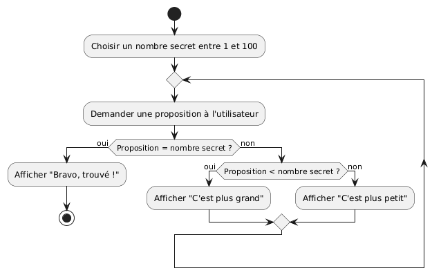

# Introduction à la programmation et aux algorithmes

V. Guidoux, avec l'aide de
[GitHub Copilot](https://github.com/features/copilot).

Ce travail est sous licence [CC BY-SA 4.0][licence].

## Ressources

- Objectifs, méthodes d'enseignement et d'apprentissage, et méthodes
  d'évaluation : [Lien vers le contenu](..)
- Supports de cours : [Lien vers le contenu](../01-supports-de-cours/README.md)
  ·
  [Presentation (web)](https://heig-vd-prog-course.github.io/HEIG-VD-ProgIM-Course/01.02-introduction-a-la-programmation-et-aux-algorithmes/01-supports-de-cours/index.html)
  ·
  [Presentation (PDF)](https://heig-vd-prog-course.github.io/HEIG-VD-ProgIM-Course/01.02-introduction-a-la-programmation-et-aux-algorithmes/01-supports-de-cours/01.02-introduction-a-la-programmation-et-aux-algorithmes-presentation.pdf)
- Exemples de code : [Lien vers le contenu](../02-exemples-de-code/)
- Exercices : [Lien vers le contenu](../03-exercices/README.md)

## Table des matières

- [Ressources](#ressources)
- [Table des matières](#table-des-matières)
- [Objectifs](#objectifs)
- [Qu’est-ce que la programmation ?](#quest-ce-que-la-programmation)
- [Qu’est-ce qu’un algorithme ?](#quest-ce-quun-algorithme)
- [La recette de cuisine : une métaphore](#la-recette-de-cuisine-une-métaphore)
- [Pourquoi la précision est importante](#pourquoi-la-précision-est-importante)
- [Présentation des exemples dans le cours](#présentation-des-exemples-dans-le-cours)
  - [Exemple : « Deviner un nombre »](#exemple-deviner-un-nombre)
- [Ressources complémentaires](#ressources-complémentaires)

## Objectifs

Dans ce cours, nous allons découvrir ce qu’est la programmation et ce qu’est un
algorithme, à travers une métaphore simple : la recette de cuisine.

À la fin de ce cours, vous serez capables de :

- Expliquer ce qu’est la programmation à l’aide d’exemples du quotidien
- Comprendre la notion d’algorithme grâce à la métaphore de la recette
- Suivre et imaginer des instructions simples pour résoudre un problème
- Prendre conscience de l’importance de la précision dans les instructions

## Qu’est-ce que la programmation ?

La programmation, c’est donner des instructions précises à un ordinateur pour
qu’il réalise une tâche. C’est comme expliquer à quelqu’un comment faire quelque
chose, étape par étape.

## Qu’est-ce qu’un algorithme ?

Un algorithme, c’est une suite d’instructions ordonnées qui permettent de
résoudre un problème ou d’atteindre un objectif. On retrouve des algorithmes
partout dans la vie quotidienne, pas seulement en informatique !

## La recette de cuisine : une métaphore

Pour comprendre ce qu’est un algorithme, imaginons une recette de cuisine. Une
recette, c’est une liste d’étapes à suivre pour préparer un plat. Par exemple :

1. Prendre un saladier
2. Casser deux œufs dans le saladier
3. Ajouter 100g de sucre
4. Mélanger
5. Verser dans un moule
6. Cuire 30 minutes au four

Chaque étape doit être claire et précise. Si on oublie une étape ou si on n’est
pas assez précis, le résultat ne sera pas celui attendu !

## Pourquoi la précision est importante

Si une instruction est ambiguë (« mélange » : avec quoi ? combien de temps ?),
le robot risque de se tromper. En programmation, il faut être très précis pour
que l’ordinateur comprenne exactement ce qu’on attend de lui.

## Présentation des exemples dans le cours

Dans ce cours, chaque concept ou algorithme sera illustré de trois façons :

- En français (explication ou pseudo-code)
- En PlantUML (diagramme d’algorithme)
- En Java (code source)

Cela permet de mieux comprendre le raisonnement, la structure et la traduction
en code réel.

### Exemple : « Deviner un nombre »

**En français :**

> L’ordinateur choisit un nombre au hasard entre 1 et 100. L’utilisateur doit
> deviner ce nombre. Après chaque proposition, l’ordinateur indique si le nombre
> à deviner est plus grand, plus petit ou égal à la proposition. Le jeu continue
> jusqu’à ce que l’utilisateur trouve le bon nombre.

**En PlantUML :**



**En Java :**

```java
import java.util.Random;
import java.util.Scanner;

public class GuessNumber {
    public static void main(String[] args) {
        Random rand = new Random();
        int secret = rand.nextInt(100) + 1;
        Scanner scanner = new Scanner(System.in);
        int guess = 0;
        System.out.println("Devine le nombre entre 1 et 100 :");
        while (guess != secret) {
            System.out.print("Ta proposition : ");
            guess = scanner.nextInt();
            if (guess < secret) {
                System.out.println("C'est plus grand.");
            } else if (guess > secret) {
                System.out.println("C'est plus petit.");
            } else {
                System.out.println("Bravo, tu as trouvé !");
            }
        }
        scanner.close();
    }
}
```

## Ressources complémentaires

- [France-IOI – Premiers pas en algorithmique](https://www.france-ioi.org/algo/course/?chapter=1)
- [Pix – Algorithmique](https://pix.fr/)

[licence]:
	https://github.com/HEIG-VD-Prog-Course/HEIG-VD-ProgIM-Course/blob/main/LICENSE.md
