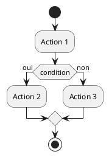
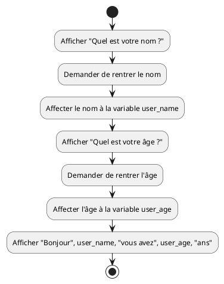
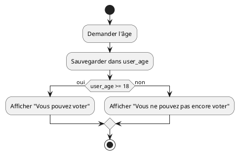

<!--
theme: custom-marp-theme
size: 16:9
paginate: true
author: V. Guidoux, avec l'aide de GitHub Copilot
title: HEIG-VD ProgIM1 Course - Séquence, sélection et itération
description: Séquence, sélection et itération pour l'unité d'enseignement ProgIM1 enseigné à la HEIG-VD, Suisse
url: https://HEIG-VD-Prog-Course.github.io/HEIG-VD-ProgIM-Course/02.01-sequence-selection-iteration/01-supports-de-cours/index.html
header: "**Séquence, sélection et itération**"
footer: '[**HEIG-VD**](https://heig-vd.ch) - [ProgIM1 2025-2026](https://github.com/HEIG-VD-Prog-Course/HEIG-VD-ProgIM-Course) - [CC BY-SA 4.0](https://github.com/HEIG-VD-Prog-Course/HEIG-VD-ProgIM-Course/blob/main/LICENSE.md)'
headingDivider: 6
math: mathjax
-->

# Séquence, sélection et itération

<!--
_class: lead
_paginate: false
-->

<https://github.com/HEIG-VD-Prog-Course/HEIG-VD-ProgIM-Course>

[Support de cours][cours] · [Présentation (web)][presentation-web] ·
[Présentation (PDF)][presentation-pdf]

<small>V. Guidoux, avec l'aide de
[GitHub Copilot](https://github.com/features/copilot).</small>

<small>Ce travail est sous licence [CC BY-SA 4.0][license].</small>

![bg brightness:2 opacity:0.2][illustration-principale]

## _Retrouvez plus de détails dans le support de cours_

<!-- _class: lead -->

_Cette présentation est un résumé du support de cours. Pour plus de détails,
consultez le [support de cours][cours]._

## Objectifs (1/3)

- Comprendre les trois piliers fondamentaux de la programmation
- Décrire le concept de variable en programmation
- Écrire des algorithmes en pseudocode
- Créer des diagrammes d'activité avec PlantUML

![bg right:40%][illustration-objectifs]

## Objectifs (2/3)

- Comprendre et appliquer la séquence d'instructions
- Décrire la sélection avec les conditions SI/ALORS/SINON
- Utiliser l'itération avec les différents types de boucles
- Traduire des concepts algorithmiques en diagrammes visuels

## Objectifs (3/3)

- Analyser et décomposer des problèmes complexes

![bg right:40%][illustration-objectifs]

## Les trois piliers de la programmation

<!-- _class: lead -->

**Tout programme informatique repose sur trois concepts fondamentaux :**

1. **Séquence** : exécuter des instructions dans l'ordre
2. **Sélection** : prendre des décisions
3. **Itération** : répéter des actions

## Les variables

<!-- _class: lead -->

### Qu'est-ce qu'une variable ?

- Une **boîte** qui peut contenir une valeur
- Comme une **étiquette** sur un tiroir
- Peut changer de contenu au cours du temps
- Essentielle pour stocker et manipuler des données

### Variables : exemple concret

```text
name = "Marie"
user_age = 20
height = 1.65
is_student = vrai
```

**Analogie** : Pensez aux variables comme des tiroirs étiquetés dans un bureau.

## Le pseudocode

<!-- _class: lead -->

### Qu'est-ce que le pseudocode ?

- Langage **simplifié** pour décrire des algorithmes
- **Français structuré** avec des mots-clés
- Indépendant de tout langage de programmation
- Permet de **réfléchir** avant de coder

### Règles de base du pseudocode

```text
DÉBUT
    Demander le nom de l'utilisatrice
    Sauvegarder le nom dans la variable name

    Afficher "Bonjour", name
FIN
```

- `DÉBUT` et `FIN` délimitent l'algorithme
- Instructions claires en français
- Utilisation de variables explicites

## PlantUML : vos diagrammes visuels

<!-- _class: lead -->

### Pourquoi utiliser PlantUML ?

- **Visualise** la logique de vos algorithmes
- **Facilite la compréhension** des flux complexes
- **Standard professionnel** dans l'informatique
- **Éditeur en ligne** disponible gratuitement

Liens utiles :

- <https://www.plantuml.com/plantuml/uml/>
- <https://plantuml.com/fr/activity-diagram-beta>

### Éléments de base PlantUML

- `start` / `stop` : début et fin
- `:action;` : une action



![bg right:30% w:100%][illustration-plantuml]

## La séquence

<!-- _class: lead -->

### Qu'est-ce qu'une séquence ?

- Suite d'**instructions exécutées dans l'ordre**
- Chaque instruction se fait **après** la précédente
- Comme une **recette de cuisine** : étape 1, puis 2, puis 3...

### Exemple de séquence

```text
DÉBUT
    Afficher "Quel est votre nom ?"
    Demander user_name

    Afficher "Quel est votre âge ?"
    Demander user_age

    Afficher "Bonjour", user_name, "vous avez", user_age, "ans"
FIN
```

Va afficher : "Bonjour Alice, vous avez 30 ans" si l'utilisatrice a entré
"Alice" et "30".

### Diagramme d'activité - Séquence

![bg right:40% w:100%][illustration-sequence]



**Les rectangles** montrent la séquence d'actions.

## La sélection

<!-- _class: lead -->

### Qu'est-ce qu'une sélection ?

- Permet de **prendre des décisions** dans un programme
- **SI** une condition est vraie, **ALORS** faire quelque chose
- **SINON** faire autre chose
- Comme un **carrefour** : aller à gauche ou à droite ?

### Structure de la sélection

```text
SI (condition) ALORS
    actions si la condition est vraie
SINON
    actions si la condition est fausse
FIN SI
```

**Exemple** : Déterminer si une personne peut voter

### Exemple concret de sélection

```text
DÉBUT
    Demander l'âge de la personne
    Sauvegarder l'âge dans user_age

    SI (user_age >= 18) ALORS
        Afficher "Vous pouvez voter"
    SINON
        Afficher "Vous ne pouvez pas encore voter"
    FIN SI
FIN
```

### Diagramme d'activité - Sélection

![bg right:40% w:100%][illustration-selection]



**Le losange** représente la condition.

## L'itération

<!-- _class: lead -->

### Qu'est-ce qu'une itération ?

- Permet de **répéter** des instructions plusieurs fois
- Évite de réécrire le même code
- Comme apprendre ses **tables de multiplication** : répéter jusqu'à maîtriser
- Trois types principaux de boucles

### Les trois types d'itération

1. **POUR** : quand on sait **combien de fois** répéter
2. **TANT QUE** : répéter **tant qu'une condition** est vraie
3. **RÉPÉTER JUSQU'À** : répéter **jusqu'à ce qu'une condition** soit vraie

### Boucle POUR - Exemple

```text
DÉBUT
    POUR i DE 1 À 10 FAIRE
        Afficher "Table de 5 :", 5, "×", i, "=", (5 * i)
    FIN POUR
FIN
```

**Résultat** : Affiche la table de multiplication de 5 de 1 à 10.

### Boucle TANT QUE - Exemple

```text
DÉBUT
    secret_number = 42
    guessed_number = 0
    Demander un nombre
    TANT QUE (guessed_number ≠ secret_number) FAIRE
        SI (guessed_number < secret_number) ALORS
            Afficher "Trop petit !"
        SINON
            Afficher "Trop grand !"
        FIN SI
        Demander un nombre
    FIN TANT QUE
    Afficher "Bravo !"
FIN
```

### Diagramme d'activité - Itération

```plantuml
start
:secret_number = 42;
:guessed_number = 0;
:Demander un nombre;
while (guessed_number ≠ secret_number) is (oui)
    if (guessed_number < secret_number) then (oui)
        :Afficher "Trop petit !";
    else (non)
        :Afficher "Trop grand !";
    endif
    :Demander un nombre;
endwhile (non)
:Afficher "Bravo !";
stop
```

---

![bg  h:100%][illustration-iteration]

## À vous de jouer !

- (Re)lire le [support de cours][cours]
- Réaliser les [exercices][exercices]
- Expérimenter avec [PlantUML en ligne][plantuml-editor]
- Poser des questions si nécessaire

\
**La programmation s'apprend par la pratique !** **N'hésitez pas à créer vos propres
exercices.**

![bg right:40%][illustration-a-vous-de-jouer]

## Questions

<!-- _class: lead -->

Est-ce que vous avez des questions ?

## Sources

- [Illustration objectifs][illustration-objectifs] par
  [Aline de Nadai](https://unsplash.com/@alinedenadai) sur
  [Unsplash](https://unsplash.com/photos/j6brni7fpvs)
- [Illustration variables][illustration-variables] par
  [Javier Allegue Barros](https://unsplash.com/@soymeraki) sur
  [Unsplash](https://unsplash.com/photos/C7B-ExXpOIE)
- [Illustration pseudocode][illustration-pseudocode] par
  [Florian Olivo](https://unsplash.com/@florianolv) sur
  [Unsplash](https://unsplash.com/photos/4hbJ-eymZ1o)
- [Illustration exercices][illustration-exercices] par
  [Green Chameleon](https://unsplash.com/@craftedbygc) sur
  [Unsplash](https://unsplash.com/photos/s9CC2SKySJM)
- [Illustration récap][illustration-recap] par
  [Patrick Perkins](https://unsplash.com/@patrickperkins) sur
  [Unsplash](https://unsplash.com/photos/ETRPjvb0KM0)
- [Illustration à vous de jouer][illustration-a-vous-de-jouer] par
  [Nikita Kachanovsky](https://unsplash.com/@nkachanovskyyy) sur
  [Unsplash](https://unsplash.com/photos/FJFPuE1MAOM)

<!-- URLs -->

[presentation-web]:
	https://HEIG-VD-Prog-Course.github.io/HEIG-VD-ProgIM-Course/02.01-sequence-selection-iteration/01-supports-de-cours/index.html
[presentation-pdf]:
	https://HEIG-VD-Prog-Course.github.io/HEIG-VD-ProgIM-Course/02.01-sequence-selection-iteration/01-supports-de-cours/02.01-sequence-selection-iteration-presentation.pdf
[cours]:
	https://github.com/HEIG-VD-Prog-Course/HEIG-VD-ProgIM-Course/tree/main/02.01-sequence-selection-iteration/01-supports-de-cours
[exercices]:
	https://github.com/HEIG-VD-Prog-Course/HEIG-VD-ProgIM-Course/tree/main/02.01-sequence-selection-iteration/02-exercices
[plantuml-editor]:
	https://www.plantuml.com/plantuml/uml/SyfFKj2rKt3CoKnELR1Io4ZDoSa70000
[license]:
	https://github.com/HEIG-VD-Prog-Course/HEIG-VD-ProgIM-Course/blob/main/LICENSE.md

<!-- Illustrations -->

[illustration-principale]: ./images/home.jpg
[illustration-objectifs]:
	https://images.unsplash.com/photo-1516389573391-5620a0263801?fit=crop&h=720
[illustration-variables]:
	https://images.unsplash.com/photo-1558618666-fcd25c85cd64?fit=crop&h=720
[illustration-pseudocode]:
	https://images.unsplash.com/photo-1461749280684-dccba630e2f6?fit=crop&h=720
[illustration-sequence]: ./images/sequence.png
[illustration-selection]: ./images/selection.png
[illustration-iteration]: ./images/iteration.png
[illustration-plantuml]: ./images/exemple.png
[illustration-exercices]:
	https://images.unsplash.com/photo-1434030216411-0b793f4b4173?fit=crop&h=720
[illustration-recap]:
	https://images.unsplash.com/photo-1484480974693-6ca0a78fb36b?fit=crop&h=720
[illustration-a-vous-de-jouer]:
	https://images.unsplash.com/photo-1509198397868-475647b2a1e5?fit=crop&h=720
