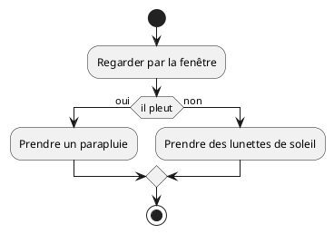
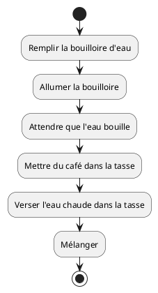
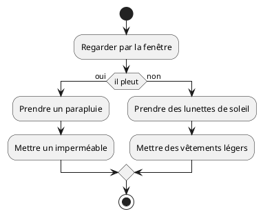
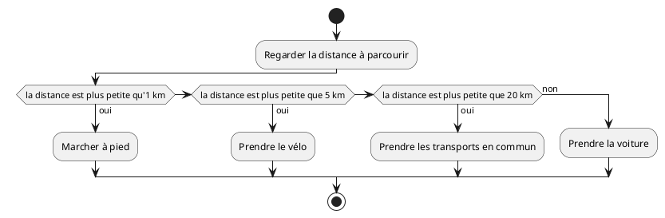
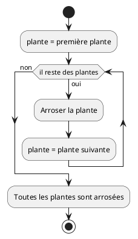
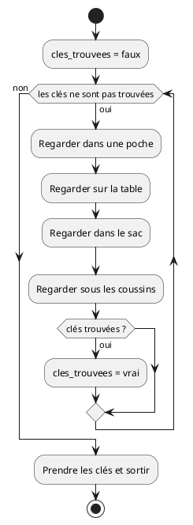
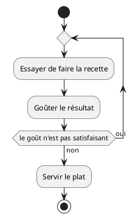

# Séquence, sélection et itération - Support de cours

V. Guidoux, avec l'aide de
[GitHub Copilot](https://github.com/features/copilot).

Ce travail est sous licence [CC BY-SA 4.0][licence].

## Ressources

- Objectifs, méthodes d'enseignement et d'apprentissage, et méthodes
  d'évaluation : [Lien vers le contenu](..)
- Supports de cours : [Lien vers le contenu](../01-supports-de-cours/README.md)
  ·
  [Presentation (web)](https://HEIG-VD-Prog-Course.github.io/HEIG-VD-ProgIM-Course/02.01-sequence-selection-iteration/01-supports-de-cours/index.html)
  ·
  [Presentation (PDF)](https://HEIG-VD-Prog-Course.github.io/HEIG-VD-ProgIM-Course/02.01-sequence-selection-iteration/01-supports-de-cours/02.01-sequence-selection-iteration-presentation.pdf)
- Exercices : [Énoncés et solutions](../02-exercices/README.md)

## Table des matières

- [Ressources](#ressources)
- [Table des matières](#table-des-matières)
- [Objectifs](#objectifs)
- [Introduction](#introduction)
- [Les variables](#les-variables)
  - [Qu'est-ce qu'une variable ?](#quest-ce-quune-variable-)
  - [Comment utiliser les variables ?](#comment-utiliser-les-variables-)
  - [Types de variables courantes](#types-de-variables-courantes)
  - [Pour aller plus loin : Comprendre les variables](#pour-aller-plus-loin--comprendre-les-variables)
- [Le pseudocode](#le-pseudocode)
  - [Qu'est-ce que le pseudocode ?](#quest-ce-que-le-pseudocode-)
  - [Règles de base du pseudocode](#règles-de-base-du-pseudocode)
  - [Avantages du pseudocode](#avantages-du-pseudocode)
- [À propos des diagrammes d'activité PlantUML](#à-propos-des-diagrammes-dactivité-plantuml)
  - [Détail des éléments PlantUML](#détail-des-éléments-plantuml)
- [La séquence](#la-séquence)
  - [Qu'est-ce qu'une séquence ?](#quest-ce-quune-séquence-)
  - [Pseudocode pour la séquence](#pseudocode-pour-la-séquence)
  - [Diagramme d'activité pour la séquence](#diagramme-dactivité-pour-la-séquence)
- [La sélection](#la-sélection)
  - [Qu'est-ce qu'une sélection ?](#quest-ce-quune-sélection-)
  - [Pseudocode pour la sélection](#pseudocode-pour-la-sélection)
  - [Diagramme d'activité pour la sélection](#diagramme-dactivité-pour-la-sélection)
- [L'itération](#litération)
  - [Qu'est-ce qu'une itération ?](#quest-ce-quune-itération-)
  - [Types d'itération](#types-ditération)
  - [Pseudocode pour l'itération](#pseudocode-pour-litération)
  - [Diagrammes d'activité pour l'itération](#diagrammes-dactivité-pour-litération)
- [Conclusion](#conclusion)
  - [Ce que vous savez maintenant faire](#ce-que-vous-savez-maintenant-faire)
  - [Prochaines étapes](#prochaines-étapes)
  - [Bibliographie et ressources utilisées](#bibliographie-et-ressources-utilisées)

## Objectifs

Cette séance a pour but de vous présenter les concepts fondamentaux de la
programmation, à savoir la séquence, la sélection et l'itération. Et de savoir
les représenter à l'aide de pseudocode et de diagrammes d'activités.

De façon plus concise, à la fin de cette séance, vous devriez être capable de :

- Expliquer les concepts de séquence, sélection et itération
- Utiliser le pseudocode pour décrire des algorithmes simples
- Créer des diagrammes d'activités pour représenter des processus

## Introduction

La programmation est l'art de donner des instructions à un ordinateur pour qu'il
accomplisse des tâches spécifiques. Comme une cheffe cuisinière qui suit une
recette, l'ordinateur exécute une série d'instructions dans un ordre précis pour
obtenir le résultat souhaité.

Toute la programmation, quel que soit le langage utilisé (Java, Python,
JavaScript, etc.), repose sur trois concepts fondamentaux :

1. **La séquence** : exécuter des instructions l'une après l'autre
2. **La sélection** : choisir quelle instruction exécuter selon une condition
3. **L'itération** : répéter des instructions plusieurs fois

Ces trois concepts sont universels et se retrouvent dans tous les programmes
informatiques, des plus simples aux plus complexes. Maîtriser ces concepts vous
permettra de comprendre et de créer n'importe quel algorithme.

Dans ce cours, nous allons explorer chaque concept en détail et apprendre à les
représenter de deux manières :

- **Le pseudocode** : un langage simple et proche du français pour décrire des
  algorithmes
- **Les diagrammes d'activités** : une représentation graphique qui permet de
  visualiser le flux d'exécution

> [!NOTE]
>
> Un **algorithme** est une suite finie d'instructions précises qui permettent
> de résoudre un problème ou d'accomplir une tâche. C'est comme une recette de
> cuisine : chaque étape est clairement définie et, si on les suit correctement,
> on obtient toujours le même résultat.

## Les variables

### Qu'est-ce qu'une variable ?

Avant de commencer à créer des algorithmes, il est important de comprendre le
concept de **variable**. Une variable est comme une boîte étiquetée dans
laquelle on peut stocker une information (un nombre, un mot, etc.) pour
l'utiliser plus tard dans notre programme.

**Analogie concrète** : Imaginez des bocaux de cuisine étiquetés dans votre
garde-manger :

- Un bocal étiqueté "sucre" contient du sucre
- Un bocal étiqueté "farine" contient de la farine
- Un bocal étiqueté "nombre_de_personnes" pourrait contenir le nombre 4

En programmation, c'est pareil :

- Une variable nommée `age` peut contenir le nombre 25
- Une variable nommée `name` peut contenir le texte "Marie"
- Une variable nommée `temperature` peut contenir le nombre 18.5

### Comment utiliser les variables ?

Pour utiliser une variable, on suit généralement ces étapes :

1. **Déclarer** la variable (créer la boîte et lui donner un nom)
2. **Affecter** une valeur à la variable (mettre quelque chose dans la boîte)
3. **Utiliser** la variable dans nos calculs ou affichages

**Exemple simple** :

```text
DÉBUT
    user_age = 20               // On met la valeur 20 dans la variable "user_age"
    Afficher "Votre âge est :"
    Afficher user_age           // On utilise le contenu de la variable
FIN
```

### Types de variables courantes

- **Nombres entiers** : 1, 2, 100, -5
- **Nombres décimaux** : 3.14, 18.5, -2.7
- **Texte** : "Bonjour", "Marie", "Programmation"
- **Vrai/Faux** : vrai, faux (pour les conditions)

**Règles importantes** :

- Choisissez des noms clairs : `user_age` plutôt que `x`
- Une variable ne peut contenir qu'une seule valeur à la fois
- Si on change le contenu d'une variable, l'ancienne valeur est perdue

### Pour aller plus loin : Comprendre les variables

Les variables sont la base de tout programme informatique. Voici quelques points
supplémentaires pour mieux les comprendre :

- **Types de variables** : Selon le langage, il existe différents types (entier,
  décimal, texte, booléen). En Java, par exemple : `int` pour les entiers,
  `double` pour les décimaux, `String` pour le texte, `boolean` pour vrai/faux.
- **Portée d'une variable** : Une variable n'est accessible que dans la partie
  du programme où elle a été déclarée (par exemple, à l'intérieur d'une
  fonction).
- **Initialisation** : Il est recommandé de donner une valeur initiale à une
  variable dès sa déclaration pour éviter des erreurs.
- **Modification** : On peut changer la valeur d'une variable à tout moment,
  mais l'ancienne valeur sera perdue.

**Exemple en Java :**

```java
int age = 25;           // Déclaration et initialisation
age = age + 1;          // Modification de la valeur (age vaut maintenant 26)
```

**À retenir :**  
Une variable est comme une boîte : elle a un nom, un type, et peut contenir une
valeur qui peut changer au cours du programme.

---

## Le pseudocode

### Qu'est-ce que le pseudocode ?

Le pseudocode est un langage informel utilisé par les programmeurs pour décrire
des algorithmes. Il utilise des mots en français (ou dans votre langue
maternelle) plutôt que la syntaxe spécifique d'un langage de programmation.

C'est un excellent outil pour :

- Planifier un programme avant de l'écrire
- Communiquer des idées entre développeurs
- Apprendre les concepts de programmation

### Règles de base du pseudocode

1. **Utilisez des mots simples et clairs**

   - "Demander l'âge à l'utilisatrice" (recommandé)
   - "scanf(%d, &age)" (à éviter)

2. **Indentez pour montrer la structure**

   ```text
   SI condition ALORS
       action 1
       action 2
   FIN SI
   ```

3. **Utilisez des mots-clés cohérents**

   - DÉBUT / FIN
   - SI / ALORS / SINON / FIN SI
   - POUR / À / FAIRE / FIN POUR
   - TANT QUE / FAIRE / FIN TANT QUE

4. **Nommez clairement les variables**
   - user_age, secret_number, total_price (recommandé)
   - x, y, temp, a1 (à éviter)

### Avantages du pseudocode

- **Indépendant du langage** : peut être traduit en Java, Python, C++, etc.
- **Facile à comprendre** : même sans connaissances en programmation
- **Permet de se concentrer sur la logique** : pas de syntaxe compliquée
- **Facilite la correction d'erreurs** : plus simple de repérer les erreurs de
  logique

**Exemple complet** : Préparer le petit-déjeuner pour la famille :

```text
DÉBUT
    Sortir le pain
    Mettre le pain dans le grille-pain
    Appuyer sur le bouton
    Attendre que le pain grille
    Sortir le pain grillé
    Étaler le beurre
    Ajouter la confiture
    Servir sur l'assiette
FIN
```

<details>
<summary>Exemple en Java</summary>

```java
public class PetitDejeuner {
    public static void main(String[] args) {
        // Préparer le petit-déjeuner - séquence d'actions
        System.out.println("Sortir le pain");
        System.out.println("Mettre le pain dans le grille-pain");
        System.out.println("Appuyer sur le bouton");

        // Simuler l'attente
        System.out.println("Attendre que le pain grille...");

        System.out.println("Sortir le pain grillé");
        System.out.println("Étaler le beurre");
        System.out.println("Ajouter la confiture");
        System.out.println("Servir sur l'assiette");

        System.out.println("Petit-déjeuner prêt !");
    }
}
```

</details>

## À propos des diagrammes d'activité PlantUML

Les diagrammes d'activité sont des outils visuels pour représenter le
déroulement d'un algorithme ou d'un processus. Ils permettent de :

- Visualiser l'enchaînement des actions (séquence)
- Montrer les choix possibles (sélection)
- Illustrer les répétitions (itération)

**Principaux éléments d'un diagramme d'activité :**

- **Début/Fin** : représentés par un cercle noir (début) et un cercle avec un
  point (fin)
- **Actions** : rectangles contenant une instruction ou une opération
- **Décisions** : losanges pour les conditions (oui/non)
- **Flèches** : indiquent le sens du déroulement

**Exemple simple en PlantUML :**



Pour créer vos propres diagrammes, vous pouvez utiliser
[PlantUML en ligne](https://plantuml.nortalle.ch).

### Détail des éléments PlantUML

#### **Début/Fin**

- **Début** : `start` - Un cercle noir
- **Fin** : `stop` - Un cercle noir entouré d'un cercle blanc

#### **Actions**

- Syntaxe : `:Action à effectuer;`
- Exemple : `:Demander l'âge;`

#### **Décisions**

- Syntaxe : `if (condition) then (oui) ... else (non) ... endif`
- Les losanges permettent les embranchements

#### **Flèches**

- Automatiquement générées par PlantUML
- Indiquent le flux d'exécution

## La séquence

### Qu'est-ce qu'une séquence ?

Une séquence est la forme la plus simple d'un algorithme. Elle consiste à
exécuter des instructions l'une après l'autre, dans l'ordre où elles sont
écrites. C'est exactement comme suivre une recette de cuisine : on fait d'abord
l'étape 1, puis l'étape 2, puis l'étape 3, etc.

**Exemple concret** : Pour préparer un café, on suit cette séquence :

1. Remplir la bouilloire d'eau
2. Allumer la bouilloire
3. Attendre que l'eau bouille
4. Mettre du café dans la tasse
5. Verser l'eau chaude dans la tasse
6. Mélanger

Chaque étape doit être accomplie avant de passer à la suivante.

### Pseudocode pour la séquence

Le pseudocode utilise des mots simples pour décrire les actions. Voici comment
on écrirait l'exemple du café :

```text
DÉBUT
    Remplir la bouilloire d'eau
    Allumer la bouilloire
    Attendre que l'eau bouille
    Mettre du café dans la tasse
    Verser l'eau chaude dans la tasse
    Mélanger
FIN
```

**Autre exemple** : Ranger sa chambre :

```text
DÉBUT
    Faire le lit
    Ramasser les vêtements sales
    Les mettre dans le panier à linge
    Ranger les livres sur l'étagère
    Passer l'aspirateur
    Fermer les rideaux
FIN
```

<details>
<summary>Exemple en Java</summary>

```java
public class RangerChambre {
    public static void main(String[] args) {
        // Ranger sa chambre - séquence d'actions
        System.out.println("Faire le lit");
        System.out.println("Ramasser les vêtements sales");
        System.out.println("Les mettre dans le panier à linge");
        System.out.println("Ranger les livres sur l'étagère");
        System.out.println("Passer l'aspirateur");
        System.out.println("Fermer les rideaux");

        System.out.println("Chambre rangée !");
    }
}
```

</details>

### Diagramme d'activité pour la séquence

Un diagramme d'activité utilise des formes géométriques pour représenter les
actions. Voici le diagramme pour l'exemple du café :



**Légende** :

- Le cercle noir (start) indique le début
- Les rectangles contiennent les actions à effectuer
- Les flèches montrent l'ordre d'exécution
- Le cercle avec un point noir (stop) indique la fin

> [!TIP]
>
> Vous pouvez tester ce diagramme directement dans l'éditeur PlantUML en ligne :
> <https://plantuml.nortalle.ch>

## La sélection

### Qu'est-ce qu'une sélection ?

La sélection permet de choisir quelle instruction exécuter selon une condition.
C'est comme arriver à un carrefour : selon la direction que l'on veut prendre,
on va à droite ou à gauche.

En programmation, on utilise souvent les mots **SI** (if) et **SINON** (else)
pour exprimer ces choix.

**Exemple concret** : Choisir comment s'habiller selon la météo :

- **SI** il pleut, **ALORS** prendre un parapluie
- **SINON** ne pas prendre de parapluie

### Pseudocode pour la sélection

Voici la structure de base d'une sélection en pseudocode :

```text
SI condition ALORS
    actions à faire si la condition est vraie
SINON
    actions à faire si la condition est fausse
FIN SI
```

**Exemple complet** : Choisir ses vêtements selon la météo :

```text
DÉBUT
    Regarder par la fenêtre

    SI il pleut ALORS
        Prendre un parapluie
        Mettre un imperméable
    SINON
        Prendre des lunettes de soleil
        Mettre des vêtements légers
    FIN SI
FIN
```

<details>
<summary>Exemple en Java</summary>

```java
import java.util.Scanner;

public class ChoixVetements {
    public static void main(String[] args) {
        // Création d'un scanner pour lire les entrées
        Scanner scanner = new Scanner(System.in);

        // Demander la météo
        System.out.print("Est-ce qu'il pleut ? (oui/non) : ");
        // Lire la réponse et la stocker
        String meteo = scanner.nextLine();

        // Vérifier la météo pour choisir les vêtements
        if (meteo.equals("oui")) {
            // S'il pleut
            System.out.println("Prendre un parapluie");
            System.out.println("Mettre un imperméable");
        } else {
            // S'il ne pleut pas
            System.out.println("Prendre des lunettes de soleil");
            System.out.println("Mettre des vêtements légers");
        }

        // Fermer le scanner
        scanner.close();
    }
}
```

</details>

**Autre exemple** : Choisir un moyen de transport :

```text
DÉBUT
    Regarder la distance à parcourir

    SI la distance est plus petite qu'1 km ALORS
        Marcher à pied
    SINON SI la distance est plus petite que 5 km ALORS
        Prendre le vélo
    SINON SI la distance est plus petite que 20 km ALORS
        Prendre les transports en commun
    SINON
        Prendre la voiture
    FIN SI
FIN
```

### Diagramme d'activité pour la sélection

Voici le diagramme pour l'exemple des vêtements selon la météo :



**Exemple plus complexe** avec plusieurs conditions :



## L'itération

### Qu'est-ce qu'une itération ?

L'itération permet de répéter des instructions plusieurs fois. C'est très utile
quand on doit faire la même chose de nombreuses fois, comme compter de 1 à 100
ou traiter une liste d'éléments.

**Exemple concret** : Pour apprendre les tables de multiplication, on répète :

- "2 × 1 = 2"
- "2 × 2 = 4"
- "2 × 3 = 6"
- ... jusqu'à "2 × 10 = 20"

### Types d'itération

Il existe trois types principaux d'itération :

1. **POUR** (for) : quand on sait combien de fois répéter
2. **TANT QUE** (while) : quand on répète tant qu'une condition est vraie
3. **RÉPÉTER JUSQU'À** (repeat until) : quand on répète jusqu'à ce qu'une
   condition soit vraie

### Pseudocode pour l'itération

#### Boucle POUR

```text
POUR variable DE valeur_début À valeur_fin FAIRE
    actions à répéter
FIN POUR
```

**Exemple** : Arroser toutes les plantes du jardin :

```text
DÉBUT
    POUR chaque plante du jardin FAIRE
        Arroser la plante
    FIN POUR
FIN
```

<details>
<summary>Exemple en Java</summary>

```java
public class ArroserPlantes {
    public static void main(String[] args) {
        // Définir les plantes du jardin
        String[] plantes = {"Rose", "Tulipe", "Marguerite", "Lavande", "Basilic"};

        System.out.println("Commencer l'arrosage du jardin :");

        // Boucle POUR : arroser chaque plante du jardin
        for (int i = 0; i < plantes.length; i++) {
            System.out.println("Arroser la " + plantes[i]);
        }

        System.out.println("Toutes les plantes sont arrosées !");
    }
}
```

</details>

#### Boucle TANT QUE

```text
TANT QUE condition FAIRE
    actions à répéter
FIN TANT QUE
```

**Exemple** : Chercher ses clés :

```text
DÉBUT
    TANT QUE les clés ne sont pas trouvées FAIRE
        Regarder dans une poche
        Regarder sur la table
        Regarder dans le sac
        Regarder sous les coussins
    FIN TANT QUE

    Prendre les clés et sortir
FIN
```

<details>
<summary>Exemple en Java</summary>

```java
import java.util.Random;

public class ChercherCles {
    public static void main(String[] args) {
        // Simuler la recherche de clés
        Random random = new Random();
        boolean cles_trouvees = false;

        System.out.println("Oh non ! Où sont mes clés ?");

        // Boucle TANT QUE les clés ne sont pas trouvées
        while (!cles_trouvees) {
            System.out.println("Regarder dans une poche...");
            System.out.println("Regarder sur la table...");
            System.out.println("Regarder dans le sac...");
            System.out.println("Regarder sous les coussins...");

            // Simuler la chance de trouver les clés (20% à chaque tentative)
            if (random.nextInt(5) == 0) {
                cles_trouvees = true;
            } else {
                System.out.println("Toujours pas trouvées, continuer à chercher...\n");
            }
        }

        System.out.println("Trouvées ! Prendre les clés et sortir");
    }
}
```

</details>

#### Boucle RÉPÉTER JUSQU'À

```text
RÉPÉTER
    actions à répéter
JUSQU'À (condition)
```

**Exemple** : Apprendre une nouvelle recette :

```text
DÉBUT
    RÉPÉTER
        Essayer de faire la recette
        Goûter le résultat
    JUSQU'À le goût est satisfaisant

    Servir le plat
FIN
```

<details>
<summary>Exemple en Java</summary>

```java
import java.util.Random;

public class ApprendreRecette {
    public static void main(String[] args) {
        // Simuler l'apprentissage d'une recette
        Random random = new Random();
        boolean gout_satisfaisant = false;
        int tentative = 1;

        System.out.println("Apprendre à faire des crêpes :");

        // Boucle RÉPÉTER JUSQU'À ce que le goût soit satisfaisant
        do {
            System.out.println("\nTentative " + tentative + " :");
            System.out.println("Essayer de faire la recette...");
            System.out.println("Mélanger la farine, les œufs et le lait");
            System.out.println("Faire cuire la crêpe");
            System.out.println("Goûter le résultat...");

            // Simuler si le goût est satisfaisant (30% de chance à chaque fois)
            if (random.nextInt(10) < 3) {
                gout_satisfaisant = true;
                System.out.println("Mmm, délicieux ! Le goût est parfait !");
            } else {
                System.out.println("Pas terrible... il faut réessayer");
                tentative++;
            }

        } while (!gout_satisfaisant);

        System.out.println("\nServir le plat - Recette maîtrisée !");
    }
}
```

</details>

### Diagrammes d'activité pour l'itération

#### Boucle POUR avec PlantUML



#### Boucle TANT QUE



#### Boucle RÉPÉTER JUSQU'À



## Conclusion

Félicitations ! Vous venez d'apprendre les trois piliers de la programmation :

1. **La séquence** : exécuter des instructions dans l'ordre
2. **La sélection** : prendre des décisions avec SI/ALORS/SINON
3. **L'itération** : répéter des actions avec des boucles

Ces concepts sont universels et se retrouvent dans tous les langages de
programmation. Que vous appreniez Java, Python, JavaScript ou tout autre
langage, vous utiliserez toujours ces trois structures de base.

### Ce que vous savez maintenant faire

- Écrire des algorithmes simples en pseudocode
- Créer des diagrammes d'activités avec PlantUML
- Comprendre le flux d'exécution d'un programme
- Analyser et décomposer un problème en étapes logiques

### Prochaines étapes

Dans les prochains cours, vous apprendrez :

- À traduire votre pseudocode en vrai code Java
- À utiliser des variables et des types de données
- À créer des fonctions pour organiser votre code
- À manipuler des tableaux et des structures de données plus complexes

> [!IMPORTANT]
>
> La programmation s'apprend par la pratique ! N'hésitez pas à créer vos propres
> exercices et à expérimenter avec les diagrammes PlantUML. Plus vous pratiquez,
> plus ces concepts deviendront naturels.

**Ressources pour aller plus loin :**

- [Documentation PlantUML pour les diagrammes d'activité](https://plantuml.com/fr/activity-diagram-beta)

### Bibliographie et ressources utilisées

Les ressources suivantes ont été utilisées pour la préparation de ce cours :

- <https://plantuml.com/fr/activity-diagram-beta>
- <https://www.w3schools.com/java/java_intro.asp>
- <https://www.geeksforgeeks.org/java/java/>
- <https://www.learnjavaonline.org/>
- <https://upskillcourses.com/courses/essential-web-developer-course>

[licence]:
	https://github.com/HEIG-VD-Prog-Course/HEIG-VD-ProgIM-Course/blob/main/LICENSE.md
