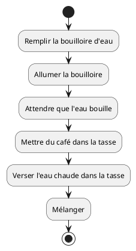
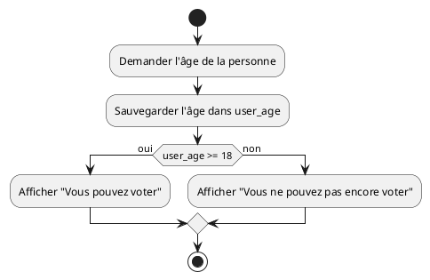
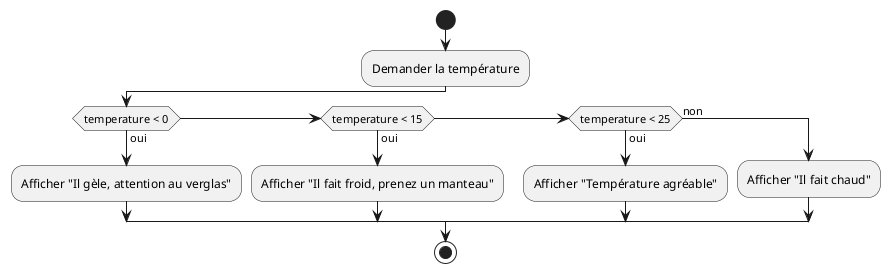
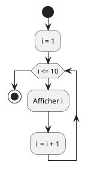
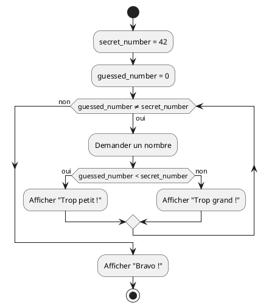
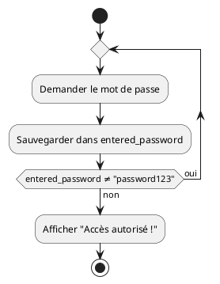

# Modalité de l'unité d'enseignement

V. Guidoux, avec l'aide de
[GitHub Copilot](https://github.com/features/copilot).

Ce travail est sous licence [CC BY-SA 4.0][licence].

## Ressources

- Objectifs, méthodes d'enseignement et d'apprentissage, et méthodes
  d'évaluation : [Lien vers le contenu](..)
- Supports de cours : [Lien vers le contenu](../01-supports-de-cours/README.md)
  ·
  [Presentation (web)](https://HEIG-VD-Prog-Course.github.io/HEIG-VD-ProgIM-Course/02.01-sequence-selection-iteration/01-supports-de-cours/index.html)
  ·
  [Presentation (PDF)](https://HEIG-VD-Prog-Course.github.io/HEIG-VD-ProgIM-Course/02.01-sequence-selection-iteration/01-supports-de-cours/02.01-sequence-selection-iteration-presentation.pdf)
- Exemples de code : [Lien vers le contenu](../02-exemples-de-code/)
- Exercices : [Énoncés et solutions](../02-exercices/README.md)

## Table des matières

- [Ressources](#ressources)
- [Table des matières](#table-des-matières)
- [Objectifs](#objectifs)
- [Introduction](#introduction)
- [Les variables](#les-variables)
  - [Qu'est-ce qu'une variable ?](#quest-ce-quune-variable-)
  - [Comment utiliser les variables ?](#comment-utiliser-les-variables-)
  - [Types de variables courantes](#types-de-variables-courantes)
- [Le pseudocode](#le-pseudocode)
  - [Qu'est-ce que le pseudocode ?](#quest-ce-que-le-pseudocode-)
  - [Règles de base du pseudocode](#règles-de-base-du-pseudocode)
  - [Avantages du pseudocode](#avantages-du-pseudocode)
- [La séquence](#la-séquence)
  - [Qu'est-ce qu'une séquence ?](#quest-ce-quune-séquence-)
  - [Pseudocode pour la séquence](#pseudocode-pour-la-séquence)
  - [Diagramme d'activité pour la séquence](#diagramme-dactivité-pour-la-séquence)
- [La sélection](#la-sélection)
  - [Qu'est-ce qu'une sélection ?](#quest-ce-quune-sélection-)
  - [Pseudocode pour la sélection](#pseudocode-pour-la-sélection)
  - [Diagramme d'activité pour la sélection](#diagramme-dactivité-pour-la-sélection)
- [L'itération](#litération)
  - [Qu'est-ce qu'une itération ?](#quest-ce-quune-itération-)
  - [Types d'itération](#types-ditération)
  - [Pseudocode pour l'itération](#pseudocode-pour-litération)
  - [Diagrammes d'activité pour l'itération](#diagrammes-dactivité-pour-litération)
- [Conclusion](#conclusion)
  - [Ce que vous savez maintenant faire](#ce-que-vous-savez-maintenant-faire)
  - [Prochaines étapes](#prochaines-étapes)
  - [Bibliographie et ressources utilisées](#bibliographie-et-ressources-utilisées)

## Objectifs

Cette séance a pour but de vous présenter les concepts fondamentaux de la
programmation, à savoir la séquence, la sélection et l'itération. Et de savoir
les représenter à l'aide de pseudocode et de diagrammes d'activités.

De façon plus concise, à la fin de cette séance, vous devriez être capable de :

- Expliquer les concepts de séquence, sélection et itération
- Utiliser le pseudocode pour décrire des algorithmes simples
- Créer des diagrammes d'activités pour représenter des processus

## Introduction

La programmation est l'art de donner des instructions à un ordinateur pour qu'il
accomplisse des tâches spécifiques. Comme une cheffe cuisinière qui suit une
recette, l'ordinateur exécute une série d'instructions dans un ordre précis pour
obtenir le résultat souhaité.

Toute la programmation, quel que soit le langage utilisé (Java, Python,
JavaScript, etc.), repose sur trois concepts fondamentaux :

1. **La séquence** : exécuter des instructions l'une après l'autre
2. **La sélection** : choisir quelle instruction exécuter selon une condition
3. **L'itération** : répéter des instructions plusieurs fois

Ces trois concepts sont universels et se retrouvent dans tous les programmes
informatiques, des plus simples aux plus complexes. Maîtriser ces concepts vous
permettra de comprendre et de créer n'importe quel algorithme.

Dans ce cours, nous allons explorer chaque concept en détail et apprendre à les
représenter de deux manières :

- **Le pseudocode** : un langage simple et proche du français pour décrire des
  algorithmes
- **Les diagrammes d'activités** : une représentation graphique qui permet de
  visualiser le flux d'exécution

> [!NOTE]
>
> Un **algorithme** est une suite finie d'instructions précises qui permettent
> de résoudre un problème ou d'accomplir une tâche. C'est comme une recette de
> cuisine : chaque étape est clairement définie et, si on les suit correctement,
> on obtient toujours le même résultat.

## Les variables

### Qu'est-ce qu'une variable ?

Avant de commencer à créer des algorithmes, il est important de comprendre le
concept de **variable**. Une variable est comme une boîte étiquetée dans
laquelle on peut stocker une information (un nombre, un mot, etc.) pour
l'utiliser plus tard dans notre programme.

**Analogie concrète** : Imaginez des bocaux de cuisine étiquetés dans votre
garde-manger :

- Un bocal étiqueté "sucre" contient du sucre
- Un bocal étiqueté "farine" contient de la farine
- Un bocal étiqueté "nombre_de_personnes" pourrait contenir le nombre 4

En programmation, c'est pareil :

- Une variable nommée `age` peut contenir le nombre 25
- Une variable nommée `name` peut contenir le texte "Marie"
- Une variable nommée `temperature` peut contenir le nombre 18.5

### Comment utiliser les variables ?

Pour utiliser une variable, on suit généralement ces étapes :

1. **Déclarer** la variable (créer la boîte et lui donner un nom)
2. **Affecter** une valeur à la variable (mettre quelque chose dans la boîte)
3. **Utiliser** la variable dans nos calculs ou affichages

**Exemple simple** :

```text
DÉBUT
    user_age = 20               // On met la valeur 20 dans la variable "user_age"
    Afficher "Votre âge est :"
    Afficher user_age           // On utilise le contenu de la variable
FIN
```

### Types de variables courantes

- **Nombres entiers** : 1, 2, 100, -5
- **Nombres décimaux** : 3.14, 18.5, -2.7
- **Texte** : "Bonjour", "Marie", "Programmation"
- **Vrai/Faux** : vrai, faux (pour les conditions)

**Règles importantes** :

- Choisissez des noms clairs : `user_age` plutôt que `x`
- Une variable ne peut contenir qu'une seule valeur à la fois
- Si on change le contenu d'une variable, l'ancienne valeur est perdue

## Le pseudocode

### Qu'est-ce que le pseudocode ?

Le pseudocode est un langage informel utilisé par les programmeurs pour décrire
des algorithmes. Il utilise des mots en français (ou dans votre langue
maternelle) plutôt que la syntaxe spécifique d'un langage de programmation.

C'est un excellent outil pour :

- Planifier un programme avant de l'écrire
- Communiquer des idées entre développeurs
- Apprendre les concepts de programmation

### Règles de base du pseudocode

1. **Utilisez des mots simples et clairs**

   - "Demander l'âge à l'utilisatrice" (recommandé)
   - "scanf(%d, &age)" (à éviter)

2. **Indentez pour montrer la structure**

   ```text
   SI (condition) ALORS
       action 1
       action 2
   FIN SI
   ```

3. **Utilisez des mots-clés cohérents**

   - DÉBUT / FIN
   - SI / ALORS / SINON / FIN SI
   - POUR / À / FAIRE / FIN POUR
   - TANT QUE / FAIRE / FIN TANT QUE

4. **Nommez clairement les variables**
   - user_age, secret_number, total_price (recommandé)
   - x, y, temp, a1 (à éviter)

### Avantages du pseudocode

- **Indépendant du langage** : peut être traduit en Java, Python, C++, etc.
- **Facile à comprendre** : même sans connaissances en programmation
- **Permet de se concentrer sur la logique** : pas de syntaxe compliquée
- **Facilite la correction d'erreurs** : plus simple de repérer les erreurs de
  logique

**Exemple complet** : Calculer la moyenne d'une classe :

```text
DÉBUT
    total = 0
    student_count = 0

    Afficher "Combien d'élèves dans la classe ?"
    Demander student_count

    POUR i DE 1 À student_count FAIRE
        Afficher "Note de l'élève", i, ":"
        Demander grade
        total = total + grade
    FIN POUR

    average = total / student_count
    Afficher "La moyenne de la classe est :", average
FIN
```

<details>
<summary>Exemple en Java</summary>

```java
import java.util.Scanner;

public class MoyenneClasse {
    public static void main(String[] args) {
        // Scanner pour lire les entrées
        Scanner scanner = new Scanner(System.in);

        // Variables pour stocker le total des notes et le nombre d'élèves
        double total = 0;
        int student_count = 0;

        // Demander le nombre d'élèves dans la classe
        System.out.print("Combien d'élèves dans la classe ? ");
        student_count = scanner.nextInt();

        // Boucle pour demander chaque note
        for (int i = 1; i <= student_count; i++) {
            // Afficher quel élève on traite actuellement
            System.out.print("Note de l'élève " + i + " : ");
            // Lire la note saisie
            double grade = scanner.nextDouble();
            // Ajouter cette note au total
            total = total + grade;
        }

        // Calculer la moyenne : total divisé par nombre d'élèves
        double average = total / student_count;

        // Afficher le résultat
        System.out.println("La moyenne de la classe est : " + average);

        // Fermer le scanner
        scanner.close();
    }
}
```

</details>

## La séquence

### Qu'est-ce qu'une séquence ?

Une séquence est la forme la plus simple d'un algorithme. Elle consiste à
exécuter des instructions l'une après l'autre, dans l'ordre où elles sont
écrites. C'est exactement comme suivre une recette de cuisine : on fait d'abord
l'étape 1, puis l'étape 2, puis l'étape 3, etc.

**Exemple concret** : Pour préparer un café, on suit cette séquence :

1. Remplir la bouilloire d'eau
2. Allumer la bouilloire
3. Attendre que l'eau bouille
4. Mettre du café dans la tasse
5. Verser l'eau chaude dans la tasse
6. Mélanger

Chaque étape doit être accomplie avant de passer à la suivante.

### Pseudocode pour la séquence

Le pseudocode utilise des mots simples pour décrire les actions. Voici comment
on écrirait l'exemple du café :

```text
DÉBUT
    Remplir la bouilloire d'eau
    Allumer la bouilloire
    Attendre que l'eau bouille
    Mettre du café dans la tasse
    Verser l'eau chaude dans la tasse
    Mélanger
FIN
```

**Autre exemple** : Calculer la surface d'un rectangle :

```text
DÉBUT
    Demander la longueur à l'utilisatrice
    Sauvegarder la longueur dans une variable length
    Demander la largeur à l'utilisatrice
    Sauvegarder la largeur dans une variable width
    Calculer la surface : surface = length × width
    Afficher le résultat surface
FIN
```

<details>
<summary>Exemple en Java</summary>

```java
import java.util.Scanner;

public class CalculSurface {
    public static void main(String[] args) {
        // Création d'un objet Scanner pour lire les entrées de l'utilisatrice
        Scanner scanner = new Scanner(System.in);

        // Demander la longueur à l'utilisatrice
        System.out.print("Entrez la longueur du rectangle : ");
        // Lire la longueur saisie et la stocker dans la variable length
        double length = scanner.nextDouble();

        // Demander la largeur à l'utilisatrice
        System.out.print("Entrez la largeur du rectangle : ");
        // Lire la largeur saisie et la stocker dans la variable width
        double width = scanner.nextDouble();

        // Calculer la surface en multipliant longueur × largeur
        double surface = length * width;

        // Afficher le résultat à l'utilisatrice
        System.out.println("La surface du rectangle est : " + surface);

        // Fermer le scanner pour libérer les ressources
        scanner.close();
    }
}
```

</details>

### Diagramme d'activité pour la séquence

Un diagramme d'activité utilise des formes géométriques pour représenter les
actions. Voici le diagramme pour l'exemple du café :



**Légende** :

- Le cercle noir (start) indique le début
- Les rectangles contiennent les actions à effectuer
- Les flèches montrent l'ordre d'exécution
- Le cercle avec un point noir (stop) indique la fin

> [!TIP]
>
> Vous pouvez tester ce diagramme directement dans l'éditeur PlantUML en ligne :
> <https://www.plantuml.com/plantuml/uml/>

## La sélection

### Qu'est-ce qu'une sélection ?

La sélection permet de choisir quelle instruction exécuter selon une condition.
C'est comme arriver à un carrefour : selon la direction que l'on veut prendre,
on va à droite ou à gauche.

En programmation, on utilise souvent les mots **SI** (if) et **SINON** (else)
pour exprimer ces choix.

**Exemple concret** : Choisir comment s'habiller selon la météo :

- **SI** il pleut, **ALORS** prendre un parapluie
- **SINON** ne pas prendre de parapluie

### Pseudocode pour la sélection

Voici la structure de base d'une sélection en pseudocode :

```text
SI (condition) ALORS
    actions à faire si la condition est vraie
SINON
    actions à faire si la condition est fausse
FIN SI
```

**Exemple complet** : Déterminer si une personne peut voter :

```text
DÉBUT
    Demander l'âge de la personne
    Sauvegarder l'âge dans une variable user_age

    SI (user_age >= 18) ALORS
        Afficher "Vous pouvez voter"
    SINON
        Afficher "Vous ne pouvez pas encore voter"
    FIN SI
FIN
```

<details>
<summary>Exemple en Java</summary>

```java
import java.util.Scanner;

public class DroitDeVote {
    public static void main(String[] args) {
        // Création d'un scanner pour lire les entrées
        Scanner scanner = new Scanner(System.in);

        // Demander l'âge de la personne
        System.out.print("Quel est votre âge ? ");
        // Lire l'âge saisi et le stocker dans la variable user_age
        int user_age = scanner.nextInt();

        // Vérifier si la personne peut voter (condition : âge >= 18)
        if (user_age >= 18) {
            // Si la condition est vraie (âge >= 18)
            System.out.println("Vous pouvez voter");
        } else {
            // Si la condition est fausse (âge < 18)
            System.out.println("Vous ne pouvez pas encore voter");
        }

        // Fermer le scanner
        scanner.close();
    }
}
```

</details>

**Autre exemple** : Calculatrice simple :

```text
DÉBUT
    Demander le premier nombre (first_number)
    Demander l'opération (+, -, *, /)
    Demander le second nombre (second_number)

    SI (operation = "+") ALORS
        result = first_number + second_number
    SINON SI (operation = "-") ALORS
        result = first_number - second_number
    SINON SI (operation = "*") ALORS
        result = first_number * second_number
    SINON SI (operation = "/") ALORS
        SI (second_number ≠ 0) ALORS
            result = first_number / second_number
        SINON
            Afficher "Erreur : division par zéro"
        FIN SI
    SINON
        Afficher "Opération non reconnue"
    FIN SI

    Afficher le result
FIN
```

### Diagramme d'activité pour la sélection

Voici le diagramme pour l'exemple du droit de vote :



**Exemple plus complexe** avec plusieurs conditions :



**Légende** :

- Le losange représente une condition (question oui/non)
- Les branches "oui" et "non" montrent les différents chemins possibles
- Toutes les branches se rejoignent ensuite

## L'itération

### Qu'est-ce qu'une itération ?

L'itération permet de répéter des instructions plusieurs fois. C'est très utile
quand on doit faire la même chose de nombreuses fois, comme compter de 1 à 100
ou traiter une liste d'éléments.

**Exemple concret** : Pour apprendre les tables de multiplication, on répète :

- "2 × 1 = 2"
- "2 × 2 = 4"
- "2 × 3 = 6"
- ... jusqu'à "2 × 10 = 20"

### Types d'itération

Il existe trois types principaux d'itération :

1. **POUR** (for) : quand on sait combien de fois répéter
2. **TANT QUE** (while) : quand on répète tant qu'une condition est vraie
3. **RÉPÉTER JUSQU'À** (repeat until) : quand on répète jusqu'à ce qu'une
   condition soit vraie

### Pseudocode pour l'itération

#### Boucle POUR

```text
POUR variable DE valeur_début À valeur_fin FAIRE
    actions à répéter
FIN POUR
```

**Exemple** : Afficher les nombres de 1 à 10 :

```text
DÉBUT
    POUR i DE 1 À 10 FAIRE
        Afficher i
    FIN POUR
FIN
```

<details>
<summary>Exemple en Java</summary>

```java
public class AfficherNombres {
    public static void main(String[] args) {
        // Boucle FOR qui répète 10 fois (i va de 1 à 10)
        for (int i = 1; i <= 10; i++) {
            // Afficher la valeur actuelle de i
            System.out.println(i);
            // i est automatiquement incrémenté à la fin de chaque itération
        }
    }
}
```

</details>

#### Boucle TANT QUE

```text
TANT QUE (condition) FAIRE
    actions à répéter
FIN TANT QUE
```

**Exemple** : Deviner un nombre :

```text
DÉBUT
    secret_number = 42
    guessed_number = 0

    TANT QUE (guessed_number ≠ secret_number) FAIRE
        Demander un nombre à l'utilisatrice
        Sauvegarder dans guessed_number

        SI (guessed_number < secret_number) ALORS
            Afficher "Trop petit !"
        SINON SI (guessed_number > secret_number) ALORS
            Afficher "Trop grand !"
        FIN SI
    FIN TANT QUE

    Afficher "Bravo ! Vous avez trouvé !"
FIN
```

<details>
<summary>Exemple en Java</summary>

```java
import java.util.Scanner;

public class DevinerNombre {
    public static void main(String[] args) {
        // Scanner pour lire les entrées de l'utilisatrice
        Scanner scanner = new Scanner(System.in);

        // Définir le nombre secret
        int secret_number = 42;
        // Initialiser le nombre saisi à 0 (différent du nombre secret)
        int guessed_number = 0;

        // Boucle WHILE : continuer tant que le nombre saisi est différent du secret
        while (guessed_number != secret_number) {
            // Demander un nombre à l'utilisatrice
            System.out.print("Devinez le nombre (entre 1 et 100) : ");
            // Lire et sauvegarder le nombre saisi
            guessed_number = scanner.nextInt();

            // Vérifier si le nombre est trop petit ou trop grand
            if (guessed_number < secret_number) {
                System.out.println("Trop petit !");
            } else if (guessed_number > secret_number) {
                System.out.println("Trop grand !");
            }
            // Si guessed_number == secret_number, la boucle s'arrêtera
        }

        // Message de félicitations (affiché quand on sort de la boucle)
        System.out.println("Bravo ! Vous avez trouvé !");

        // Fermer le scanner
        scanner.close();
    }
}
```

</details>

#### Boucle RÉPÉTER JUSQU'À

```text
RÉPÉTER
    actions à répéter
JUSQU'À (condition)
```

**Exemple** : Saisie sécurisée d'un mot de passe :

```text
DÉBUT
    RÉPÉTER
        Demander le mot de passe
        Sauvegarder dans entered_password
    JUSQU'À (entered_password = "password123")

    Afficher "Accès autorisé !"
FIN
```

<details>
<summary>Exemple en Java</summary>

```java
import java.util.Scanner;

public class MotDePasseSecurise {
    public static void main(String[] args) {
        // Scanner pour lire les entrées
        Scanner scanner = new Scanner(System.in);

        // Variable pour stocker le mot de passe saisi
        String entered_password;

        // Boucle DO-WHILE : exécuter AU MOINS une fois, puis répéter si nécessaire
        do {
            // Demander le mot de passe à l'utilisatrice
            System.out.print("Entrez le mot de passe : ");
            // Lire et sauvegarder le mot de passe saisi
            entered_password = scanner.nextLine();

            // La condition est vérifiée à la fin de la boucle
            // Continuer tant que le mot de passe est incorrect
        } while (!entered_password.equals("password123"));

        // Message affiché quand le mot de passe est correct
        System.out.println("Accès autorisé !");

        // Fermer le scanner
        scanner.close();
    }
}
```

</details>

### Diagrammes d'activité pour l'itération

#### Boucle POUR avec PlantUML



#### Boucle TANT QUE



#### Boucle RÉPÉTER JUSQU'À



## Conclusion

Félicitations ! Vous venez d'apprendre les trois piliers de la programmation :

1. **La séquence** : exécuter des instructions dans l'ordre
2. **La sélection** : prendre des décisions avec SI/ALORS/SINON
3. **L'itération** : répéter des actions avec des boucles

Ces concepts sont universels et se retrouvent dans tous les langages de
programmation. Que vous appreniez Java, Python, JavaScript ou tout autre
langage, vous utiliserez toujours ces trois structures de base.

### Ce que vous savez maintenant faire

- Écrire des algorithmes simples en pseudocode
- Créer des diagrammes d'activités avec PlantUML
- Comprendre le flux d'exécution d'un programme
- Analyser et décomposer un problème en étapes logiques

### Prochaines étapes

Dans les prochains cours, vous apprendrez :

- À traduire votre pseudocode en vrai code Java
- À utiliser des variables et des types de données
- À créer des fonctions pour organiser votre code
- À manipuler des tableaux et des structures de données plus complexes

> [!IMPORTANT]
>
> La programmation s'apprend par la pratique ! N'hésitez pas à créer vos propres
> exercices et à expérimenter avec les diagrammes PlantUML. Plus vous pratiquez,
> plus ces concepts deviendront naturels.

**Ressources pour aller plus loin :**

- [Documentation PlantUML pour les diagrammes d'activité](https://plantuml.com/fr/activity-diagram-beta)
- Entraînez-vous sur des plateformes comme

### Bibliographie et ressources utilisées

Les ressources suivantes ont été utilisées pour la préparation de ce cours :

- <https://plantuml.com/fr/activity-diagram-legacy>
- <https://www.w3schools.com/java/java_intro.asp>
- <https://www.geeksforgeeks.org/java/java/>
- <https://www.learnjavaonline.org/>
- <https://upskillcourses.com/courses/essential-web-developer-course>

[licence]:
	https://github.com/HEIG-VD-Prog-Course/HEIG-VD-ProgIM-Course/blob/main/LICENSE.md
