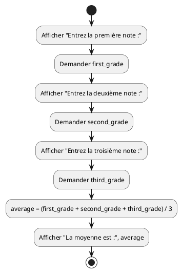
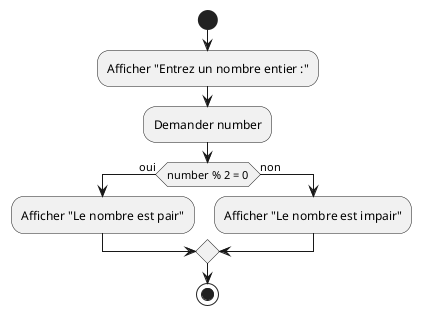
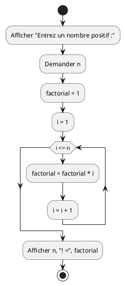
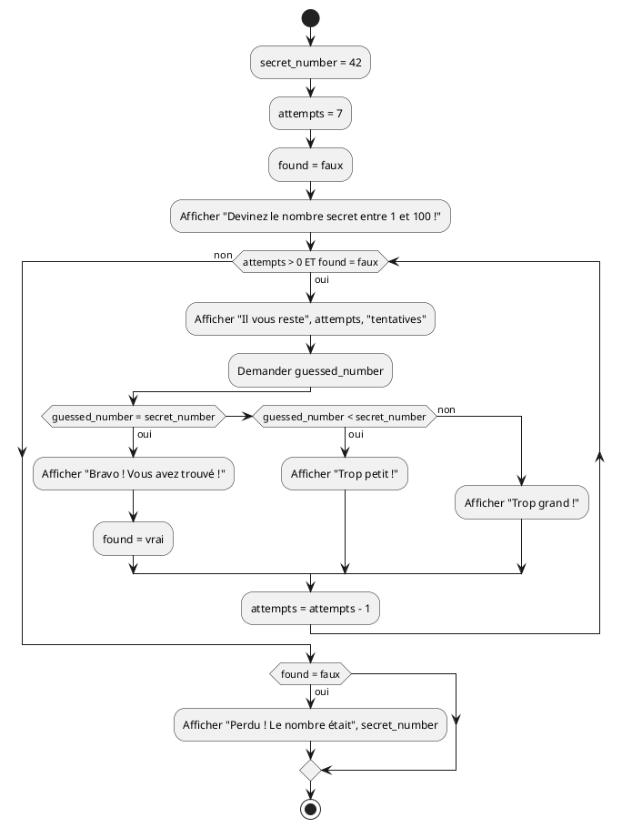
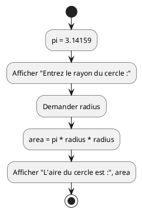
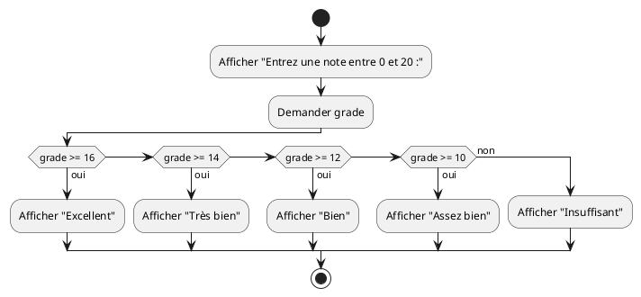
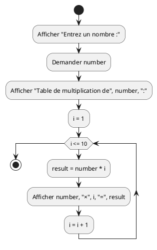
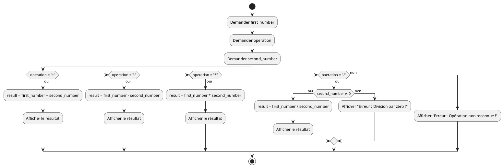
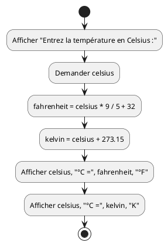
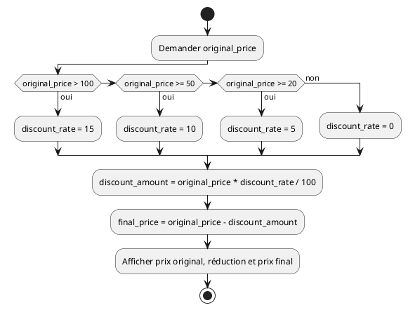

# Séquence, sélection et itération - Exercices

Cette série d'exercices est conçue pour vous permettre de valider les concepts
théoriques et pratiques vus dans le cours
_[Séquence, sélection et itération](../01-supports-de-cours/README.md)_.

## Ressources

- Supports de cours : [Lien vers le contenu](../01-supports-de-cours/README.md)
  ·
  [Presentation (web)](https://HEIG-VD-Prog-Course.github.io/HEIG-VD-ProgIM-Course/02.01-sequence-selection-iteration/01-supports-de-cours/index.html)
  ·
  [Presentation (PDF)](https://HEIG-VD-Prog-Course.github.io/HEIG-VD-ProgIM-Course/02.01-sequence-selection-iteration/01-supports-de-cours/02.01-sequence-selection-iteration-presentation.pdf)
- Exercices : [Énoncés et solutions](../02-exercices/README.md)

## Table des matières

- [Ressources](#ressources)
- [Table des matières](#table-des-matières)
- [Exercice 1 - Séquence simple : Moyenne de trois notes](#exercice-1---séquence-simple--moyenne-de-trois-notes)
  - [Énoncé](#énoncé)
  - [Consignes](#consignes)
  - [Variables à utiliser](#variables-à-utiliser)
- [Exercice 2 - Sélection : Nombre pair ou impair](#exercice-2---sélection--nombre-pair-ou-impair)
  - [Énoncé](#énoncé-1)
  - [Consignes](#consignes-1)
  - [Variables à utiliser](#variables-à-utiliser-1)
  - [Rappel](#rappel)
- [Exercice 3 - Itération : Factorielle](#exercice-3---itération--factorielle)
  - [Énoncé](#énoncé-2)
  - [Consignes](#consignes-2)
  - [Variables à utiliser](#variables-à-utiliser-2)
  - [Exemples](#exemples)
- [Exercice 4 - Combinaison : Jeu de devinette](#exercice-4---combinaison--jeu-de-devinette)
  - [Énoncé](#énoncé-3)
  - [Consignes](#consignes-3)
  - [Variables à utiliser](#variables-à-utiliser-3)
- [Exercice 5 - Séquence : Calcul d'aire](#exercice-5---séquence--calcul-daire)
  - [Énoncé](#énoncé-4)
  - [Consignes](#consignes-4)
  - [Variables à utiliser](#variables-à-utiliser-4)
- [Exercice 6 - Sélection : Système de notes](#exercice-6---sélection--système-de-notes)
  - [Énoncé](#énoncé-5)
  - [Consignes](#consignes-5)
  - [Variables à utiliser](#variables-à-utiliser-5)
- [Exercice 7 - Itération : Table de multiplication](#exercice-7---itération--table-de-multiplication)
  - [Énoncé](#énoncé-6)
  - [Consignes](#consignes-6)
  - [Variables à utiliser](#variables-à-utiliser-6)
- [Exercice 8 - Combinaison : Calculatrice simple](#exercice-8---combinaison--calculatrice-simple)
  - [Énoncé](#énoncé-7)
  - [Consignes](#consignes-7)
  - [Variables à utiliser](#variables-à-utiliser-7)
- [Exercice 9 - Séquence : Conversion de température](#exercice-9---séquence--conversion-de-température)
  - [Énoncé](#énoncé-8)
  - [Consignes](#consignes-8)
  - [Variables à utiliser](#variables-à-utiliser-8)
- [Exercice 10 - Sélection : Calcul de réduction](#exercice-10---sélection--calcul-de-réduction)
  - [Énoncé](#énoncé-9)
  - [Consignes](#consignes-9)
  - [Variables à utiliser](#variables-à-utiliser-9)

> [!TIP]
>
> Pour chaque exercice, créez d'abord le **pseudocode**, puis le **diagramme
> d'activité** avec PlantUML, et enfin vérifiez votre logique avec la solution.
>
> Utilisez l'éditeur PlantUML en ligne :
> <https://www.plantuml.com/plantuml/uml/SyfFKj2rKt3CoKnELR1Io4ZDoSa70000>

> [!NOTE]
>
> **À propos du code Java** : Le code Java fourni dans les solutions est
> **uniquement à titre de référence** pour illustrer la traduction des concepts
> en langage de programmation. À ce stade du cours, **vous n'êtes pas censées
> comprendre ou écrire du code Java**. Concentrez-vous sur le pseudocode et les
> diagrammes d'activité, qui sont les éléments essentiels à maîtriser.

## Exercice 1 - Séquence simple : Moyenne de trois notes

### Énoncé

Créer un algorithme qui demande trois notes à l'utilisatrice, calcule la moyenne
et affiche le résultat.

### Consignes

1. Demander la première note
2. Demander la deuxième note
3. Demander la troisième note
4. Calculer la moyenne (somme ÷ 3)
5. Afficher le résultat

### Variables à utiliser

- `first_grade` : première note
- `second_grade` : deuxième note
- `third_grade` : troisième note
- `average` : moyenne calculée

<details>
<summary>Afficher la solution - Pseudocode</summary>

```
DÉBUT
    Afficher "Entrez la première note :"
    Demander first_grade

    Afficher "Entrez la deuxième note :"
    Demander second_grade

    Afficher "Entrez la troisième note :"
    Demander third_grade

    average = (first_grade + second_grade + third_grade) / 3

    Afficher "La moyenne est :", average
FIN
```

</details>

<details>
<summary>Afficher la solution - Diagramme PlantUML</summary>



</details>

<details>
<summary>Afficher la solution - Code Java</summary>

```java
import java.util.Scanner;

public class MoyenneTroisNotes {
    public static void main(String[] args) {
        Scanner scanner = new Scanner(System.in);

        // Demander la première note
        System.out.print("Entrez la première note : ");
        double first_grade = scanner.nextDouble();

        // Demander la deuxième note
        System.out.print("Entrez la deuxième note : ");
        double second_grade = scanner.nextDouble();

        // Demander la troisième note
        System.out.print("Entrez la troisième note : ");
        double third_grade = scanner.nextDouble();

        // Calculer la moyenne
        double average = (first_grade + second_grade + third_grade) / 3;

        // Afficher le résultat
        System.out.println("La moyenne est : " + average);

        scanner.close();
    }
}
```

</details>

## Exercice 2 - Sélection : Nombre pair ou impair

### Énoncé

Créer un algorithme qui demande un nombre à l'utilisatrice et détermine s'il est
pair ou impair.

### Consignes

1. Demander un nombre entier à l'utilisatrice
2. Vérifier si le nombre est divisible par 2 (reste de la division = 0)
3. Afficher "Le nombre est pair" ou "Le nombre est impair"

### Variables à utiliser

- `number` : le nombre saisi par l'utilisatrice

### Rappel

Un nombre est **pair** si le reste de sa division par 2 est égal à 0. En
pseudocode, on utilise l'opérateur **modulo** noté `%` ou `MOD`.

<details>
<summary>Afficher la solution - Pseudocode</summary>

```
DÉBUT
    Afficher "Entrez un nombre entier :"
    Demander number

    SI (number % 2 = 0) ALORS
        Afficher "Le nombre est pair"
    SINON
        Afficher "Le nombre est impair"
    FIN SI
FIN
```

</details>

<details>
<summary>Afficher la solution - Diagramme PlantUML</summary>



</details>

<details>
<summary>Afficher la solution - Code Java</summary>

```java
import java.util.Scanner;

public class PairOuImpair {
    public static void main(String[] args) {
        Scanner scanner = new Scanner(System.in);

        // Demander un nombre à l'utilisatrice
        System.out.print("Entrez un nombre entier : ");
        int number = scanner.nextInt();

        // Vérifier si le nombre est pair ou impair
        if (number % 2 == 0) {
            System.out.println("Le nombre est pair");
        } else {
            System.out.println("Le nombre est impair");
        }

        scanner.close();
    }
}
```

</details>

## Exercice 3 - Itération : Factorielle

### Énoncé

Créer un algorithme qui calcule la factorielle d'un nombre n. La factorielle de
n (notée n!) est le produit de tous les nombres entiers positifs inférieurs ou
égaux à n.

### Consignes

1. Demander un nombre positif à l'utilisatrice
2. Calculer la factorielle : n! = 1 × 2 × 3 × ... × n
3. Afficher le résultat

### Variables à utiliser

- `n` : le nombre dont on veut calculer la factorielle
- `factorial` : le résultat de la factorielle
- `i` : variable de boucle

### Exemples

- 3! = 1 × 2 × 3 = 6
- 4! = 1 × 2 × 3 × 4 = 24
- 5! = 1 × 2 × 3 × 4 × 5 = 120

<details>
<summary>Afficher la solution - Pseudocode</summary>

```
DÉBUT
    Afficher "Entrez un nombre positif :"
    Demander n

    factorial = 1

    POUR i DE 1 À n FAIRE
        factorial = factorial * i
    FIN POUR

    Afficher n, "! =", factorial
FIN
```

</details>

<details>
<summary>Afficher la solution - Diagramme PlantUML</summary>



</details>

<details>
<summary>Afficher la solution - Code Java</summary>

```java
import java.util.Scanner;

public class Factorielle {
    public static void main(String[] args) {
        Scanner scanner = new Scanner(System.in);

        // Demander un nombre à l'utilisatrice
        System.out.print("Entrez un nombre positif : ");
        int n = scanner.nextInt();

        // Calculer la factorielle
        long factorial = 1;
        for (int i = 1; i <= n; i++) {
            factorial = factorial * i;
        }

        // Afficher le résultat
        System.out.println(n + "! = " + factorial);

        scanner.close();
    }
}
```

</details>

## Exercice 4 - Combinaison : Jeu de devinette

### Énoncé

Créer un jeu où l'ordinateur choisit un nombre secret entre 1 et 100, et
l'utilisatrice doit le deviner en maximum 7 tentatives.

### Consignes

1. Générer un nombre secret entre 1 et 100
2. Donner 7 tentatives maximum à l'utilisatrice
3. Pour chaque tentative :
   - Demander un nombre
   - Comparer avec le nombre secret
   - Afficher "Trop grand", "Trop petit" ou "Bravo !"
4. Afficher "Perdu !" si les 7 tentatives sont épuisées

### Variables à utiliser

- `secret_number` : le nombre secret (fixé à 42 pour cet exercice)
- `guessed_number` : le nombre proposé par l'utilisatrice
- `attempts` : nombre de tentatives restantes
- `found` : booléen indiquant si le nombre a été trouvé

<details>
<summary>Afficher la solution - Pseudocode</summary>

```
DÉBUT
    secret_number = 42
    attempts = 7
    found = faux

    Afficher "Devinez le nombre secret entre 1 et 100 !"
    Afficher "Vous avez", attempts, "tentatives."

    TANT QUE (attempts > 0 ET found = faux) FAIRE
        Afficher "Il vous reste", attempts, "tentatives."
        Afficher "Entrez votre proposition :"
        Demander guessed_number

        SI (guessed_number = secret_number) ALORS
            Afficher "Bravo ! Vous avez trouvé !"
            found = vrai
        SINON SI (guessed_number < secret_number) ALORS
            Afficher "Trop petit !"
        SINON
            Afficher "Trop grand !"
        FIN SI

        attempts = attempts - 1
    FIN TANT QUE

    SI (found = faux) ALORS
        Afficher "Perdu ! Le nombre était", secret_number
    FIN SI
FIN
```

</details>

<details>
<summary>Afficher la solution - Diagramme PlantUML</summary>



</details>

<details>
<summary>Afficher la solution - Code Java</summary>

```java
import java.util.Scanner;

public class JeuDevinette {
    public static void main(String[] args) {
        Scanner scanner = new Scanner(System.in);

        // Initialiser le jeu
        int secret_number = 42;
        int attempts = 7;
        boolean found = false;

        System.out.println("Devinez le nombre secret entre 1 et 100 !");
        System.out.println("Vous avez " + attempts + " tentatives.");

        // Boucle principale du jeu
        while (attempts > 0 && !found) {
            System.out.println("Il vous reste " + attempts + " tentatives.");
            System.out.print("Entrez votre proposition : ");
            int guessed_number = scanner.nextInt();

            // Vérifier la proposition
            if (guessed_number == secret_number) {
                System.out.println("Bravo ! Vous avez trouvé !");
                found = true;
            } else if (guessed_number < secret_number) {
                System.out.println("Trop petit !");
            } else {
                System.out.println("Trop grand !");
            }

            attempts--;
        }

        // Message de fin si pas trouvé
        if (!found) {
            System.out.println("Perdu ! Le nombre était " + secret_number);
        }

        scanner.close();
    }
}
```

</details>

## Exercice 5 - Séquence : Calcul d'aire

### Énoncé

Créer un algorithme qui calcule l'aire d'un cercle. Demander le rayon à
l'utilisatrice et afficher l'aire correspondante.

### Consignes

1. Demander le rayon du cercle
2. Calculer l'aire avec la formule : aire = π × rayon²
3. Utiliser π ≈ 3.14159
4. Afficher le résultat

### Variables à utiliser

- `radius` : rayon du cercle
- `area` : aire calculée
- `pi` : constante pi (3.14159)

<details>
<summary>Afficher la solution - Pseudocode</summary>

```
DÉBUT
    pi = 3.14159

    Afficher "Entrez le rayon du cercle :"
    Demander radius

    area = pi * radius * radius

    Afficher "L'aire du cercle est :", area
FIN
```

</details>

<details>
<summary>Afficher la solution - Diagramme PlantUML</summary>



</details>

<details>
<summary>Afficher la solution - Code Java</summary>

```java
import java.util.Scanner;

public class AireCercle {
    public static void main(String[] args) {
        Scanner scanner = new Scanner(System.in);

        // Constante pi
        final double pi = 3.14159;

        // Demander le rayon
        System.out.print("Entrez le rayon du cercle : ");
        double radius = scanner.nextDouble();

        // Calculer l'aire
        double area = pi * radius * radius;

        // Afficher le résultat
        System.out.println("L'aire du cercle est : " + area);

        scanner.close();
    }
}
```

</details>

## Exercice 6 - Sélection : Système de notes

### Énoncé

Créer un algorithme qui convertit une note numérique (0-20) en appréciation
littérale.

### Consignes

1. Demander une note entre 0 et 20
2. Afficher l'appréciation correspondante :
   - 16-20 : "Excellent"
   - 14-15.9 : "Très bien"
   - 12-13.9 : "Bien"
   - 10-11.9 : "Assez bien"
   - 0-9.9 : "Insuffisant"

### Variables à utiliser

- `grade` : la note saisie

<details>
<summary>Afficher la solution - Pseudocode</summary>

```
DÉBUT
    Afficher "Entrez une note entre 0 et 20 :"
    Demander grade

    SI (grade >= 16) ALORS
        Afficher "Excellent"
    SINON SI (grade >= 14) ALORS
        Afficher "Très bien"
    SINON SI (grade >= 12) ALORS
        Afficher "Bien"
    SINON SI (grade >= 10) ALORS
        Afficher "Assez bien"
    SINON
        Afficher "Insuffisant"
    FIN SI
FIN
```

</details>

<details>
<summary>Afficher la solution - Diagramme PlantUML</summary>



</details>

<details>
<summary>Afficher la solution - Code Java</summary>

```java
import java.util.Scanner;

public class SystemeNotes {
    public static void main(String[] args) {
        Scanner scanner = new Scanner(System.in);

        // Demander la note
        System.out.print("Entrez une note entre 0 et 20 : ");
        double grade = scanner.nextDouble();

        // Déterminer l'appréciation
        if (grade >= 16) {
            System.out.println("Excellent");
        } else if (grade >= 14) {
            System.out.println("Très bien");
        } else if (grade >= 12) {
            System.out.println("Bien");
        } else if (grade >= 10) {
            System.out.println("Assez bien");
        } else {
            System.out.println("Insuffisant");
        }

        scanner.close();
    }
}
```

</details>

## Exercice 7 - Itération : Table de multiplication

### Énoncé

Créer un algorithme qui affiche la table de multiplication d'un nombre donné (de
1 à 10).

### Consignes

1. Demander un nombre à l'utilisatrice
2. Afficher la table de multiplication de ce nombre de 1 à 10
3. Format d'affichage : "5 × 3 = 15"

### Variables à utiliser

- `number` : le nombre pour lequel afficher la table
- `i` : variable de boucle (de 1 à 10)
- `result` : résultat de la multiplication

<details>
<summary>Afficher la solution - Pseudocode</summary>

```
DÉBUT
    Afficher "Entrez un nombre :"
    Demander number

    Afficher "Table de multiplication de", number, ":"

    POUR i DE 1 À 10 FAIRE
        result = number * i
        Afficher number, "×", i, "=", result
    FIN POUR
FIN
```

</details>

<details>
<summary>Afficher la solution - Diagramme PlantUML</summary>



</details>

<details>
<summary>Afficher la solution - Code Java</summary>

```java
import java.util.Scanner;

public class TableMultiplication {
    public static void main(String[] args) {
        Scanner scanner = new Scanner(System.in);

        // Demander le nombre
        System.out.print("Entrez un nombre : ");
        int number = scanner.nextInt();

        // Afficher la table de multiplication
        System.out.println("Table de multiplication de " + number + " :");

        for (int i = 1; i <= 10; i++) {
            int result = number * i;
            System.out.println(number + " × " + i + " = " + result);
        }

        scanner.close();
    }
}
```

</details>

## Exercice 8 - Combinaison : Calculatrice simple

### Énoncé

Créer une calculatrice qui demande deux nombres et une opération, puis affiche
le résultat.

### Consignes

1. Demander le premier nombre
2. Demander l'opération (+, -, \*, /)
3. Demander le second nombre
4. Effectuer le calcul selon l'opération choisie
5. Gérer la division par zéro
6. Afficher le résultat ou un message d'erreur

### Variables à utiliser

- `first_number`, `second_number` : les deux nombres
- `operation` : l'opération choisie (+, -, \*, /)
- `result` : le résultat du calcul

<details>
<summary>Afficher la solution - Pseudocode</summary>

```
DÉBUT
    Afficher "Entrez le premier nombre :"
    Demander first_number

    Afficher "Entrez l'opération (+, -, *, /) :"
    Demander operation

    Afficher "Entrez le second nombre :"
    Demander second_number

    SI (operation = "+") ALORS
        result = first_number + second_number
        Afficher first_number, "+", second_number, "=", result
    SINON SI (operation = "-") ALORS
        result = first_number - second_number
        Afficher first_number, "-", second_number, "=", result
    SINON SI (operation = "*") ALORS
        result = first_number * second_number
        Afficher first_number, "*", second_number, "=", result
    SINON SI (operation = "/") ALORS
        SI (second_number ≠ 0) ALORS
            result = first_number / second_number
            Afficher first_number, "/", second_number, "=", result
        SINON
            Afficher "Erreur : Division par zéro !"
        FIN SI
    SINON
        Afficher "Erreur : Opération non reconnue !"
    FIN SI
FIN
```

</details>

<details>
<summary>Afficher la solution - Diagramme PlantUML</summary>



</details>

<details>
<summary>Afficher la solution - Code Java</summary>

```java
import java.util.Scanner;

public class CalculatriceSimple {
    public static void main(String[] args) {
        Scanner scanner = new Scanner(System.in);

        // Demander les données
        System.out.print("Entrez le premier nombre : ");
        double first_number = scanner.nextDouble();

        System.out.print("Entrez l'opération (+, -, *, /) : ");
        String operation = scanner.next();

        System.out.print("Entrez le second nombre : ");
        double second_number = scanner.nextDouble();

        // Effectuer le calcul
        double result = 0;
        boolean valid_operation = true;

        if (operation.equals("+")) {
            result = first_number + second_number;
        } else if (operation.equals("-")) {
            result = first_number - second_number;
        } else if (operation.equals("*")) {
            result = first_number * second_number;
        } else if (operation.equals("/")) {
            if (second_number != 0) {
                result = first_number / second_number;
            } else {
                System.out.println("Erreur : Division par zéro !");
                valid_operation = false;
            }
        } else {
            System.out.println("Erreur : Opération non reconnue !");
            valid_operation = false;
        }

        // Afficher le résultat
        if (valid_operation && !operation.equals("/") || (operation.equals("/") && second_number != 0)) {
            System.out.println(first_number + " " + operation + " " + second_number + " = " + result);
        }

        scanner.close();
    }
}
```

</details>

## Exercice 9 - Séquence : Conversion de température

### Énoncé

Créer un algorithme qui convertit une température de Celsius vers Fahrenheit et
Kelvin.

### Consignes

1. Demander une température en Celsius
2. Convertir en Fahrenheit : F = C × 9/5 + 32
3. Convertir en Kelvin : K = C + 273.15
4. Afficher les trois températures

### Variables à utiliser

- `celsius` : température en Celsius
- `fahrenheit` : température en Fahrenheit
- `kelvin` : température en Kelvin

<details>
<summary>Afficher la solution - Pseudocode</summary>

```
DÉBUT
    Afficher "Entrez la température en Celsius :"
    Demander celsius

    fahrenheit = celsius * 9 / 5 + 32
    kelvin = celsius + 273.15

    Afficher celsius, "°C =", fahrenheit, "°F"
    Afficher celsius, "°C =", kelvin, "K"
FIN
```

</details>

<details>
<summary>Afficher la solution - Diagramme PlantUML</summary>



</details>

<details>
<summary>Afficher la solution - Code Java</summary>

```java
import java.util.Scanner;

public class ConversionTemperature {
    public static void main(String[] args) {
        Scanner scanner = new Scanner(System.in);

        // Demander la température en Celsius
        System.out.print("Entrez la température en Celsius : ");
        double celsius = scanner.nextDouble();

        // Convertir en Fahrenheit et Kelvin
        double fahrenheit = celsius * 9.0 / 5.0 + 32;
        double kelvin = celsius + 273.15;

        // Afficher les résultats
        System.out.println(celsius + "°C = " + fahrenheit + "°F");
        System.out.println(celsius + "°C = " + kelvin + "K");

        scanner.close();
    }
}
```

</details>

## Exercice 10 - Sélection : Calcul de réduction

### Énoncé

Créer un algorithme qui calcule le prix final d'un article après application
d'une réduction selon le montant d'achat.

### Consignes

1. Demander le prix de l'article
2. Appliquer la réduction selon le barème :
   - Plus de 100€ : 15% de réduction
   - Entre 50€ et 100€ : 10% de réduction
   - Entre 20€ et 49.99€ : 5% de réduction
   - Moins de 20€ : aucune réduction
3. Afficher le prix original, la réduction et le prix final

### Variables à utiliser

- `original_price` : prix original
- `discount_rate` : taux de réduction (en %)
- `discount_amount` : montant de la réduction
- `final_price` : prix final après réduction

<details>
<summary>Afficher la solution - Pseudocode</summary>

```
DÉBUT
    Afficher "Entrez le prix de l'article :"
    Demander original_price

    SI (original_price > 100) ALORS
        discount_rate = 15
    SINON SI (original_price >= 50) ALORS
        discount_rate = 10
    SINON SI (original_price >= 20) ALORS
        discount_rate = 5
    SINON
        discount_rate = 0
    FIN SI

    discount_amount = original_price * discount_rate / 100
    final_price = original_price - discount_amount

    Afficher "Prix original :", original_price, "€"
    Afficher "Réduction (", discount_rate, "%) :", discount_amount, "€"
    Afficher "Prix final :", final_price, "€"
FIN
```

</details>

<details>
<summary>Afficher la solution - Diagramme PlantUML</summary>



</details>

<details>
<summary>Afficher la solution - Code Java</summary>

```java
import java.util.Scanner;

public class CalculReduction {
    public static void main(String[] args) {
        Scanner scanner = new Scanner(System.in);

        // Demander le prix original
        System.out.print("Entrez le prix de l'article : ");
        double original_price = scanner.nextDouble();

        // Déterminer le taux de réduction
        int discount_rate;
        if (original_price > 100) {
            discount_rate = 15;
        } else if (original_price >= 50) {
            discount_rate = 10;
        } else if (original_price >= 20) {
            discount_rate = 5;
        } else {
            discount_rate = 0;
        }

        // Calculer la réduction et le prix final
        double discount_amount = original_price * discount_rate / 100.0;
        double final_price = original_price - discount_amount;

        // Afficher les résultats
        System.out.println("Prix original : " + original_price + "€");
        System.out.println("Réduction (" + discount_rate + "%) : " + discount_amount + "€");
        System.out.println("Prix final : " + final_price + "€");

        scanner.close();
    }
}
```

</details>
