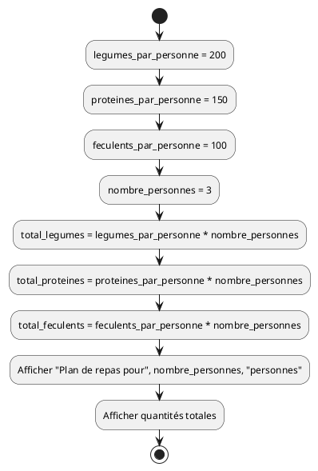
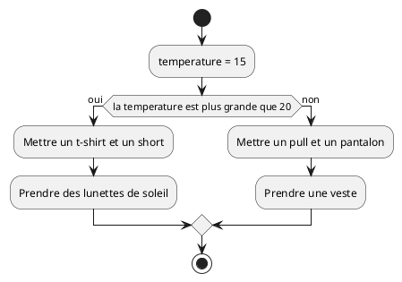
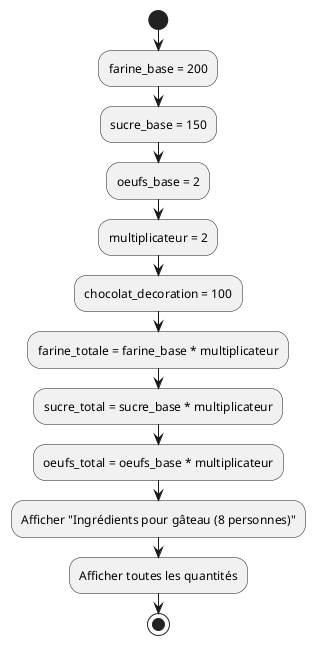
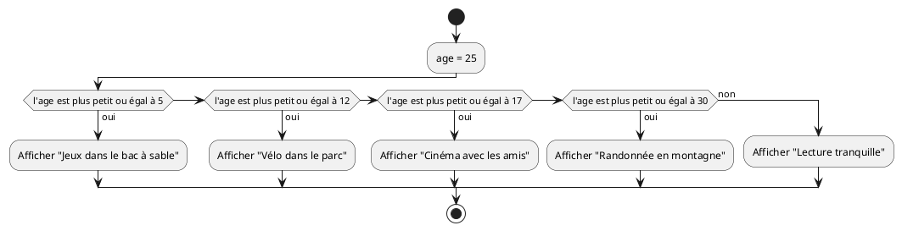
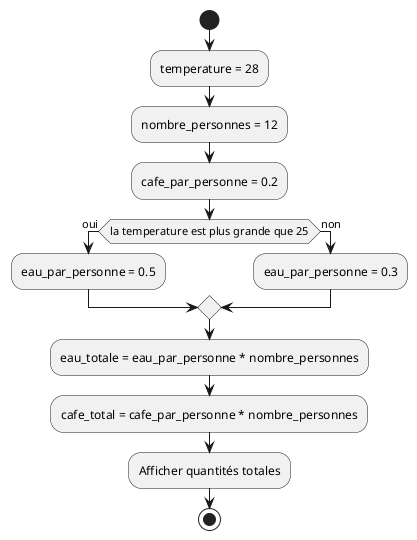
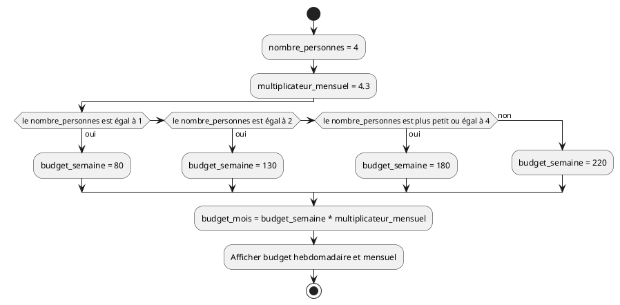
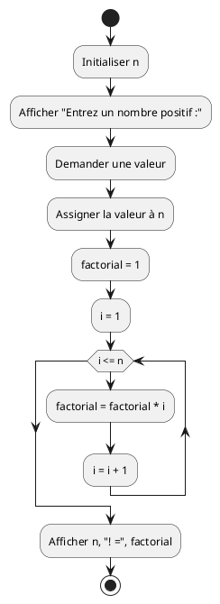
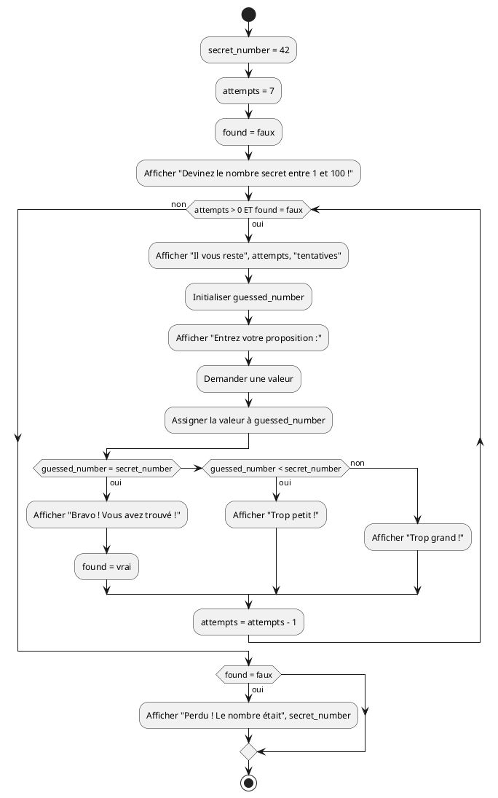
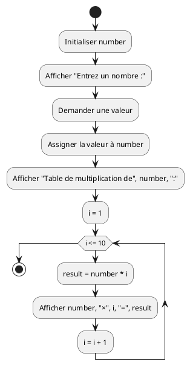
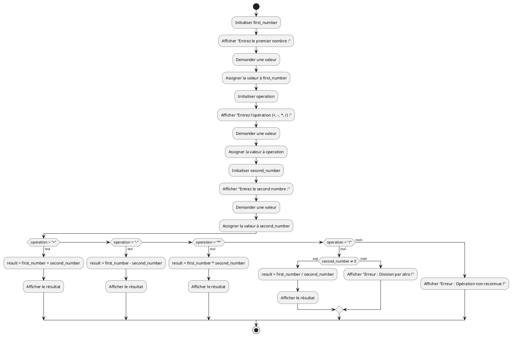

# Séquence, sélection et itération - Exercices

Cette série d'exercices est conçue pour vous permettre de valider les concepts
théoriques et pratiques vus dans le cours
_[Séquence, sélection et itération](../01-supports-de-cours/README.md)_.

## Ressources

- Supports de cours : [Lien vers le contenu](../01-supports-de-cours/README.md)
  ·
  [Presentation (web)](https://HEIG-VD-Prog-Course.github.io/HEIG-VD-ProgIM-Course/02.01-sequence-selection-iteration/01-supports-de-cours/index.html)
  ·
  [Presentation (PDF)](https://HEIG-VD-Prog-Course.github.io/HEIG-VD-ProgIM-Course/02.01-sequence-selection-iteration/01-supports-de-cours/02.01-sequence-selection-iteration-presentation.pdf)
- Exercices : [Énoncés et solutions](../02-exercices/README.md)

## Table des matières

- [Ressources](#ressources)
- [Table des matières](#table-des-matières)
- [Exercice 1 - Séquence simple : Planifier un repas équilibré](#exercice-1---séquence-simple--planifier-un-repas-équilibré)
  - [Énoncé](#énoncé)
  - [Consignes](#consignes)
  - [Variables à utiliser](#variables-à-utiliser)
- [Exercice 2 - Sélection : Choisir ses vêtements selon la température](#exercice-2---sélection--choisir-ses-vêtements-selon-la-température)
  - [Énoncé](#énoncé-1)
  - [Consignes](#consignes-1)
  - [Variables à utiliser](#variables-à-utiliser-1)
  - [Rappel](#rappel)
- [Exercice 3 - Séquence : Préparer un gâteau pour une fête](#exercice-3---séquence--préparer-un-gâteau-pour-une-fête)
  - [Énoncé](#énoncé-2)
  - [Consignes](#consignes-2)
  - [Variables à utiliser](#variables-à-utiliser-2)
- [Exercice 4 - Sélection : Choisir une activité selon l'âge](#exercice-4---sélection--choisir-une-activité-selon-lâge)
  - [Énoncé](#énoncé-3)
  - [Consignes](#consignes-3)
  - [Variables à utiliser](#variables-à-utiliser-3)
- [Exercice 5 - Séquence : Préparer des boissons pour une réunion](#exercice-5---séquence--préparer-des-boissons-pour-une-réunion)
  - [Énoncé](#énoncé-4)
  - [Consignes](#consignes-4)
  - [Variables à utiliser](#variables-à-utiliser-4)
- [Exercice 6 - Sélection : Calculer le budget courses familiales](#exercice-6---sélection--calculer-le-budget-courses-familiales)
  - [Énoncé](#énoncé-5)
  - [Consignes](#consignes-5)
  - [Variables à utiliser](#variables-à-utiliser-5)
- [Pour aller plus loin](#pour-aller-plus-loin)
- [Exercice 7 - Itération : Factorielle](#exercice-7---itération--factorielle)
  - [Énoncé](#énoncé-6)
  - [Consignes](#consignes-6)
  - [Variables à utiliser](#variables-à-utiliser-6)
  - [Exemples](#exemples)
- [Exercice 8 - Combinaison : Jeu de devinette](#exercice-8---combinaison--jeu-de-devinette)
  - [Énoncé](#énoncé-7)
  - [Consignes](#consignes-7)
  - [Variables à utiliser](#variables-à-utiliser-7)
- [Exercice 9 - Itération : Table de multiplication](#exercice-9---itération--table-de-multiplication)
  - [Énoncé](#énoncé-8)
  - [Consignes](#consignes-8)
  - [Variables à utiliser](#variables-à-utiliser-8)
- [Exercice 10 - Combinaison : Calculatrice simple](#exercice-10---combinaison--calculatrice-simple)
  - [Énoncé](#énoncé-9)
  - [Consignes](#consignes-9)
  - [Variables à utiliser](#variables-à-utiliser-9)

> [!TIP]
>
> Pour chaque exercice, créez d'abord le **pseudocode**, puis le **diagramme
> d'activité** avec PlantUML, et enfin vérifiez votre logique avec la solution.
>
> **À propos du pseudocode** : Le pseudocode est un outil pour structurer vos
> idées et organiser votre réflexion. Vous pouvez l'écrire à la main sur papier,
> dans un bloc-notes, dans n'importe quelle application de texte, ou même
> mentalement. L'important est qu'il vous aide à clarifier la logique de votre
> algorithme avant de passer à l'implémentation.
>
> **À propos de PlantUML** : Utilisez l'éditeur PlantUML en ligne :
> <https://plantuml.nortalle.ch>

> [!IMPORTANT]
>
> **Approche pédagogique** : Ces exercices utilisent des **exemples de la vie
> quotidienne** plutôt que des problèmes de programmation classiques. L'objectif
> est de vous faire comprendre les concepts fondamentaux (séquence, sélection,
> itération) à travers des situations familières avant d'aborder la
> programmation pure.
>
> **À propos du code Java** : Le code Java fourni dans les solutions est
> **uniquement à titre de référence** pour illustrer la traduction des concepts
> en langage de programmation. À ce stade du cours, **vous n'êtes pas censées
> comprendre ou écrire du code Java**. Concentrez-vous sur le pseudocode et les
> diagrammes d'activité, qui sont les éléments essentiels à maîtriser.

## Exercice 1 - Séquence simple : Planifier un repas équilibré

### Énoncé

Créer un algorithme qui planifie un repas équilibré en calculant les portions
moyennes pour 3 personnes.

### Consignes

1. Définir la quantité de légumes nécessaire (200g par personne)
2. Définir la quantité de protéines nécessaire (150g par personne)
3. Définir la quantité de féculents nécessaire (100g par personne)
4. Calculer les quantités totales pour 3 personnes
5. Afficher le plan de repas

### Variables à utiliser

- `legumes_par_personne` : quantité de légumes par personne (200g)
- `proteines_par_personne` : quantité de protéines par personne (150g)
- `feculents_par_personne` : quantité de féculents par personne (100g)
- `nombre_personnes` : nombre de convives (3)

<details>
<summary>Afficher la solution - Pseudocode</summary>

```text
DÉBUT
    legumes_par_personne = 200
    proteines_par_personne = 150
    feculents_par_personne = 100
    nombre_personnes = 3

    total_legumes = legumes_par_personne * nombre_personnes
    total_proteines = proteines_par_personne * nombre_personnes
    total_feculents = feculents_par_personne * nombre_personnes

    Afficher "Plan de repas pour", nombre_personnes, "personnes :"
    Afficher "Légumes :", total_legumes, "g"
    Afficher "Protéines :", total_proteines, "g"
    Afficher "Féculents :", total_feculents, "g"
FIN
```

</details>

<details>
<summary>Afficher la solution - Diagramme PlantUML</summary>



</details>

<details>
<summary>Afficher la solution - Code Java</summary>

```java
public class PlanifierRepas {
    public static void main(String[] args) {
        // Définir les quantités par personne
        int legumes_par_personne = 200;  // grammes
        int proteines_par_personne = 150; // grammes
        int feculents_par_personne = 100; // grammes
        int nombre_personnes = 3;

        // Calculer les quantités totales
        int total_legumes = legumes_par_personne * nombre_personnes;
        int total_proteines = proteines_par_personne * nombre_personnes;
        int total_feculents = feculents_par_personne * nombre_personnes;

        // Afficher le plan de repas
        System.out.println("Plan de repas pour " + nombre_personnes + " personnes :");
        System.out.println("Légumes : " + total_legumes + "g");
        System.out.println("Protéines : " + total_proteines + "g");
        System.out.println("Féculents : " + total_feculents + "g");
    }
}
```

</details>

## Exercice 2 - Sélection : Choisir ses vêtements selon la température

### Énoncé

Créer un algorithme qui choisit les vêtements appropriés selon la température
extérieure.

### Consignes

1. Définir la température actuelle (15 degrés)
2. Vérifier si la température est chaude (plus de 20°) ou froide
3. Afficher les vêtements recommandés

### Variables à utiliser

- `temperature` : la température extérieure (15 degrés)

### Rappel

Pour une bonne lisibilité, utilisez des conditions naturelles comme "SI la
température est plus grande que 20 ALORS" plutôt que des symboles mathématiques.

<details>
<summary>Afficher la solution - Pseudocode</summary>

```text
DÉBUT
    temperature = 15

    SI la temperature est plus grande que 20 ALORS
        Afficher "Mettre un t-shirt et un short"
        Afficher "Prendre des lunettes de soleil"
    SINON
        Afficher "Mettre un pull et un pantalon"
        Afficher "Prendre une veste"
    FIN SI
FIN
```

</details>

<details>
<summary>Afficher la solution - Diagramme PlantUML</summary>



</details>

<details>
<summary>Afficher la solution - Code Java</summary>

```java
public class ChoisirVetements {
    public static void main(String[] args) {
        // Définir la température actuelle
        int temperature = 15;

        // Choisir les vêtements selon la température
        if (temperature > 20) {
            System.out.println("Mettre un t-shirt et un short");
            System.out.println("Prendre des lunettes de soleil");
        } else {
            System.out.println("Mettre un pull et un pantalon");
            System.out.println("Prendre une veste");
        }
    }
}
```

</details>

## Exercice 3 - Séquence : Préparer un gâteau pour une fête

### Énoncé

Créer un algorithme qui calcule les ingrédients nécessaires pour un gâteau au
chocolat pour 8 personnes.

### Consignes

1. Définir les ingrédients de base pour 4 personnes
2. Calculer les quantités pour 8 personnes (multiplier par 2)
3. Ajouter la décoration (100g de chocolat fondu)
4. Afficher la liste complète des ingrédients

### Variables à utiliser

- `farine_base` : farine pour 4 personnes (200g)
- `sucre_base` : sucre pour 4 personnes (150g)
- `oeufs_base` : œufs pour 4 personnes (2)
- `multiplicateur` : facteur pour ajuster les quantités (2)

> [!TIP]
>
> **Bonnes pratiques - Constantes** : Il est recommandé d'initialiser et
> d'assigner les constantes (comme `pi`) au début du programme. Ainsi, si vous
> voulez modifier la précision ou la valeur plus tard, vous n'avez qu'un seul
> endroit à changer dans tout le code.

<details>
<summary>Afficher la solution - Pseudocode</summary>

```text
DÉBUT
    farine_base = 200
    sucre_base = 150
    oeufs_base = 2
    multiplicateur = 2
    chocolat_decoration = 100

    farine_totale = farine_base * multiplicateur
    sucre_total = sucre_base * multiplicateur
    oeufs_total = oeufs_base * multiplicateur

    Afficher "Ingrédients pour gâteau au chocolat (8 personnes) :"
    Afficher "Farine :", farine_totale, "g"
    Afficher "Sucre :", sucre_total, "g"
    Afficher "Œufs :", oeufs_total
    Afficher "Chocolat pour décoration :", chocolat_decoration, "g"
FIN
```

</details>

<details>
<summary>Afficher la solution - Diagramme PlantUML</summary>



</details>

<details>
<summary>Afficher la solution - Code Java</summary>

```java
public class PreparerGateau {
    public static void main(String[] args) {
        // Ingrédients de base pour 4 personnes
        int farine_base = 200;  // grammes
        int sucre_base = 150;   // grammes
        int oeufs_base = 2;
        int multiplicateur = 2; // pour passer de 4 à 8 personnes
        int chocolat_decoration = 100; // grammes

        // Calculer les quantités pour 8 personnes
        int farine_totale = farine_base * multiplicateur;
        int sucre_total = sucre_base * multiplicateur;
        int oeufs_total = oeufs_base * multiplicateur;

        // Afficher la liste des ingrédients
        System.out.println("Ingrédients pour gâteau au chocolat (8 personnes) :");
        System.out.println("Farine : " + farine_totale + "g");
        System.out.println("Sucre : " + sucre_total + "g");
        System.out.println("Œufs : " + oeufs_total);
        System.out.println("Chocolat pour décoration : " + chocolat_decoration + "g");
    }
}
```

</details>

## Exercice 4 - Sélection : Choisir une activité selon l'âge

### Énoncé

Créer un algorithme qui recommande une activité de loisir selon l'âge d'une
personne.

### Consignes

1. Définir l'âge de la personne (25 ans)
2. Recommander une activité selon l'âge :
   - 0-5 ans : "Jeux dans le bac à sable"
   - 6-12 ans : "Vélo dans le parc"
   - 13-17 ans : "Cinéma avec les amis"
   - 18-30 ans : "Randonnée en montagne"
   - Plus de 30 ans : "Lecture tranquille"

### Variables à utiliser

- `age` : l'âge de la personne (25 ans)

> [!TIP]
>
> **Bonnes pratiques - Validation des entrées** : Dans un vrai programme, il
> serait judicieux de vérifier que la note saisie est bien entre 0 et 20. Cela
> peut sembler redondant d'avoir des boucles et des if/else imbriqués, mais nous
> verrons plus tard dans le semestre comment les **fonctions** nous aident à
> organiser et structurer ce type de code de validation.

<details>
<summary>Afficher la solution - Pseudocode</summary>

```text
DÉBUT
    age = 25

    SI l'age est plus petit ou égal à 5 ALORS
        Afficher "Jeux dans le bac à sable"
    SINON SI l'age est plus petit ou égal à 12 ALORS
        Afficher "Vélo dans le parc"
    SINON SI l'age est plus petit ou égal à 17 ALORS
        Afficher "Cinéma avec les amis"
    SINON SI l'age est plus petit ou égal à 30 ALORS
        Afficher "Randonnée en montagne"
    SINON
        Afficher "Lecture tranquille"
    FIN SI
FIN
```

> [!TIP]
>
> **Structures imbriquées** : Les if/else imbriqués sont comme des poupées
> russes - chaque structure s'imbrique dans la précédente. **Important** :
> n'oubliez jamais de fermer chaque structure avec son `FIN SI`, `FIN POUR`,
> `FIN TANT QUE`, etc. Chaque ouverture doit avoir sa fermeture correspondante !

</details>

<details>
<summary>Afficher la solution - Diagramme PlantUML</summary>



</details>

<details>
<summary>Afficher la solution - Code Java</summary>

```java
public class ChoisirActivite {
    public static void main(String[] args) {
        // Définir l'âge de la personne
        int age = 25;

        // Recommander une activité selon l'âge
        if (age <= 5) {
            System.out.println("Jeux dans le bac à sable");
        } else if (age <= 12) {
            System.out.println("Vélo dans le parc");
        } else if (age <= 17) {
            System.out.println("Cinéma avec les amis");
        } else if (age <= 30) {
            System.out.println("Randonnée en montagne");
        } else {
            System.out.println("Lecture tranquille");
        }
    }
}
```

</details>

## Exercice 5 - Séquence : Préparer des boissons pour une réunion

### Énoncé

Créer un algorithme qui calcule les quantités de boissons nécessaires pour une
réunion de 12 personnes.

### Consignes

1. Définir la température extérieure (28 degrés)
2. Calculer la quantité d'eau : 0.5L par personne quand il fait chaud, 0.3L
   sinon
3. Calculer la quantité de café : 0.2L par personne
4. Afficher les quantités totales nécessaires

### Variables à utiliser

- `temperature` : température extérieure (28 degrés)
- `nombre_personnes` : nombre de participants (12)
- `eau_par_personne` : quantité d'eau par personne
- `cafe_par_personne` : quantité de café par personne (0.2L)

<details>
<summary>Afficher la solution - Pseudocode</summary>

```text
DÉBUT
    temperature = 28
    nombre_personnes = 12
    cafe_par_personne = 0.2

    SI la temperature est plus grande que 25 ALORS
        eau_par_personne = 0.5
    SINON
        eau_par_personne = 0.3
    FIN SI

    eau_totale = eau_par_personne * nombre_personnes
    cafe_total = cafe_par_personne * nombre_personnes

    Afficher "Boissons nécessaires pour", nombre_personnes, "personnes :"
    Afficher "Eau :", eau_totale, "L"
    Afficher "Café :", cafe_total, "L"
FIN
```

</details>

<details>
<summary>Afficher la solution - Diagramme PlantUML</summary>



</details>

<details>
<summary>Afficher la solution - Code Java</summary>

```java
public class PreparerBoissons {
    public static void main(String[] args) {
        // Définir les paramètres
        int temperature = 28; // degrés
        int nombre_personnes = 12;
        double cafe_par_personne = 0.2; // litres
        double eau_par_personne;

        // Ajuster la quantité d'eau selon la température
        if (temperature > 25) {
            eau_par_personne = 0.5; // plus d'eau quand il fait chaud
        } else {
            eau_par_personne = 0.3;
        }

        // Calculer les quantités totales
        double eau_totale = eau_par_personne * nombre_personnes;
        double cafe_total = cafe_par_personne * nombre_personnes;

        // Afficher les résultats
        System.out.println("Boissons nécessaires pour " + nombre_personnes + " personnes :");
        System.out.println("Eau : " + eau_totale + "L");
        System.out.println("Café : " + cafe_total + "L");
    }
}
```

</details>

## Exercice 6 - Sélection : Calculer le budget courses familiales

### Énoncé

Créer un algorithme qui calcule le budget courses d'une famille selon le nombre
de personnes dans le foyer.

### Consignes

1. Définir le nombre de personnes dans la famille (4 personnes)
2. Calculer le budget selon la taille du foyer :
   - 1 personne : 80€ par semaine
   - 2 personnes : 130€ par semaine
   - 3-4 personnes : 180€ par semaine
   - Plus de 4 personnes : 220€ par semaine
3. Calculer le budget mensuel (multiplier par 4.3)
4. Afficher le budget hebdomadaire et mensuel

### Variables à utiliser

- `nombre_personnes` : nombre de personnes dans la famille (4)
- `budget_semaine` : budget hebdomadaire
- `budget_mois` : budget mensuel
- `multiplicateur_mensuel` : coefficient pour passer de semaine à mois (4.3)

<details>
<summary>Afficher la solution - Pseudocode</summary>

```text
DÉBUT
    nombre_personnes = 4
    multiplicateur_mensuel = 4.3

    SI le nombre_personnes est égal à 1 ALORS
        budget_semaine = 80
    SINON SI le nombre_personnes est égal à 2 ALORS
        budget_semaine = 130
    SINON SI le nombre_personnes est plus petit ou égal à 4 ALORS
        budget_semaine = 180
    SINON
        budget_semaine = 220
    FIN SI

    budget_mois = budget_semaine * multiplicateur_mensuel

    Afficher "Budget courses pour", nombre_personnes, "personnes :"
    Afficher "Hebdomadaire :", budget_semaine, "€"
    Afficher "Mensuel :", budget_mois, "€"
FIN
```

</details>

<details>
<summary>Afficher la solution - Diagramme PlantUML</summary>



</details>

<details>
<summary>Afficher la solution - Code Java</summary>

```java
public class BudgetCourses {
    public static void main(String[] args) {
        // Définir les paramètres
        int nombre_personnes = 4;
        double multiplicateur_mensuel = 4.3;
        int budget_semaine;

        // Déterminer le budget selon la taille du foyer
        if (nombre_personnes == 1) {
            budget_semaine = 80;
        } else if (nombre_personnes == 2) {
            budget_semaine = 130;
        } else if (nombre_personnes <= 4) {
            budget_semaine = 180;
        } else {
            budget_semaine = 220;
        }

        // Calculer le budget mensuel
        double budget_mois = budget_semaine * multiplicateur_mensuel;

        // Afficher les résultats
        System.out.println("Budget courses pour " + nombre_personnes + " personnes :");
        System.out.println("Hebdomadaire : " + budget_semaine + "€");
        System.out.println("Mensuel : " + (int)budget_mois + "€");
    }
}
```

</details>

## Pour aller plus loin

Cette section contient des exercices plus avancés sur l'**itération** et la
**combinaison** de concepts qui seront vus la semaine prochaine. Ces exercices
sont optionnels pour cette semaine.

## Exercice 7 - Itération : Factorielle

### Énoncé

Créer un algorithme qui calcule la factorielle d'un nombre n. La factorielle de
n (notée n!) est le produit de tous les nombres entiers positifs inférieurs ou
égaux à n.

### Consignes

1. Demander un nombre positif à l'utilisatrice
2. Calculer la factorielle : n! = 1 × 2 × 3 × ... × n
3. Afficher le résultat

### Variables à utiliser

- `n` : le nombre dont on veut calculer la factorielle
- `factorial` : le résultat de la factorielle
- `i` : variable de boucle

### Exemples

- 3! = 1 × 2 × 3 = 6
- 4! = 1 × 2 × 3 × 4 = 24
- 5! = 1 × 2 × 3 × 4 × 5 = 120

<details>
<summary>Afficher la solution - Pseudocode</summary>

```text
DÉBUT
    Initialiser n
    Afficher "Entrez un nombre positif :"
    Demander une valeur
    Assigner la valeur à n

    factorial = 1

    POUR i DE 1 À n FAIRE
        factorial = factorial * i
    FIN POUR

    Afficher n, "! =", factorial
FIN
```

</details>

<details>
<summary>Afficher la solution - Diagramme PlantUML</summary>



</details>

<details>
<summary>Afficher la solution - Code Java</summary>

```java
import java.util.Scanner;

public class Factorielle {
    public static void main(String[] args) {
        Scanner scanner = new Scanner(System.in);

        // Demander un nombre à l'utilisatrice
        System.out.print("Entrez un nombre positif : ");
        int n = scanner.nextInt();

        // Calculer la factorielle
        long factorial = 1;
        for (int i = 1; i <= n; i++) {
            factorial = factorial * i;
        }

        // Afficher le résultat
        System.out.println(n + "! = " + factorial);

        scanner.close();
    }
}
```

</details>

## Exercice 8 - Combinaison : Jeu de devinette

### Énoncé

Créer un jeu où l'ordinateur choisit un nombre secret entre 1 et 100, et
l'utilisatrice doit le deviner en maximum 7 tentatives.

### Consignes

1. Générer un nombre secret entre 1 et 100
2. Donner 7 tentatives maximum à l'utilisatrice
3. Pour chaque tentative :
   - Demander un nombre
   - Comparer avec le nombre secret
   - Afficher "Trop grand", "Trop petit" ou "Bravo !"
4. Afficher "Perdu !" si les 7 tentatives sont épuisées

### Variables à utiliser

- `secret_number` : le nombre secret (fixé à 42 pour cet exercice)
- `guessed_number` : le nombre proposé par l'utilisatrice
- `attempts` : nombre de tentatives restantes
- `found` : booléen indiquant si le nombre a été trouvé

<details>
<summary>Afficher la solution - Pseudocode</summary>

```text
DÉBUT
    secret_number = 42
    attempts = 7
    found = faux

    Afficher "Devinez le nombre secret entre 1 et 100 !"
    Afficher "Vous avez", attempts, "tentatives."

    TANT QUE (attempts > 0 ET found = faux) FAIRE
        Afficher "Il vous reste", attempts, "tentatives."
        Initialiser guessed_number
        Afficher "Entrez votre proposition :"
        Demander une valeur
        Assigner la valeur à guessed_number

        SI (guessed_number = secret_number) ALORS
            Afficher "Bravo ! Vous avez trouvé !"
            found = vrai
        SINON SI (guessed_number < secret_number) ALORS
            Afficher "Trop petit !"
        SINON
            Afficher "Trop grand !"
        FIN SI

        attempts = attempts - 1
    FIN TANT QUE

> [!TIP]
>
> **Poupées russes** : Cet exercice combine une boucle `TANT QUE` avec des
> `SI/SINON` imbriqués à l'intérieur. Comme des poupées russes, chaque
> structure doit être correctement fermée : le `FIN SI` ferme la structure
> conditionnelle, et le `FIN TANT QUE` ferme la boucle. Vérifiez toujours que
> vous avez le bon nombre de fermetures !

    SI (found = faux) ALORS
        Afficher "Perdu ! Le nombre était", secret_number
    FIN SI
FIN
```

</details>

<details>
<summary>Afficher la solution - Diagramme PlantUML</summary>



</details>

<details>
<summary>Afficher la solution - Code Java</summary>

```java
import java.util.Scanner;

public class JeuDevinette {
    public static void main(String[] args) {
        Scanner scanner = new Scanner(System.in);

        // Initialiser le jeu
        int secret_number = 42;
        int attempts = 7;
        boolean found = false;

        System.out.println("Devinez le nombre secret entre 1 et 100 !");
        System.out.println("Vous avez " + attempts + " tentatives.");

        // Boucle principale du jeu
        while (attempts > 0 && !found) {
            System.out.println("Il vous reste " + attempts + " tentatives.");
            System.out.print("Entrez votre proposition : ");
            int guessed_number = scanner.nextInt();

            // Vérifier la proposition
            if (guessed_number == secret_number) {
                System.out.println("Bravo ! Vous avez trouvé !");
                found = true;
            } else if (guessed_number < secret_number) {
                System.out.println("Trop petit !");
            } else {
                System.out.println("Trop grand !");
            }

            attempts--;
        }

        // Message de fin si pas trouvé
        if (!found) {
            System.out.println("Perdu ! Le nombre était " + secret_number);
        }

        scanner.close();
    }
}
```

</details>

## Exercice 9 - Itération : Table de multiplication

### Énoncé

Créer un algorithme qui affiche la table de multiplication d'un nombre donné (de
1 à 10).

### Consignes

1. Demander un nombre à l'utilisatrice
2. Afficher la table de multiplication de ce nombre de 1 à 10
3. Format d'affichage : "5 × 3 = 15"

### Variables à utiliser

- `number` : le nombre pour lequel afficher la table
- `i` : variable de boucle (de 1 à 10)
- `result` : résultat de la multiplication

<details>
<summary>Afficher la solution - Pseudocode</summary>

```text
DÉBUT
    Initialiser number
    Afficher "Entrez un nombre :"
    Demander une valeur
    Assigner la valeur à number

    Afficher "Table de multiplication de", number, ":"

    POUR i DE 1 À 10 FAIRE
        result = number * i
        Afficher number, "×", i, "=", result
    FIN POUR
FIN
```

</details>

<details>
<summary>Afficher la solution - Diagramme PlantUML</summary>



</details>

<details>
<summary>Afficher la solution - Code Java</summary>

```java
import java.util.Scanner;

public class TableMultiplication {
    public static void main(String[] args) {
        Scanner scanner = new Scanner(System.in);

        // Demander le nombre
        System.out.print("Entrez un nombre : ");
        int number = scanner.nextInt();

        // Afficher la table de multiplication
        System.out.println("Table de multiplication de " + number + " :");

        for (int i = 1; i <= 10; i++) {
            int result = number * i;
            System.out.println(number + " × " + i + " = " + result);
        }

        scanner.close();
    }
}
```

</details>

## Exercice 10 - Combinaison : Calculatrice simple

### Énoncé

Créer une calculatrice qui demande deux nombres et une opération, puis affiche
le résultat.

### Consignes

1. Demander le premier nombre
2. Demander l'opération (+, -, \*, /)
3. Demander le second nombre
4. Effectuer le calcul selon l'opération choisie
5. Gérer la division par zéro
6. Afficher le résultat ou un message d'erreur

### Variables à utiliser

- `first_number`, `second_number` : les deux nombres
- `operation` : l'opération choisie (+, -, \*, /)
- `result` : le résultat du calcul

<details>
<summary>Afficher la solution - Pseudocode</summary>

```text
DÉBUT
    Initialiser first_number
    Afficher "Entrez le premier nombre :"
    Demander une valeur
    Assigner la valeur à first_number

    Initialiser operation
    Afficher "Entrez l'opération (+, -, *, /) :"
    Demander une valeur
    Assigner la valeur à operation

    Initialiser second_number
    Afficher "Entrez le second nombre :"
    Demander une valeur
    Assigner la valeur à second_number

    SI (operation = "+") ALORS
        result = first_number + second_number
        Afficher first_number, "+", second_number, "=", result
    SINON SI (operation = "-") ALORS
        result = first_number - second_number
        Afficher first_number, "-", second_number, "=", result
    SINON SI (operation = "*") ALORS
        result = first_number * second_number
        Afficher first_number, "*", second_number, "=", result
    SINON SI (operation = "/") ALORS
        SI (second_number ≠ 0) ALORS
            result = first_number / second_number
            Afficher first_number, "/", second_number, "=", result
        SINON
            Afficher "Erreur : Division par zéro !"
        FIN SI
    SINON
        Afficher "Erreur : Opération non reconnue !"
    FIN SI
FIN
```

</details>

<details>
<summary>Afficher la solution - Diagramme PlantUML</summary>



</details>

<details>
<summary>Afficher la solution - Code Java</summary>

```java
import java.util.Scanner;

public class CalculatriceSimple {
    public static void main(String[] args) {
        Scanner scanner = new Scanner(System.in);

        // Demander les données
        System.out.print("Entrez le premier nombre : ");
        double first_number = scanner.nextDouble();

        System.out.print("Entrez l'opération (+, -, *, /) : ");
        String operation = scanner.next();

        System.out.print("Entrez le second nombre : ");
        double second_number = scanner.nextDouble();

        // Effectuer le calcul
        double result = 0;
        boolean valid_operation = true;

        if (operation.equals("+")) {
            result = first_number + second_number;
        } else if (operation.equals("-")) {
            result = first_number - second_number;
        } else if (operation.equals("*")) {
            result = first_number * second_number;
        } else if (operation.equals("/")) {
            if (second_number != 0) {
                result = first_number / second_number;
            } else {
                System.out.println("Erreur : Division par zéro !");
                valid_operation = false;
            }
        } else {
            System.out.println("Erreur : Opération non reconnue !");
            valid_operation = false;
        }

        // Afficher le résultat
        if (valid_operation && !operation.equals("/") || (operation.equals("/") && second_number != 0)) {
            System.out.println(first_number + " " + operation + " " + second_number + " = " + result);
        }

        scanner.close();
    }
}
```

</details>
