<!--
theme: custom-marp-theme
size: 16:9
paginate: true
author: V. Guidoux, avec l'aide de GitHub Copilot
title: HEIG-VD ProgIM1 Course - Itération
description: Itération pour l'unité d'enseignement ProgIM1 enseigné à la HEIG-VD, Suisse
url: https://HEIG-VD-Prog-Course.github.io/HEIG-VD-ProgIM-Course/03.01-iteration/01-supports-de-cours/index.html
header: "**Itération**"
footer: '[**HEIG-VD**](https://heig-vd.ch) - [ProgIM1 2025-2026](https://github.com/HEIG-VD-Prog-Course/HEIG-VD-ProgIM-Course) - [CC BY-SA 4.0](https://github.com/HEIG-VD-Prog-Course/HEIG-VD-ProgIM-Course/blob/main/LICENSE.md)'
headingDivider: 6
math: mathjax
-->

# Itération

<!--
_class: lead
_paginate: false
-->

<https://github.com/HEIG-VD-Prog-Course/HEIG-VD-ProgIM-Course>

[Support de cours][cours] · [Présentation (web)][presentation-web] ·
[Présentation (PDF)][presentation-pdf]

<small>V. Guidoux, avec l'aide de
[GitHub Copilot](https://github.com/features/copilot).</small>

<small>Ce travail est sous licence [CC BY-SA 4.0][license].</small>

![bg brightness:2 opacity:0.2][illustration-principale]

## _Retrouvez plus de détails dans le support de cours_

<!-- _class: lead -->

_Cette présentation est un résumé du support de cours. Pour plus de détails,
consultez le [support de cours][cours]._

## L'itération

Deux structures très utilisées sont :

- **TANT QUE** (while) : quand on répète tant qu'une condition est vraie
- **POUR** (for) : quand on sait à l'avance combien de fois on doit répéter

## TANT QUE / WHILE

<!-- _class: lead -->

## La boucle TANT QUE (quand on ne connaît pas le nombre d'itérations)

> Dans la plupart des langages de programmation, la boucle « TANT QUE »
> s'appelle « WHILE » (mot anglais pour « tant que »).

Structure générale :

```text
TANT QUE (condition) FAIRE
  actions à répéter
FIN TANT QUE
```

### Comment représenter une boucle TANT QUE en UML ?

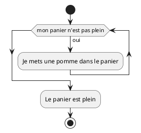


## Exemple 1 — Économiser pour un objectif (1/3)

> Ajouter 50 francs dans la tirelire chaque semaine jusqu'à atteindre 300
> francs.

## Exemple 1 — Économiser pour un objectif (2/3)

```text
DÉBUT
  Définir son objectif à 300.-
  Définir ses économies hebdomadaires à 50.-
  Ma tirelire d'économie ne contient rien pour le moment

  TANT QUE ma tirelire ne contient pas mon objectif FAIRE
    J'ajoute mes économies hebdomadaires à ma tirelire
  FIN TANT QUE

  J'ai réussi à économiser mon objectif de 300.- !!!
FIN
```

## Exemple 1 — Économiser pour un objectif (3/3)

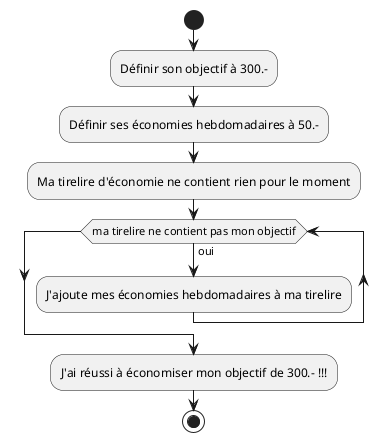

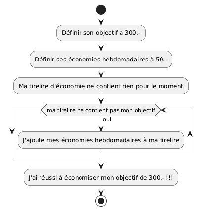

## Exemple 2 — Faire des séries d'exercices jusqu'à atteindre 60 minutes (1/3)

> Faire des séries de 15 minutes jusqu'à totaliser au moins 60 minutes
> d'entraînement.

## Exemple 2 (2/3)

Pseudocode :

```text
DÉBUT
  Je me fixe un objectif de 60 minutes d'entraînement
  Chaque série d'exercice dure 15 minutes
  Pour l'instant, je n'ai pas encore commencé à m'entraîner

  TANT QUE je n'ai pas atteint mon objectif de 60 minutes FAIRE
    J'ajoute une série de 15 minutes à mon temps d'entraînement
  FIN TANT QUE

  J'ai terminé mon objectif d'entraînement de 60 minutes !
FIN
```

## Exemple 2 (3/3)

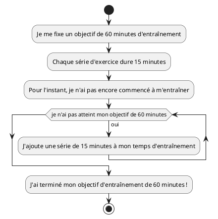

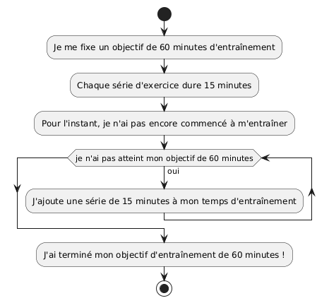

## Points d'attention pour `TANT QUE`

- Veillez à modifier une variable qui fera évoluer la condition (sinon la boucle
  peut devenir infinie).
- Vérifiez la condition avant d'entrer dans la boucle (si elle est fausse au
  départ, le corps ne sera pas exécuté).

## Variables

<!-- _class: lead -->

## Variables

Les boucles s'appuient souvent sur des variables : un compteur (indice) ou un
accumulateur (somme).

- Un **panier** contient des pommes. On peut avoir une variable `pommes` qui
  indique combien de pommes sont dans le panier.
- Un **portefeuille** contient de l'argent. On peut avoir une variable `argent`
  qui indique combien d'francs on a.

## Exemple (1/3)

Ces variables peuvent être lues et modifiées à chaque répétition :

> Je prends un panier vide et j'y mets 5 pommes.

## Exemple (2/3)

Pseudocode :

```text
DÉBUT
  Je prends un panier de pommes vide
  J'y mets 5 pommes
  Mon panier contient 5 pommes
FIN
```

## Exemple (3/3)

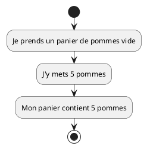

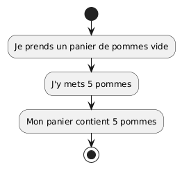

## POUR / FOR

<!-- _class: lead -->

## La boucle POUR (quand on connaît le nombre d'itérations)

> Dans la plupart des langages de programmation, la boucle « POUR » s'appelle
> « FOR » (mot anglais pour « pour »).

Structure générale :

```text
POUR variable DE valeur_debut À valeur_fin FAIRE
  actions à répéter
FIN POUR
```

### Comment représenter une boucle POUR en UML ?

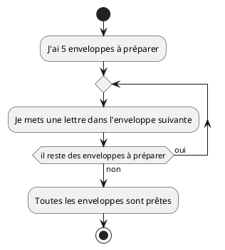

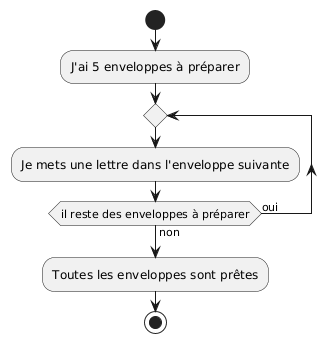

## Exemple 1 — Arroser les plantes du jardin (1/3)

> Arroser successivement chacune des 5 plantes du jardin.

## Exemple 1 — Arroser les plantes du jardin (2/3)

Pseudocode :

```text
DÉBUT
  J'ai 5 plantes dans mon jardin
  Pour chaque plante du jardin
    J'arrose la plante
  Fin pour
  Toutes les plantes sont arrosées
FIN
```

## Exemple 1 — Arroser les plantes du jardin (3/3)

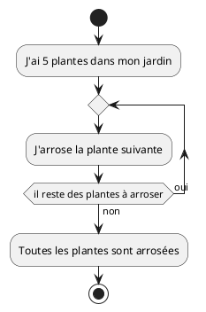

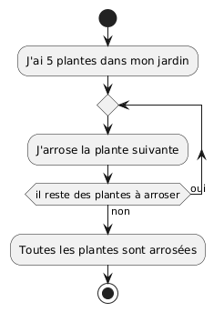

## Exemple 2 — Distribuer des parts de gâteau

> Donner une part de gâteau à chacun des 8 invités.

## Exemple 2 — Distribuer des parts de gâteau (2/3)

Pseudocode :

```text
DÉBUT
  Il y a 8 invités à la fête
  Pour chaque invité
    Je donne une part de gâteau à l'invité
  Fin pour
  Tout le monde a eu une part de gâteau
FIN
```

## Exemple 2 — Distribuer des parts de gâteau (3/3)

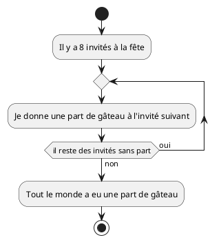

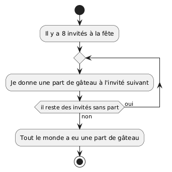

## Comparaison rapide : POUR vs TANT QUE

- `POUR` : vous utilisez un compteur quand vous savez exactement combien de
  répétitions exécuter.
- `TANT QUE` : vous répétez tant qu'une condition est vraie ; le nombre
  d'itérations peut être variable.

## Erreurs courantes et bonnes pratiques

- Toujours initialiser vos variables (compteurs, accumulateurs) avant la boucle.
- Penser à la condition d'arrêt : testez avec de petites valeurs pour vérifier
  que votre boucle s'arrête correctement.
- Éviter les boucles infinies : assurez-vous que la condition deviendra
  éventuellement fausse.

## À vous de jouer !

- (Re)lire le [support de cours][cours]
- Réaliser les [exercices][exercices]
- Expérimenter avec [PlantUML en ligne][plantuml-editor]
- Poser des questions si nécessaire

\
**La programmation s'apprend par la pratique !** **N'hésitez pas à créer vos propres
exercices.**

![bg right:40%][illustration-a-vous-de-jouer]

## Questions

<!-- _class: lead -->

Est-ce que vous avez des questions ?

## Sources

- [Illustration objectifs][illustration-objectifs] par
  [Aline de Nadai](https://unsplash.com/@alinedenadai) sur
  [Unsplash](https://unsplash.com/photos/j6brni7fpvs)
- [Illustration variables][illustration-variables] par
  [Javier Allegue Barros](https://unsplash.com/@soymeraki) sur
  [Unsplash](https://unsplash.com/photos/C7B-ExXpOIE)
- [Illustration pseudocode][illustration-pseudocode] par
  [Florian Olivo](https://unsplash.com/@florianolv) sur
  [Unsplash](https://unsplash.com/photos/4hbJ-eymZ1o)
- [Illustration exercices][illustration-exercices] par
  [Green Chameleon](https://unsplash.com/@craftedbygc) sur
  [Unsplash](https://unsplash.com/photos/s9CC2SKySJM)
- [Illustration récap][illustration-recap] par
  [Patrick Perkins](https://unsplash.com/@patrickperkins) sur
  [Unsplash](https://unsplash.com/photos/ETRPjvb0KM0)
- [Illustration à vous de jouer][illustration-a-vous-de-jouer] par
  [Nikita Kachanovsky](https://unsplash.com/@nkachanovskyyy) sur
  [Unsplash](https://unsplash.com/photos/FJFPuE1MAOM)

<!-- URLs -->

[presentation-web]:
	https://HEIG-VD-Prog-Course.github.io/HEIG-VD-ProgIM-Course/03.01-iteration/01-supports-de-cours/index.html
[presentation-pdf]:
	https://HEIG-VD-Prog-Course.github.io/HEIG-VD-ProgIM-Course/03.01-iteration/01-supports-de-cours/03.01-iteration-presentation.pdf
[cours]:
	https://github.com/HEIG-VD-Prog-Course/HEIG-VD-ProgIM-Course/tree/main/03.01-iteration/01-supports-de-cours
[exercices]:
	https://github.com/HEIG-VD-Prog-Course/HEIG-VD-ProgIM-Course/tree/main/03.01-iteration/02-exercices
[plantuml-editor]: https://plantuml.nortalle.ch
[license]:
	https://github.com/HEIG-VD-Prog-Course/HEIG-VD-ProgIM-Course/blob/main/LICENSE.md

<!-- Illustrations -->

[illustration-principale]: ./images/home.jpg
[illustration-objectifs]:
	https://images.unsplash.com/photo-1516389573391-5620a0263801?fit=crop&h=720
[illustration-variables]:
	https://images.unsplash.com/photo-1558618666-fcd25c85cd64?fit=crop&h=720
[illustration-pseudocode]:
	https://images.unsplash.com/photo-1461749280684-dccba630e2f6?fit=crop&h=720
[illustration-exercices]:
	https://images.unsplash.com/photo-1434030216411-0b793f4b4173?fit=crop&h=720
[illustration-recap]:
	https://images.unsplash.com/photo-1484480974693-6ca0a78fb36b?fit=crop&h=720
[illustration-a-vous-de-jouer]:
	https://images.unsplash.com/photo-1509198397868-475647b2a1e5?fit=crop&h=720
