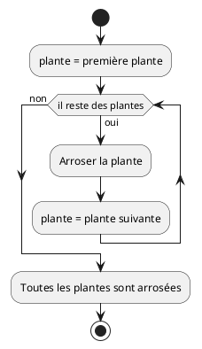
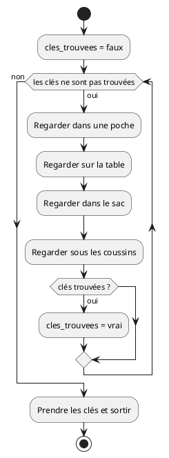
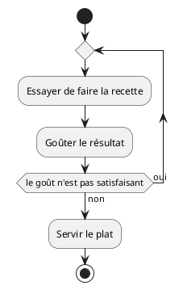

# Itération

V. Guidoux, avec l'aide de
[GitHub Copilot](https://github.com/features/copilot).

Ce travail est sous licence [CC BY-SA 4.0][licence].

## Ressources

- Objectifs, méthodes d'enseignement et d'apprentissage, et méthodes
  d'évaluation : [Lien vers le contenu](..)
- Supports de cours : [Lien vers le contenu](../01-supports-de-cours/README.md)
  ·
  [Presentation (web)](https://HEIG-VD-Prog-Course.github.io/HEIG-VD-ProgIM-Course/02.01-sequence-selection-iteration/01-supports-de-cours/index.html)
  ·
  [Presentation (PDF)](https://HEIG-VD-Prog-Course.github.io/HEIG-VD-ProgIM-Course/02.01-sequence-selection-iteration/01-supports-de-cours/02.01-sequence-selection-iteration-presentation.pdf)
- Exercices : [Énoncés et solutions](../02-exercices/README.md)

## Table des matières

- [Ressources](#ressources)
- [Table des matières](#table-des-matières)
- [Objectifs](#objectifs)
- [L'itération](#litération)
  - [Qu'est-ce qu'une itération ?](#quest-ce-quune-itération-)
  - [Types d'itération](#types-ditération)
  - [Pseudocode pour l'itération](#pseudocode-pour-litération)
  - [Diagrammes d'activité pour l'itération](#diagrammes-dactivité-pour-litération)
- [Conclusion](#conclusion)
  - [Ce que vous savez maintenant faire](#ce-que-vous-savez-maintenant-faire)
  - [Prochaines étapes](#prochaines-étapes)
  - [Bibliographie et ressources utilisées](#bibliographie-et-ressources-utilisées)

## Objectifs

De façon plus concise, à la fin de cette séance, vous devriez être capable de :

-

## L'itération

### Qu'est-ce qu'une itération ?

L'itération permet de répéter des instructions plusieurs fois. C'est très utile
quand on doit faire la même chose de nombreuses fois, comme compter de 1 à 100
ou traiter une liste d'éléments.

**Exemple concret** : Pour apprendre les tables de multiplication, on répète :

- "2 × 1 = 2"
- "2 × 2 = 4"
- "2 × 3 = 6"
- ... jusqu'à "2 × 10 = 20"

### Types d'itération

Il existe trois types principaux d'itération :

1. **POUR** (for) : quand on sait combien de fois répéter
2. **TANT QUE** (while) : quand on répète tant qu'une condition est vraie
3. **RÉPÉTER JUSQU'À** (repeat until) : quand on répète jusqu'à ce qu'une
   condition soit vraie

### Pseudocode pour l'itération

#### Boucle POUR

```text
POUR variable DE valeur_début À valeur_fin FAIRE
    actions à répéter
FIN POUR
```

**Exemple** : Arroser toutes les plantes du jardin :

```text
DÉBUT
    POUR chaque plante du jardin FAIRE
        Arroser la plante
    FIN POUR
FIN
```

<details>
<summary>Exemple en Java</summary>

```java
public class ArroserPlantes {
    public static void main(String[] args) {
        // Définir les plantes du jardin
        String[] plantes = {"Rose", "Tulipe", "Marguerite", "Lavande", "Basilic"};

        System.out.println("Commencer l'arrosage du jardin :");

        // Boucle POUR : arroser chaque plante du jardin
        for (int i = 0; i < plantes.length; i++) {
            System.out.println("Arroser la " + plantes[i]);
        }

        System.out.println("Toutes les plantes sont arrosées !");
    }
}
```

</details>

#### Boucle TANT QUE

```text
TANT QUE condition FAIRE
    actions à répéter
FIN TANT QUE
```

**Exemple** : Chercher ses clés :

```text
DÉBUT
    TANT QUE les clés ne sont pas trouvées FAIRE
        Regarder dans une poche
        Regarder sur la table
        Regarder dans le sac
        Regarder sous les coussins
    FIN TANT QUE

    Prendre les clés et sortir
FIN
```

<details>
<summary>Exemple en Java</summary>

```java
import java.util.Random;

public class ChercherCles {
    public static void main(String[] args) {
        // Simuler la recherche de clés
        Random random = new Random();
        boolean cles_trouvees = false;

        System.out.println("Oh non ! Où sont mes clés ?");

        // Boucle TANT QUE les clés ne sont pas trouvées
        while (!cles_trouvees) {
            System.out.println("Regarder dans une poche...");
            System.out.println("Regarder sur la table...");
            System.out.println("Regarder dans le sac...");
            System.out.println("Regarder sous les coussins...");

            // Simuler la chance de trouver les clés (20% à chaque tentative)
            if (random.nextInt(5) == 0) {
                cles_trouvees = true;
            } else {
                System.out.println("Toujours pas trouvées, continuer à chercher...\n");
            }
        }

        System.out.println("Trouvées ! Prendre les clés et sortir");
    }
}
```

</details>

#### Boucle RÉPÉTER JUSQU'À

```text
RÉPÉTER
    actions à répéter
JUSQU'À (condition)
```

**Exemple** : Apprendre une nouvelle recette :

```text
DÉBUT
    RÉPÉTER
        Essayer de faire la recette
        Goûter le résultat
    JUSQU'À le goût est satisfaisant

    Servir le plat
FIN
```

<details>
<summary>Exemple en Java</summary>

```java
import java.util.Random;

public class ApprendreRecette {
    public static void main(String[] args) {
        // Simuler l'apprentissage d'une recette
        Random random = new Random();
        boolean gout_satisfaisant = false;
        int tentative = 1;

        System.out.println("Apprendre à faire des crêpes :");

        // Boucle RÉPÉTER JUSQU'À ce que le goût soit satisfaisant
        do {
            System.out.println("\nTentative " + tentative + " :");
            System.out.println("Essayer de faire la recette...");
            System.out.println("Mélanger la farine, les œufs et le lait");
            System.out.println("Faire cuire la crêpe");
            System.out.println("Goûter le résultat...");

            // Simuler si le goût est satisfaisant (30% de chance à chaque fois)
            if (random.nextInt(10) < 3) {
                gout_satisfaisant = true;
                System.out.println("Mmm, délicieux ! Le goût est parfait !");
            } else {
                System.out.println("Pas terrible... il faut réessayer");
                tentative++;
            }

        } while (!gout_satisfaisant);

        System.out.println("\nServir le plat - Recette maîtrisée !");
    }
}
```

</details>

### Diagrammes d'activité pour l'itération

#### Boucle POUR avec PlantUML



#### Boucle TANT QUE



#### Boucle RÉPÉTER JUSQU'À



## Conclusion

Félicitations ! Vous venez d'apprendre les trois piliers de la programmation :

1. **La séquence** : exécuter des instructions dans l'ordre
2. **La sélection** : prendre des décisions avec SI/ALORS/SINON
3. **L'itération** : répéter des actions avec des boucles

Ces concepts sont universels et se retrouvent dans tous les langages de
programmation. Que vous appreniez Java, Python, JavaScript ou tout autre
langage, vous utiliserez toujours ces trois structures de base.

### Ce que vous savez maintenant faire

- Écrire des algorithmes simples en pseudocode
- Créer des diagrammes d'activités avec PlantUML
- Comprendre le flux d'exécution d'un programme
- Analyser et décomposer un problème en étapes logiques

### Prochaines étapes

Dans les prochains cours, vous apprendrez :

- À traduire votre pseudocode en vrai code Java
- À utiliser des variables et des types de données
- À créer des fonctions pour organiser votre code
- À manipuler des tableaux et des structures de données plus complexes

> [!IMPORTANT]
>
> La programmation s'apprend par la pratique ! N'hésitez pas à créer vos propres
> exercices et à expérimenter avec les diagrammes PlantUML. Plus vous pratiquez,
> plus ces concepts deviendront naturels.

**Ressources pour aller plus loin :**

- [Documentation PlantUML pour les diagrammes d'activité](https://plantuml.com/fr/activity-diagram-beta)

### Bibliographie et ressources utilisées

Les ressources suivantes ont été utilisées pour la préparation de ce cours :

- <https://plantuml.com/fr/activity-diagram-beta>
- <https://www.w3schools.com/java/java_intro.asp>
- <https://www.geeksforgeeks.org/java/java/>
- <https://www.learnjavaonline.org/>
- <https://upskillcourses.com/courses/essential-web-developer-course>

[licence]:
	https://github.com/HEIG-VD-Prog-Course/HEIG-VD-ProgIM-Course/blob/main/LICENSE.md
