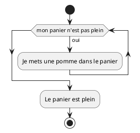
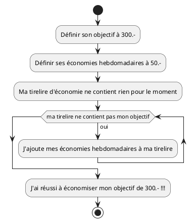
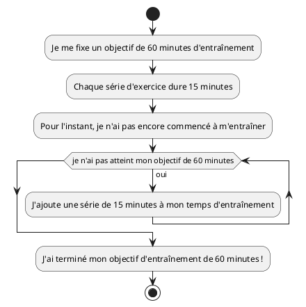
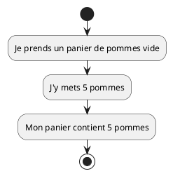
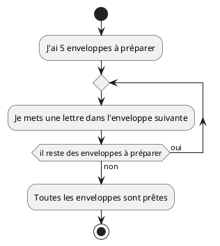
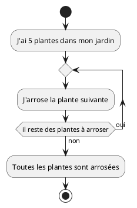
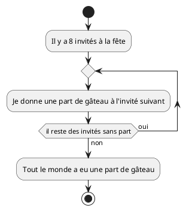

# Itération

V. Guidoux, avec l'aide de
[GitHub Copilot](https://github.com/features/copilot).

Ce travail est sous licence [CC BY-SA 4.0][licence].

## Ressources

- Objectifs, méthodes d'enseignement et d'apprentissage, et méthodes
  d'évaluation : [Lien vers le contenu](..)
- Supports de cours : [Lien vers le contenu](../01-supports-de-cours/README.md)
  ·
  [Presentation (web)](https://HEIG-VD-Prog-Course.github.io/HEIG-VD-ProgIM-Course/03.01-iteration/01-supports-de-cours/index.html)
  ·
  [Presentation (PDF)](https://HEIG-VD-Prog-Course.github.io/HEIG-VD-ProgIM-Course/03.01-iteration/01-supports-de-cours/03.01-iteration-presentation.pdf)
- Exercices : [Lien vers le contenu](../02-exercices/README.md)

## Table des matières

- [Ressources](#ressources)
- [Table des matières](#table-des-matières)
- [L'itération](#litération)
  - [Qu'est-ce que l'itération ? (rappel)](#quest-ce-que-litération--rappel)
  - [La boucle TANT QUE (quand on ne connaît pas le nombre d'itérations)](#la-boucle-tant-que-quand-on-ne-connaît-pas-le-nombre-ditérations)
  - [Variables](#variables)
  - [La boucle POUR (quand on connaît le nombre d'itérations)](#la-boucle-pour-quand-on-connaît-le-nombre-ditérations)
  - [Comparaison rapide : POUR vs TANT QUE](#comparaison-rapide--pour-vs-tant-que)
  - [Petits exercices proposés (sans programmation)](#petits-exercices-proposés-sans-programmation)
  - [Erreurs courantes et bonnes pratiques](#erreurs-courantes-et-bonnes-pratiques)

## L'itération

### Qu'est-ce que l'itération ? (rappel)

L'itération permet de répéter des actions plusieurs fois. On emploie des
structures d'itération pour automatiser des tâches répétitives : distribuer
quelque chose à plusieurs personnes, calculer une somme mois après mois, ou
parcourir une collection d'objets.

Deux structures très utilisées sont :

- **TANT QUE** (while) : quand on répète tant qu'une condition est vraie
- **POUR** (for) : quand on sait à l'avance combien de fois on doit répéter

### La boucle TANT QUE (quand on ne connaît pas le nombre d'itérations)

> [!TIP] Dans la plupart des langages de programmation, la boucle « TANT QUE »
> s'appelle « WHILE » (mot anglais pour « tant que »).

La boucle `TANT QUE` répète tant qu'une condition est vraie. Elle est utile
quand on ne connaît pas à l'avance le nombre d'itérations, mais on sait qu'on
s'arrêtera quand une condition sera satisfaite.

Structure générale :

```text
TANT QUE (condition) FAIRE
  actions à répéter
FIN TANT QUE
```

#### Comment représenter une boucle TANT QUE en UML ?

Dans un diagramme d'activité UML, une boucle « TANT QUE » (while) est
représentée par une flèche qui revient vers une condition. Tant que la condition
est vraie, on répète les actions. Quand la condition devient fausse, on sort de
la boucle.

Exemple minimal (version vie réelle) :



Exemple 1 — Économiser pour un objectif

Phrase descriptive : "Ajouter 50 euros dans la tirelire chaque semaine jusqu'à
atteindre 300 euros."  
Pseudocode :

```text
DÉBUT
  Définir son objectif à 300.-
  Définir ses économies hebdomadaires à 50.-
  Ma tirelire d'économie ne contient rien pour le moment

  TANT QUE ma tirelire ne contient pas mon objectif FAIRE
    J'ajoute mes économies hebdomadaires à ma tirelire
  FIN TANT QUE

  J'ai réussi à économiser mon objectif de 300.- !!!
FIN
```

PlantUML :



<details>
<summary>Java</summary>

```java
public class Economies {
  public static void main(String[] args) {
    int objectif = 300;
    int economie_hebdo = 50;
    int total = 0;

    while (total < objectif) {
      total = total + economie_hebdo;
      System.out.println("Économies actuelles : " + total + " euros");
    }

    System.out.println("Objectif atteint : " + total + " euros");
  }
}
```

</details>

Exemple 2 — Faire des séries d'exercices jusqu'à atteindre 60 minutes

Phrase descriptive : "Faire des séries de 15 minutes jusqu'à totaliser au moins
60 minutes d'entraînement."  
Pseudocode :

```text
DÉBUT
  Je me fixe un objectif de 60 minutes d'entraînement
  Chaque série d'exercice dure 15 minutes
  Pour l'instant, je n'ai pas encore commencé à m'entraîner

  TANT QUE je n'ai pas atteint mon objectif de 60 minutes FAIRE
    J'ajoute une série de 15 minutes à mon temps d'entraînement
  FIN TANT QUE

  J'ai terminé mon objectif d'entraînement de 60 minutes !
FIN
```

PlantUML :



<details>
<summary>Java</summary>

```java
public class Pratique {
  public static void main(String[] args) {
    int objectif_minutes = 60;
    int duree_serie = 15;
    int total_minutes = 0;

    while (total_minutes < objectif_minutes) {
      total_minutes = total_minutes + duree_serie;
      System.out.println("Minutes pratiquées : " + total_minutes);
    }

    System.out.println("Objectif de pratique atteint : " + total_minutes + " minutes");
  }
}
```

</details>

Points d'attention pour `TANT QUE` :

- Veillez à modifier une variable qui fera évoluer la condition (sinon la boucle
  peut devenir infinie).
- Vérifiez la condition avant d'entrer dans la boucle (si elle est fausse au
  départ, le corps ne sera pas exécuté).

### Variables

Les boucles s'appuient souvent sur des variables : un compteur (indice) ou un
accumulateur (somme). Voici deux analogies faciles :

- Un **panier** contient des pommes. On peut avoir une variable `pommes` qui
  indique combien de pommes sont dans le panier.
- Un **portefeuille** contient de l'argent. On peut avoir une variable `argent`
  qui indique combien d'euros on a.

Ces variables peuvent être lues et modifiées à chaque répétition :

Phrase descriptive : "Je prends un panier vide et j'y mets 5 pommes."  
Pseudocode :

```text
DÉBUT
  Je prends un panier de pommes vide
  J'y mets 5 pommes
  Mon panier contient 5 pommes
FIN
```

PlantUML :



<details>
<summary>Java</summary>

```java
public class Panier {
  public static void main(String[] args) {
    int pommes = 5;
    System.out.println("Il y a " + pommes + " pommes dans le panier");
  }
}
```

</details>

> À retenir : pour les boucles on utilise souvent :

- un compteur (par exemple `i` ou `index`) qui indique la position courante
- un accumulateur (par exemple `total` ou `somme`) qui cumule une valeur

### La boucle POUR (quand on connaît le nombre d'itérations)

> [!TIP] Dans la plupart des langages de programmation, la boucle « POUR »
> s'appelle « FOR » (mot anglais pour « pour »).

La boucle `POUR` sert quand on sait à l'avance combien de fois on veut répéter
une action (par exemple : arroser 5 plantes, distribuer 6 parts, etc.).

Structure générale :

```text
POUR variable DE valeur_debut À valeur_fin FAIRE
  actions à répéter
FIN POUR
```

#### Comment représenter une boucle POUR en UML ?

Dans un diagramme d'activité UML, une boucle « POUR » (for) ressemble à une
boucle « TANT QUE » mais on précise souvent l'initialisation, la condition et
l'incrémentation du compteur. On répète les actions pour chaque valeur du
compteur.

Exemple minimal (version vie réelle) :



Exemple 1 — Arroser les plantes du jardin

Phrase descriptive : "Arroser successivement chacune des 5 plantes du jardin."

Pseudocode :

```text
DÉBUT
  J'ai 5 plantes dans mon jardin
  Pour chaque plante du jardin
    J'arrose la plante
  Fin pour
  Toutes les plantes sont arrosées
FIN
```

PlantUML :



<details>
<summary>Java</summary>

```java
public class ArroserPlantes {
  public static void main(String[] args) {
    int nombre_plantes = 5;
    for (int plante_index = 1; plante_index <= nombre_plantes; plante_index++) {
      System.out.println("Arroser la plante " + plante_index);
    }
  }
}
```

</details>

Exemple 2 — Distribuer des parts de gâteau

Phrase descriptive : "Donner une part de gâteau à chacun des 8 invités."

Pseudocode :

```text
DÉBUT
  Il y a 8 invités à la fête
  Pour chaque invité
    Je donne une part de gâteau à l'invité
  Fin pour
  Tout le monde a eu une part de gâteau
FIN
```

PlantUML :



<details>
<summary>Java</summary>

```java
public class DistribuerPart {
  public static void main(String[] args) {
    int nombre_invites = 8;
    for (int i = 1; i <= nombre_invites; i++) {
      System.out.println("Donner une part au invité " + i);
    }
  }
}
```

</details>

Remarques pour `POUR` :

- L'indice commence souvent à 0 ou 1 selon la convention. Ici nous commençons à
  1 pour rester proche du comptage humain.
- Faites attention aux erreurs du type "off-by-one" : vérifier si la borne
  supérieure est incluse ou non.

### Comparaison rapide : POUR vs TANT QUE

- `POUR` : vous utilisez un compteur quand vous savez exactement combien de
  répétitions exécuter.
- `TANT QUE` : vous répétez tant qu'une condition est vraie ; le nombre
  d'itérations peut être variable.

### Petits exercices proposés (sans programmation)

1. Écrivez en une phrase l'algorithme pour : mettre une serviette sur chaque
   chaise de la salle si on a 12 chaises.
2. Écrivez en pseudocode : ajouter 20 CHF dans une tirelire chaque semaine
   jusqu'à atteindre 200 CHF.
3. Dessinez un petit diagramme d'activité (à la main ou avec PlantUML) pour
   distribuer des flyers à 30 maisons.

Ces exercices visent à vous entraîner à raisonner en termes de variables,
compteurs et conditions avant d'aborder la traduction en code Java.

### Erreurs courantes et bonnes pratiques

- Toujours initialiser vos variables (compteurs, accumulateurs) avant la boucle.
- Penser à la condition d'arrêt : testez avec de petites valeurs pour vérifier
  que votre boucle s'arrête correctement.
- Éviter les boucles infinies : assurez-vous que la condition deviendra
  éventuellement fausse.

[licence]:
	https://github.com/HEIG-VD-Prog-Course/HEIG-VD-ProgIM-Course/blob/main/LICENSE.md
