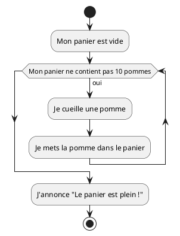
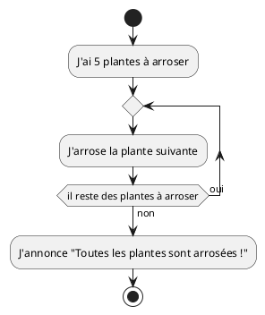
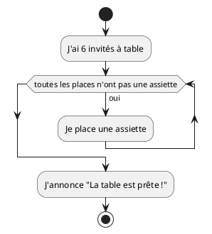

# Itération - Exercices

Cette série d'exercices est conçue pour vous permettre de valider les concepts
théoriques et pratiques vus dans le cours
_[Itération](../01-supports-de-cours/README.md)_.

## Ressources

- Supports de cours : [Lien vers le contenu](../01-supports-de-cours/README.md)
  ·
  [Presentation (web)](https://HEIG-VD-Prog-Course.github.io/HEIG-VD-ProgIM-Course/03.01-iteration/01-supports-de-cours/index.html)
  ·
  [Presentation (PDF)](https://HEIG-VD-Prog-Course.github.io/HEIG-VD-ProgIM-Course/03.01-iteration/01-supports-de-cours/03.01-iteration-presentation.pdf)
- Exercices : [Énoncés et solutions](../02-exercices/README.md)

## Table des matières

- [Ressources](#ressources)
- [Table des matières](#table-des-matières)
- [Exercice 1 - Remplir un panier de pommes](#exercice-1---remplir-un-panier-de-pommes)
  - [Énoncé](#énoncé)
  - [Consignes](#consignes)
- [Exercice 2 - Arroser les plantes du salon](#exercice-2---arroser-les-plantes-du-salon)
  - [Énoncé](#énoncé-1)
  - [Consignes](#consignes-1)
- [Exercice 3 - Mettre la table pour un dîner](#exercice-3---mettre-la-table-pour-un-dîner)
  - [Énoncé](#énoncé-2)
  - [Consignes](#consignes-2)

> [!TIP]
>
> Pour chaque exercice, créez d'abord le **pseudocode**, puis le **diagramme
> d'activité** avec PlantUML, et enfin vérifiez votre logique avec la solution.
>
> **À propos du pseudocode** : Le pseudocode est un outil pour structurer vos
> idées et organiser votre réflexion. Vous pouvez l'écrire à la main sur papier,
> dans un bloc-notes, dans n'importe quelle application de texte, ou même
> mentalement. L'important est qu'il vous aide à clarifier la logique de votre
> algorithme avant de passer à l'implémentation.
>
> **À propos de PlantUML** : Utilisez l'éditeur PlantUML en ligne :
> <https://plantuml.nortalle.ch>

> [!IMPORTANT]
>
> **Approche pédagogique** : Ces exercices utilisent des **exemples de la vie
> quotidienne** plutôt que des problèmes de programmation classiques. L'objectif
> est de vous faire comprendre les concepts fondamentaux (itération) à travers
> des situations familières avant d'aborder la programmation pure.
>
> **À propos du code Java** : Le code Java fourni dans les solutions est
> **uniquement à titre de référence** pour illustrer la traduction des concepts
> en langage de programmation. À ce stade du cours, **vous n'êtes pas censées
> comprendre ou écrire du code Java**. Concentrez-vous sur le pseudocode et les
> diagrammes d'activité, qui sont les éléments essentiels à maîtriser.

## Exercice 1 - Remplir un panier de pommes

### Énoncé

Vous avez un panier vide et un pommier. Vous voulez remplir le panier avec 10
pommes, en les cueillant une par une.

### Consignes

1. Mon panier est vide.
2. Je cueille une pomme et je la mets dans le panier.
3. Je répète jusqu'à ce que mon panier contienne 10 pommes.
4. J'annonce que le panier est plein.

<details>
<summary>Afficher la solution - Pseudocode</summary>

```text
DÉBUT
  Mon panier est vide
  TANT QUE mon panier ne contient pas 10 pommes FAIRE
    Je cueille une pomme
    Je mets la pomme dans le panier
  FIN TANT QUE
  J'annonce "Le panier est plein !"
FIN
```

</details>

<details>
<summary>Afficher la solution - Diagramme PlantUML</summary>



</details>

<details>
<summary>Afficher la solution - Code Java</summary>

```java
public class PanierPommes {
  public static void main(String[] args) {
    int pommesDansPanier = 0;
    while (pommesDansPanier < 10) {
      // Je cueille une pomme
      // Je mets la pomme dans le panier
      pommesDansPanier = pommesDansPanier + 1;
    }
    System.out.println("Le panier est plein !");
  }
}
```

</details>

## Exercice 2 - Arroser les plantes du salon

### Énoncé

Vous avez 5 plantes dans votre salon. Vous voulez arroser chaque plante, une par
une.

### Consignes

1. J'ai 5 plantes à arroser.
2. Pour chaque plante, j'arrose la plante suivante.
3. Je répète jusqu'à ce que toutes les plantes soient arrosées.
4. J'annonce que toutes les plantes ont reçu de l'eau.

<details>
<summary>Afficher la solution - Pseudocode</summary>

```text
DÉBUT
  J'ai 5 plantes à arroser
  POUR chaque plante du salon FAIRE
    J'arrose la plante suivante
  FIN POUR
  J'annonce "Toutes les plantes sont arrosées !"
FIN
```

</details>

<details>
<summary>Afficher la solution - Diagramme PlantUML</summary>



</details>

<details>
<summary>Afficher la solution - Code Java</summary>

```java
public class ArroserPlantes {
  public static void main(String[] args) {
    int nombrePlantes = 5;
    for (int plante = 1; plante <= nombrePlantes; plante++) {
      // J'arrose la plante suivante
    }
    System.out.println("Toutes les plantes sont arrosées !");
  }
}
```

</details>

## Exercice 3 - Mettre la table pour un dîner

### Énoncé

Vous attendez 6 invités pour le dîner. Vous voulez placer une assiette à chaque
place.

### Consignes

1. J'ai 6 invités à table.
2. Je place une assiette pour chaque invité.
3. Je répète jusqu'à ce que chaque place ait une assiette.
4. J'annonce que la table est prête.

<details>
<summary>Afficher la solution - Pseudocode</summary>

```text
DÉBUT
  J'ai 6 invités à table
  TANT QUE toutes les places n'ont pas une assiette FAIRE
    Je place une assiette
  FIN TANT QUE
  J'annonce "La table est prête !"
FIN
```

</details>

<details>
<summary>Afficher la solution - Diagramme PlantUML</summary>



</details>

<details>
<summary>Afficher la solution - Code Java</summary>

```java
public class MettreTable {
  public static void main(String[] args) {
    int invites = 6;
    int assiettesPosees = 0;
    while (assiettesPosees < invites) {
      // Je place une assiette
      assiettesPosees = assiettesPosees + 1;
    }
    System.out.println("La table est prête !");
  }
}
```

</details>
