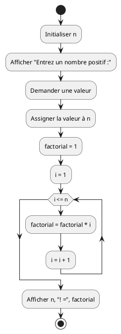
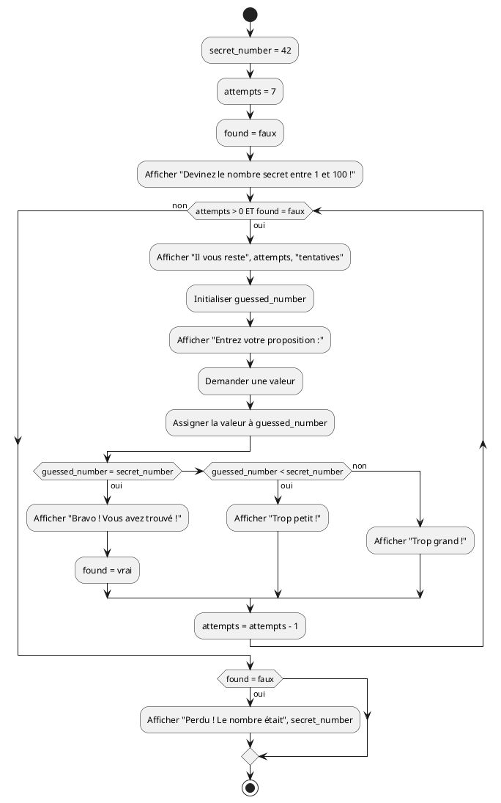
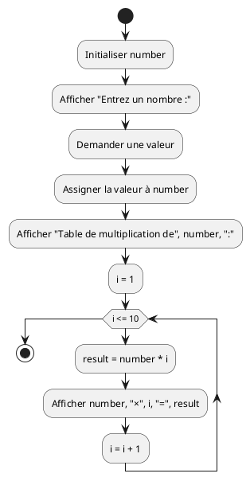
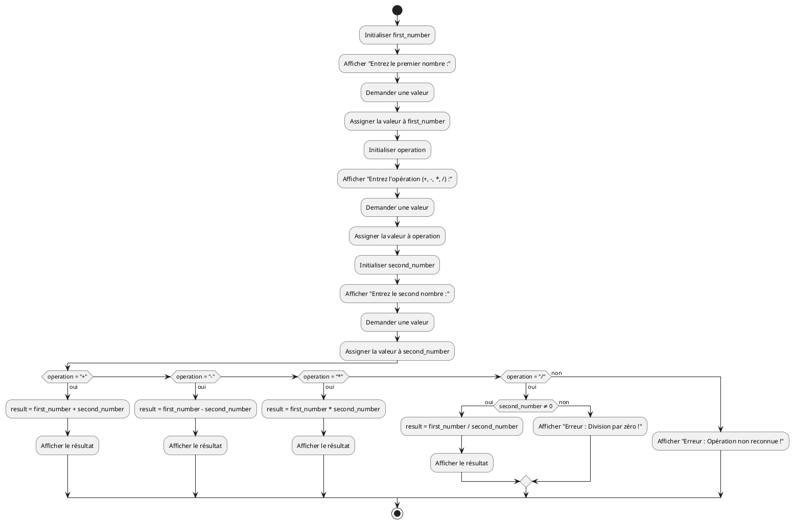

# Itération - Exercices

Cette série d'exercices est conçue pour vous permettre de valider les concepts
théoriques et pratiques vus dans le cours
_[Itération](../01-supports-de-cours/README.md)_.

## Ressources

- Supports de cours : [Lien vers le contenu](../01-supports-de-cours/README.md)
  ·
  [Presentation (web)](https://HEIG-VD-Prog-Course.github.io/HEIG-VD-ProgIM-Course/03.01-iteration/01-supports-de-cours/index.html)
  ·
  [Presentation (PDF)](https://HEIG-VD-Prog-Course.github.io/HEIG-VD-ProgIM-Course/03.01-iteration/01-supports-de-cours/03.01-iteration-presentation.pdf)
- Exercices : [Énoncés et solutions](../02-exercices/README.md)

## Table des matières

- [Ressources](#ressources)
- [Table des matières](#table-des-matières)
- [Exercice 7 - Itération : Factorielle](#exercice-7---itération--factorielle)
  - [Énoncé](#énoncé)
  - [Consignes](#consignes)
  - [Variables à utiliser](#variables-à-utiliser)
  - [Exemples](#exemples)
- [Exercice 8 - Combinaison : Jeu de devinette](#exercice-8---combinaison--jeu-de-devinette)
  - [Énoncé](#énoncé-1)
  - [Consignes](#consignes-1)
  - [Variables à utiliser](#variables-à-utiliser-1)
- [Exercice 9 - Itération : Table de multiplication](#exercice-9---itération--table-de-multiplication)
  - [Énoncé](#énoncé-2)
  - [Consignes](#consignes-2)
  - [Variables à utiliser](#variables-à-utiliser-2)
- [Exercice 10 - Combinaison : Calculatrice simple](#exercice-10---combinaison--calculatrice-simple)
  - [Énoncé](#énoncé-3)
  - [Consignes](#consignes-3)
  - [Variables à utiliser](#variables-à-utiliser-3)

> [!TIP]
>
> Pour chaque exercice, créez d'abord le **pseudocode**, puis le **diagramme
> d'activité** avec PlantUML, et enfin vérifiez votre logique avec la solution.
>
> **À propos du pseudocode** : Le pseudocode est un outil pour structurer vos
> idées et organiser votre réflexion. Vous pouvez l'écrire à la main sur papier,
> dans un bloc-notes, dans n'importe quelle application de texte, ou même
> mentalement. L'important est qu'il vous aide à clarifier la logique de votre
> algorithme avant de passer à l'implémentation.
>
> **À propos de PlantUML** : Utilisez l'éditeur PlantUML en ligne :
> <https://plantuml.nortalle.ch>
>
> [!IMPORTANT]
>
> **Approche pédagogique** : Ces exercices utilisent des **exemples de la vie
> quotidienne** plutôt que des problèmes de programmation classiques. L'objectif
> est de vous faire comprendre les concepts fondamentaux (itération) à travers
> des situations familières avant d'aborder la programmation pure.
>
> **À propos du code Java** : Le code Java fourni dans les solutions est
> **uniquement à titre de référence** pour illustrer la traduction des concepts
> en langage de programmation. À ce stade du cours, **vous n'êtes pas censées
> comprendre ou écrire du code Java**. Concentrez-vous sur le pseudocode et les
> diagrammes d'activité, qui sont les éléments essentiels à maîtriser.

## Exercice 7 - Itération : Factorielle

### Énoncé

Créer un algorithme qui calcule la factorielle d'un nombre n. La factorielle de
n (notée n!) est le produit de tous les nombres entiers positifs inférieurs ou
égaux à n.

### Consignes

1. Demander un nombre positif à l'utilisatrice
2. Calculer la factorielle : n! = 1 × 2 × 3 × ... × n
3. Afficher le résultat

### Variables à utiliser

- `n` : le nombre dont on veut calculer la factorielle
- `factorial` : le résultat de la factorielle
- `i` : variable de boucle

### Exemples

- 3! = 1 × 2 × 3 = 6
- 4! = 1 × 2 × 3 × 4 = 24
- 5! = 1 × 2 × 3 × 4 × 5 = 120

<details>
<summary>Afficher la solution - Pseudocode</summary>

```text
DÉBUT
    Initialiser n
    Afficher "Entrez un nombre positif :"
    Demander une valeur
    Assigner la valeur à n

    factorial = 1

    POUR i DE 1 À n FAIRE
        factorial = factorial * i
    FIN POUR

    Afficher n, "! =", factorial
FIN
```

</details>

<details>
<summary>Afficher la solution - Diagramme PlantUML</summary>



</details>

<details>
<summary>Afficher la solution - Code Java</summary>

```java
import java.util.Scanner;

public class Factorielle {
    public static void main(String[] args) {
        Scanner scanner = new Scanner(System.in);

        // Demander un nombre à l'utilisatrice
        System.out.print("Entrez un nombre positif : ");
        int n = scanner.nextInt();

        // Calculer la factorielle
        long factorial = 1;
        for (int i = 1; i <= n; i++) {
            factorial = factorial * i;
        }

        // Afficher le résultat
        System.out.println(n + "! = " + factorial);

        scanner.close();
    }
}
```

</details>

## Exercice 8 - Combinaison : Jeu de devinette

### Énoncé

Créer un jeu où l'ordinateur choisit un nombre secret entre 1 et 100, et
l'utilisatrice doit le deviner en maximum 7 tentatives.

### Consignes

1. Générer un nombre secret entre 1 et 100
2. Donner 7 tentatives maximum à l'utilisatrice
3. Pour chaque tentative :
   - Demander un nombre
   - Comparer avec le nombre secret
   - Afficher "Trop grand", "Trop petit" ou "Bravo !"
4. Afficher "Perdu !" si les 7 tentatives sont épuisées

### Variables à utiliser

- `secret_number` : le nombre secret (fixé à 42 pour cet exercice)
- `guessed_number` : le nombre proposé par l'utilisatrice
- `attempts` : nombre de tentatives restantes
- `found` : booléen indiquant si le nombre a été trouvé

<details>
<summary>Afficher la solution - Pseudocode</summary>

```text
DÉBUT
    secret_number = 42
    attempts = 7
    found = faux

    Afficher "Devinez le nombre secret entre 1 et 100 !"
    Afficher "Vous avez", attempts, "tentatives."

    TANT QUE (attempts > 0 ET found = faux) FAIRE
        Afficher "Il vous reste", attempts, "tentatives."
        Initialiser guessed_number
        Afficher "Entrez votre proposition :"
        Demander une valeur
        Assigner la valeur à guessed_number

        SI (guessed_number = secret_number) ALORS
            Afficher "Bravo ! Vous avez trouvé !"
            found = vrai
        SINON SI (guessed_number < secret_number) ALORS
            Afficher "Trop petit !"
        SINON
            Afficher "Trop grand !"
        FIN SI

        attempts = attempts - 1
    FIN TANT QUE

> [!TIP]
>
> **Poupées russes** : Cet exercice combine une boucle `TANT QUE` avec des
> `SI/SINON` imbriqués à l'intérieur. Comme des poupées russes, chaque
> structure doit être correctement fermée : le `FIN SI` ferme la structure
> conditionnelle, et le `FIN TANT QUE` ferme la boucle. Vérifiez toujours que
> vous avez le bon nombre de fermetures !

    SI (found = faux) ALORS
        Afficher "Perdu ! Le nombre était", secret_number
    FIN SI
FIN
```

</details>

<details>
<summary>Afficher la solution - Diagramme PlantUML</summary>



</details>

<details>
<summary>Afficher la solution - Code Java</summary>

```java
import java.util.Scanner;

public class JeuDevinette {
    public static void main(String[] args) {
        Scanner scanner = new Scanner(System.in);

        // Initialiser le jeu
        int secret_number = 42;
        int attempts = 7;
        boolean found = false;

        System.out.println("Devinez le nombre secret entre 1 et 100 !");
        System.out.println("Vous avez " + attempts + " tentatives.");

        // Boucle principale du jeu
        while (attempts > 0 && !found) {
            System.out.println("Il vous reste " + attempts + " tentatives.");
            System.out.print("Entrez votre proposition : ");
            int guessed_number = scanner.nextInt();

            // Vérifier la proposition
            if (guessed_number == secret_number) {
                System.out.println("Bravo ! Vous avez trouvé !");
                found = true;
            } else if (guessed_number < secret_number) {
                System.out.println("Trop petit !");
            } else {
                System.out.println("Trop grand !");
            }

            attempts--;
        }

        // Message de fin si pas trouvé
        if (!found) {
            System.out.println("Perdu ! Le nombre était " + secret_number);
        }

        scanner.close();
    }
}
```

</details>

## Exercice 9 - Itération : Table de multiplication

### Énoncé

Créer un algorithme qui affiche la table de multiplication d'un nombre donné (de
1 à 10).

### Consignes

1. Demander un nombre à l'utilisatrice
2. Afficher la table de multiplication de ce nombre de 1 à 10
3. Format d'affichage : "5 × 3 = 15"

### Variables à utiliser

- `number` : le nombre pour lequel afficher la table
- `i` : variable de boucle (de 1 à 10)
- `result` : résultat de la multiplication

<details>
<summary>Afficher la solution - Pseudocode</summary>

```text
DÉBUT
    Initialiser number
    Afficher "Entrez un nombre :"
    Demander une valeur
    Assigner la valeur à number

    Afficher "Table de multiplication de", number, ":"

    POUR i DE 1 À 10 FAIRE
        result = number * i
        Afficher number, "×", i, "=", result
    FIN POUR
FIN
```

</details>

<details>
<summary>Afficher la solution - Diagramme PlantUML</summary>



</details>

<details>
<summary>Afficher la solution - Code Java</summary>

```java
import java.util.Scanner;

public class TableMultiplication {
    public static void main(String[] args) {
        Scanner scanner = new Scanner(System.in);

        // Demander le nombre
        System.out.print("Entrez un nombre : ");
        int number = scanner.nextInt();

        // Afficher la table de multiplication
        System.out.println("Table de multiplication de " + number + " :");

        for (int i = 1; i <= 10; i++) {
            int result = number * i;
            System.out.println(number + " × " + i + " = " + result);
        }

        scanner.close();
    }
}
```

</details>

## Exercice 10 - Combinaison : Calculatrice simple

### Énoncé

Créer une calculatrice qui demande deux nombres et une opération, puis affiche
le résultat.

### Consignes

1. Demander le premier nombre
2. Demander l'opération (+, -, \*, /)
3. Demander le second nombre
4. Effectuer le calcul selon l'opération choisie
5. Gérer la division par zéro
6. Afficher le résultat ou un message d'erreur

### Variables à utiliser

- `first_number`, `second_number` : les deux nombres
- `operation` : l'opération choisie (+, -, \*, /)
- `result` : le résultat du calcul

<details>
<summary>Afficher la solution - Pseudocode</summary>

```text
DÉBUT
    Initialiser first_number
    Afficher "Entrez le premier nombre :"
    Demander une valeur
    Assigner la valeur à first_number

    Initialiser operation
    Afficher "Entrez l'opération (+, -, *, /) :"
    Demander une valeur
    Assigner la valeur à operation

    Initialiser second_number
    Afficher "Entrez le second nombre :"
    Demander une valeur
    Assigner la valeur à second_number

    SI (operation = "+") ALORS
        result = first_number + second_number
        Afficher first_number, "+", second_number, "=", result
    SINON SI (operation = "-") ALORS
        result = first_number - second_number
        Afficher first_number, "-", second_number, "=", result
    SINON SI (operation = "*") ALORS
        result = first_number * second_number
        Afficher first_number, "*", second_number, "=", result
    SINON SI (operation = "/") ALORS
        SI (second_number ≠ 0) ALORS
            result = first_number / second_number
            Afficher first_number, "/", second_number, "=", result
        SINON
            Afficher "Erreur : Division par zéro !"
        FIN SI
    SINON
        Afficher "Erreur : Opération non reconnue !"
    FIN SI
FIN
```

</details>

<details>
<summary>Afficher la solution - Diagramme PlantUML</summary>



</details>

<details>
<summary>Afficher la solution - Code Java</summary>

```java
import java.util.Scanner;

public class CalculatriceSimple {
    public static void main(String[] args) {
        Scanner scanner = new Scanner(System.in);

        // Demander les données
        System.out.print("Entrez le premier nombre : ");
        double first_number = scanner.nextDouble();

        System.out.print("Entrez l'opération (+, -, *, /) : ");
        String operation = scanner.next();

        System.out.print("Entrez le second nombre : ");
        double second_number = scanner.nextDouble();

        // Effectuer le calcul
        double result = 0;
        boolean valid_operation = true;

        if (operation.equals("+")) {
            result = first_number + second_number;
        } else if (operation.equals("-")) {
            result = first_number - second_number;
        } else if (operation.equals("*")) {
            result = first_number * second_number;
        } else if (operation.equals("/")) {
            if (second_number != 0) {
                result = first_number / second_number;
            } else {
                System.out.println("Erreur : Division par zéro !");
                valid_operation = false;
            }
        } else {
            System.out.println("Erreur : Opération non reconnue !");
            valid_operation = false;
        }

        // Afficher le résultat
        if (valid_operation && !operation.equals("/") || (operation.equals("/") && second_number != 0)) {
            System.out.println(first_number + " " + operation + " " + second_number + " = " + result);
        }

        scanner.close();
    }
}
```

</details>
