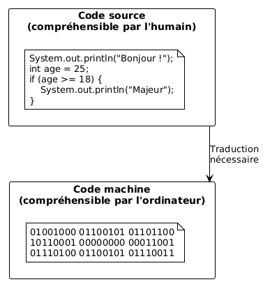
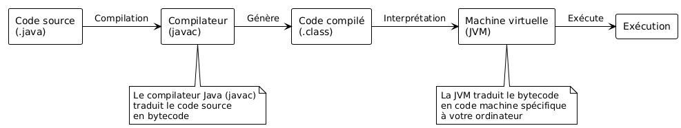
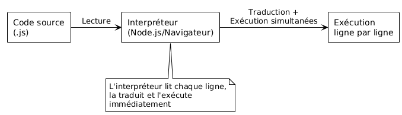
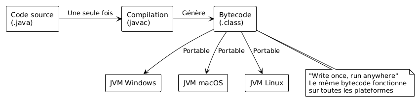

<!--
theme: custom-marp-theme
size: 16:9
paginate: true
author: V. Guidoux, avec l'aide de GitHub Copilot
title: HEIG-VD ProgIM1 Course - Introduction à Java
description: Introduction à Java et aux environnements de développement pour l'unité d'enseignement ProgIM1 enseigné à la HEIG-VD, Suisse
url: https://HEIG-VD-Prog-Course.github.io/HEIG-VD-ProgIM-Course/04.01-java/01-supports-de-cours/index.html
header: "**Introduction à Java**"
footer: '[**HEIG-VD**](https://heig-vd.ch) - [ProgIM1 2025-2026](https://github.com/HEIG-VD-Prog-Course/HEIG-VD-ProgIM-Course) - [CC BY-SA 4.0](https://github.com/HEIG-VD-Prog-Course/HEIG-VD-ProgIM-Course/blob/main/LICENSE.md)'
headingDivider: 6
math: mathjax
-->

# Introduction à Java

<!--
_class: lead
_paginate: false
-->

<https://github.com/HEIG-VD-Prog-Course/HEIG-VD-ProgIM-Course>

[Support de cours][cours] · [Présentation (web)][presentation-web] ·
[Présentation (PDF)][presentation-pdf]

<small>V. Guidoux, avec l'aide de
[GitHub Copilot](https://github.com/features/copilot).</small>

<small>Ce travail est sous licence [CC BY-SA 4.0][license].</small>

![bg brightness:2 opacity:0.2][illustration-principale]

## _Retrouvez plus de détails dans le support de cours_

<!-- _class: lead -->

_Cette présentation est un résumé du support de cours. Pour plus de détails,
consultez le [support de cours][cours]._

## Objectifs (1/3)

À la fin de cette séance, vous devriez être capable de :

- Comprendre les principes de base de la compilation, de l'interprétation et de
  l'exécution des programmes.
- Lister les outils nécessaires pour programmer en Java sur votre ordinateur.

## Objectifs (2/3)

- Expliquer le rôle de chaque outil dans le processus de développement Java.
  - Java Development Kit (JDK)
  - Un IDE (Integrated Development Environment)
- Configurer un environnement de développement Java sur votre ordinateur.
- Configurer un projet Java simple en utilisant un IDE (par exemple, Eclipse,
  IntelliJ IDEA, ou VS Code).

## Objectifs (3/3)

- Exécuter un programme Java simple qui affiche "Hello, World!" dans la console.

## Le problème de communication

<!-- _class: lead -->

## Humains vs Ordinateurs

**Ce que nous écrivons :**

```java
System.out.println("Bonjour le monde !");
```

**Ce que l'ordinateur comprend :**

```
01001000 01100101 01101100 01101100 01101111
```

> Il faut un **traducteur** entre les deux !



## Les deux approches de traduction

<!-- _class: lead -->

## Compilation vs Interprétation

**Compilation** = Traduire tout avant d'exécuter

**Interprétation** = Traduction simultanée instruction par instruction

## La compilation

**Principe :** Traduire TOUT le code source en code machine AVANT l'exécution

---



---

```java
// Fichier: HelloWorld.java
public class HelloWorld {
    public static void main(String[] args) {
        System.out.println("Hello World!");
    }
}
```

```bash
javac HelloWorld.java    # ⚙️ Compilation
java HelloWorld          # ▶️ Exécution
```

## Avantages de la compilation

✅ **Performance** : Code rapide à l'exécution

✅ **Détection d'erreurs** : Erreurs trouvées avant l'exécution

✅ **Distribution** : Peut distribuer sans le code source

❌ **Temps de développement** : Doit compiler à chaque modification

## L'interprétation

**Principe :** Traduire et exécuter ligne par ligne au moment de l'exécution

---



## Exemple : JavaScript

```javascript
// Exécuté directement par l'interpréteur
console.log("Bonjour le monde !");
let age = 25;
if (age >= 18) {
	console.log("Majeur");
}
```

> 💡 **Testez maintenant** dans la console de votre navigateur !

## Avantages de l'interprétation

✅ **Rapidité de développement** : Test immédiat

✅ **Flexibilité** : Modification à l'exécution possible

✅ **Portabilité** : Même code partout

❌ **Performance** : Plus lent que le code compilé

❌ **Erreurs tardives** : Erreurs découvertes à l'exécution

## Le cas spécial de Java

<!-- _class: lead -->

## Java : Le meilleur des deux mondes

**Java utilise une approche hybride** 🎯



## "Write once, run anywhere"

✅ **Compile une fois** → Exécute partout

✅ **Performance** correcte grâce à la JVM

✅ **Portabilité** maximale

> La **JVM** (Machine Virtuelle Java) est la clé ! 🔑

## Comparaison rapide

| Aspect            | C++ (compilé)                | JavaScript (interprété) | Java (hybride)       |
| ----------------- | ---------------------------- | ----------------------- | -------------------- |
| **Vitesse**       | 🟢 Très rapide               | 🟡 Plus lent            | 🟡 Rapide            |
| **Développement** | 🟡 Compile à chaque fois     | 🟢 Test immédiat        | 🟡 Compile puis test |
| **Portabilité**   | 🔴 Recompiler pour chaque OS | 🟢 Même code partout    | 🟢 Compile une fois  |
| **Erreurs**       | 🟢 À la compilation          | 🔴 À l'exécution        | 🟢 À la compilation  |

## Les outils de développement

<!-- _class: lead -->

## Pourquoi pas juste un éditeur de texte ?

**Techniquement possible... mais :**

- 📝 Écrire un livre avec un crayon vs traitement de texte
- 🍳 Cuisiner sans ustensiles modernes
- 🔧 Réparer une voiture sans outils

> Un développeur passe plus de temps à **lire** et **comprendre** du code qu'à
> en écrire ! 📖

![bg right:40%][illustration-outils]

## Qu'est-ce qu'un IDE ?

**IDE** = Integrated Development Environment

**Tout en un seul endroit :**

- 🎨 Coloration syntaxique
- 💡 Auto-complétion intelligente
- 🐛 Détection d'erreurs en temps réel
- 🔍 Débogueur intégré
- 📁 Gestionnaire de projets

## Nos recommandations (1/2)

**Visual Studio Code** 🆓

- Gratuit et populaire
- Extension Pack for Java
- Parfait pour débuter

## Nos recommandations (2/2)

**IntelliJ IDEA Community** 🆓

- Spécialisé pour Java
- Version gratuite complète
- Très professionnel

## Installation pratique

<!-- _class: lead -->

## Étapes d'installation

<https://code.visualstudio.com/docs/java/java-tutorial>

## Votre premier programme

Dans `Hello.java` :

```java
public class HelloWorld {
    public static void main(String[] args) {
        System.out.println("Bonjour le monde !");
    }
}
```

## À vous de jouer !

- 📖 (Re)lire le [support de cours][cours]
- 🎯 Configurer votre environnement de développement
- ❓ Poser des questions si nécessaire

**La programmation s'apprend par la pratique !** **N'hésitez pas à expérimenter
! 🧪**

![bg right:40%][illustration-a-vous-de-jouer]

## Questions

<!-- _class: lead -->

Est-ce que vous avez des questions ?

## Sources

- [Illustration objectifs][illustration-objectifs] par
  [Aline de Nadai](https://unsplash.com/@alinedenadai) sur
  [Unsplash](https://unsplash.com/photos/j6brni7fpvs)
- [Illustration variables][illustration-variables] par
  [Javier Allegue Barros](https://unsplash.com/@soymeraki) sur
  [Unsplash](https://unsplash.com/photos/C7B-ExXpOIE)
- [Illustration pseudocode][illustration-pseudocode] par
  [Florian Olivo](https://unsplash.com/@florianolv) sur
  [Unsplash](https://unsplash.com/photos/4hbJ-eymZ1o)
- [Illustration exercices][illustration-exercices] par
  [Green Chameleon](https://unsplash.com/@craftedbygc) sur
  [Unsplash](https://unsplash.com/photos/s9CC2SKySJM)
- [Illustration récap][illustration-recap] par
  [Patrick Perkins](https://unsplash.com/@patrickperkins) sur
  [Unsplash](https://unsplash.com/photos/ETRPjvb0KM0)
- [Illustration à vous de jouer][illustration-a-vous-de-jouer] par
  [Nikita Kachanovsky](https://unsplash.com/@nkachanovskyyy) sur
  [Unsplash](https://unsplash.com/photos/FJFPuE1MAOM)

<!-- URLs -->

[presentation-web]:
	https://HEIG-VD-Prog-Course.github.io/HEIG-VD-ProgIM-Course/04.01-java/01-supports-de-cours/index.html
[presentation-pdf]:
	https://HEIG-VD-Prog-Course.github.io/HEIG-VD-ProgIM-Course/04.01-java/01-supports-de-cours/04.01-java-presentation.pdf
[cours]:
	https://github.com/HEIG-VD-Prog-Course/HEIG-VD-ProgIM-Course/tree/main/04.01-java/01-supports-de-cours
[exercices]:
	https://github.com/HEIG-VD-Prog-Course/HEIG-VD-ProgIM-Course/tree/main/04.01-java/02-exercices
[plantuml-editor]: https://plantuml.nortalle.ch
[license]:
	https://github.com/HEIG-VD-Prog-Course/HEIG-VD-ProgIM-Course/blob/main/LICENSE.md

<!-- Illustrations -->

[illustration-principale]: ./images/home.jpg
[illustration-objectifs]:
	https://images.unsplash.com/photo-1516389573391-5620a0263801?fit=crop&h=720
[illustration-variables]:
	https://images.unsplash.com/photo-1558618666-fcd25c85cd64?fit=crop&h=720
[illustration-pseudocode]:
	https://images.unsplash.com/photo-1461749280684-dccba630e2f6?fit=crop&h=720
[illustration-exercices]:
	https://images.unsplash.com/photo-1434030216411-0b793f4b4173?fit=crop&h=720
[illustration-recap]:
	https://images.unsplash.com/photo-1484480974693-6ca0a78fb36b?fit=crop&h=720
[illustration-a-vous-de-jouer]:
	https://images.unsplash.com/photo-1509198397868-475647b2a1e5?fit=crop&h=720
