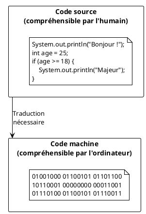
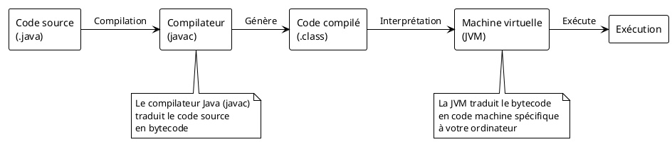
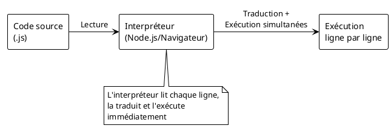
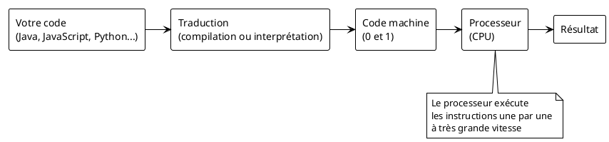
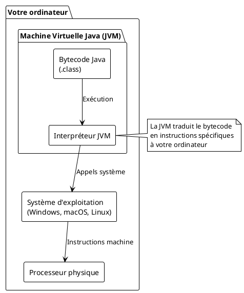
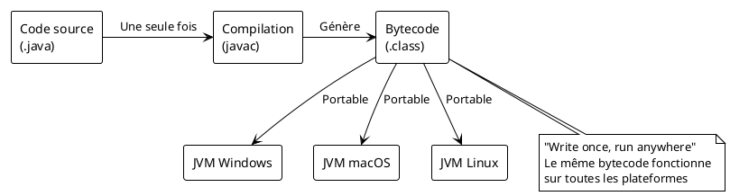

# Introduction à Java et aux environnements de développement

V. Guidoux, avec l'aide de
[GitHub Copilot](https://github.com/features/copilot).

Ce travail est sous licence [CC BY-SA 4.0][licence].

## Ressources

- Objectifs, méthodes d'enseignement et d'apprentissage, et méthodes
  d'évaluation : [Lien vers le contenu](..)
- Supports de cours : [Lien vers le contenu](../01-supports-de-cours/README.md)
  ·
  [Presentation (web)](https://HEIG-VD-Prog-Course.github.io/HEIG-VD-ProgIM-Course/04.01-java/01-supports-de-cours/index.html)
  ·
  [Presentation (PDF)](https://HEIG-VD-Prog-Course.github.io/HEIG-VD-ProgIM-Course/04.01-java/01-supports-de-cours/04.01-java-presentation.pdf)
- Exercices : [Lien vers le contenu](../02-exercices/README.md)

## Table des matières

- [Ressources](#ressources)
- [Table des matières](#table-des-matières)
- [Introduction](#introduction)
- [Les concepts fondamentaux](#les-concepts-fondamentaux)
  - [Qu'est-ce qu'un programme informatique ?](#quest-ce-quun-programme-informatique-)
  - [Code source vs code machine](#code-source-vs-code-machine)
- [La compilation](#la-compilation)
  - [Principe de la compilation](#principe-de-la-compilation)
  - [Exemple avec Java](#exemple-avec-java)
  - [Avantages et inconvénients de la compilation](#avantages-et-inconvénients-de-la-compilation)
- [L'interprétation](#linterprétation)
  - [Principe de l'interprétation](#principe-de-linterprétation)
  - [Exemple avec JavaScript](#exemple-avec-javascript)
  - [Avantages et inconvénients de l'interprétation](#avantages-et-inconvénients-de-linterprétation)
- [L'exécution des programmes](#lexécution-des-programmes)
  - [Comment le processeur exécute le code](#comment-le-processeur-exécute-le-code)
  - [Les machines virtuelles](#les-machines-virtuelles)
  - [Le cas particulier de Java](#le-cas-particulier-de-java)
- [Comparaison des approches](#comparaison-des-approches)
- [Les outils de développement](#les-outils-de-développement)
  - [Pourquoi ne pas utiliser un simple éditeur de texte ?](#pourquoi-ne-pas-utiliser-un-simple-éditeur-de-texte-)
  - [Qu'est-ce qu'un IDE ?](#quest-ce-quun-ide-)
  - [Les fonctionnalités d'un IDE](#les-fonctionnalités-dun-ide)
- [Installation et configuration de l'environnement Java](#installation-et-configuration-de-lenvironnement-java)
  - [Visual Studio Code pour Java](#visual-studio-code-pour-java)
  - [Alternative : IntelliJ IDEA](#alternative--intellij-idea)
  - [Votre premier programme Java](#votre-premier-programme-java)
- [Validation de l'installation](#validation-de-linstallation)
- [Conseils et bonnes pratiques](#conseils-et-bonnes-pratiques)
- [Sources et liens utiles](#sources-et-liens-utiles)

## Introduction

Vous avez appris les bases de la programmation avec des algorithmes et des
concepts fondamentaux. Maintenant, il est temps de passer à l'étape suivante :
apprendre à programmer dans un vrai langage de programmation.

Dans ce cours, nous allons découvrir Java, mais avant de plonger directement
dans le code, il est essentiel de comprendre comment fonctionnent les programmes
informatiques en général. Ces concepts que vous allez apprendre s'appliquent à
tous les langages de programmation, pas seulement à Java.

> [!IMPORTANT]
>
> Les concepts de compilation, d'interprétation et d'exécution que vous allez
> apprendre dans ce cours sont universels. Que vous programmiez plus tard en
> Python, JavaScript, C++, ou tout autre langage, ces fondamentaux vous seront
> toujours utiles.

À la fin de cette séance, vous devriez être capable de :

- Comprendre les principes de base de la compilation, de l'interprétation et de
  l'exécution des programmes.
- Lister les outils nécessaires pour programmer en Java sur votre ordinateur.
- Expliquer le rôle de chaque outil dans le processus de développement Java.
  - Java Development Kit (JDK)
  - Un IDE (Integrated Development Environment)
- Configurer un environnement de développement Java sur votre ordinateur.
- Configurer un projet Java simple en utilisant un IDE (par exemple, Eclipse,
  IntelliJ IDEA, ou VS Code).
- Exécuter un programme Java simple qui affiche "Hello, World!" dans la console.

## Les concepts fondamentaux

### Qu'est-ce qu'un programme informatique ?

Un programme informatique est une séquence d'instructions que l'ordinateur peut
exécuter pour accomplir une tâche spécifique. Mais il y a un problème : les
humains et les ordinateurs ne parlent pas la même langue !

Les humains préfèrent écrire du code dans des langages qui ressemblent (un peu)
à l'anglais, comme :

```java
System.out.println("Bonjour le monde !");
```

Mais l'ordinateur, lui, ne comprend que des séquences de 0 et de 1 (le code
binaire) :

```
01001000 01100101 01101100 01101100 01101111
```

### Code source vs code machine



Il faut donc un moyen de traduire le code que nous écrivons (le **code source**)
en instructions que l'ordinateur peut comprendre (le **code machine**). Il
existe deux approches principales pour faire cette traduction : la
**compilation** et l'**interprétation**.

## La compilation

### Principe de la compilation

La compilation est un processus qui traduit **tout** le code source en code
machine **avant** l'exécution du programme. C'est comme traduire un livre entier
d'une langue à une autre avant de le lire.



### Exemple avec Java

Quand vous écrivez un programme Java, voici ce qui se passe :

1. **Écriture** : Vous écrivez votre code dans un fichier `.java`
2. **Compilation** : Le compilateur `javac` traduit votre code en "bytecode"
   (fichier `.class`)
3. **Exécution** : La Machine Virtuelle Java (JVM) exécute le bytecode

```java
// Fichier: HelloWorld.java
public class HelloWorld {
    public static void main(String[] args) {
        System.out.println("Bonjour le monde !");
    }
}
```

```bash
# Compilation
javac HelloWorld.java    # Crée HelloWorld.class

# Exécution
java HelloWorld          # Exécute le programme
```

### Avantages et inconvénients de la compilation

**Avantages :**

- ✅ **Performance** : Le code compilé s'exécute généralement plus rapidement
- ✅ **Détection d'erreurs** : Beaucoup d'erreurs sont détectées à la
  compilation
- ✅ **Distribution** : Vous pouvez distribuer le code compilé sans le code
  source

**Inconvénients :**

- ❌ **Temps de développement** : Il faut compiler avant de tester
- ❌ **Portabilité** : Le code compilé est spécifique à une architecture
- ❌ **Flexibilité** : Plus difficile de modifier le comportement à l'exécution

## L'interprétation

### Principe de l'interprétation

L'interprétation traduit et exécute le code source **ligne par ligne** au moment
de l'exécution. C'est comme avoir un traducteur simultané qui traduit un
discours en temps réel.



### Exemple avec JavaScript

JavaScript est un exemple typique de langage interprété :

```javascript
// Ce code est exécuté directement par l'interpréteur
console.log("Bonjour le monde !");
let age = 25;
if (age >= 18) {
	console.log("Majeur");
}
```

> [!TIP]
>
> Vous pouvez tester du JavaScript immédiatement dans la console de votre
> navigateur web (F12 → Console) ! Tapez `console.log("Hello")` et appuyez sur
> Entrée pour voir le résultat instantanément.

### Avantages et inconvénients de l'interprétation

**Avantages :**

- ✅ **Rapidité de développement** : Pas besoin de compiler, test immédiat
- ✅ **Flexibilité** : Peut modifier le comportement du programme à l'exécution
- ✅ **Portabilité** : Le même code fonctionne partout où l'interpréteur est
  installé

**Inconvénients :**

- ❌ **Performance** : Généralement plus lent que le code compilé
- ❌ **Erreurs à l'exécution** : Certaines erreurs ne sont détectées qu'au
  moment de l'exécution
- ❌ **Dépendance** : L'interpréteur doit être installé pour exécuter le
  programme

## L'exécution des programmes

### Comment le processeur exécute le code

Le processeur de votre ordinateur ne comprend qu'un seul langage : le **langage
machine** (des séquences de 0 et 1). Toutes les instructions, qu'elles viennent
d'un code compilé ou interprété, doivent finalement être traduites dans ce
langage.



### Les machines virtuelles

Une machine virtuelle est un programme qui simule un ordinateur à l'intérieur de
votre ordinateur. Elle crée une couche d'abstraction entre votre code et le
système d'exploitation réel.



### Le cas particulier de Java

Java utilise une approche hybride qui combine les avantages de la compilation et
de l'interprétation :



> [!IMPORTANT]
>
> Le slogan de Java est "Write once, run anywhere" (Écrivez une fois, exécutez
> partout). Cela signifie que vous compilez votre code Java une seule fois, et
> le bytecode généré peut s'exécuter sur n'importe quel ordinateur qui a une JVM
> installée.

## Comparaison des approches

| Aspect                       | Compilation (ex: C++)             | Interprétation (ex: JavaScript) | Hybride (ex: Java)                   |
| ---------------------------- | --------------------------------- | ------------------------------- | ------------------------------------ |
| **Vitesse d'exécution**      | 🟢 Très rapide                    | 🟡 Plus lent                    | 🟡 Rapide                            |
| **Vitesse de développement** | 🟡 Compile à chaque modification  | 🟢 Test immédiat                | 🟡 Compile puis test                 |
| **Portabilité**              | 🔴 Doit recompiler pour chaque OS | 🟢 Même code partout            | 🟢 Compile une fois, exécute partout |
| **Détection d'erreurs**      | 🟢 À la compilation               | 🔴 À l'exécution                | 🟢 À la compilation                  |
| **Taille des fichiers**      | 🟡 Exécutable volumineux          | 🟢 Code source compact          | 🟡 Bytecode compact                  |

## Les outils de développement

### Pourquoi ne pas utiliser un simple éditeur de texte ?

Techniquement, vous pourriez écrire du code Java dans le Bloc-notes de Windows
et le compiler en ligne de commande. Mais ce serait comme :

- Écrire un livre avec un crayon au lieu d'un traitement de texte
- Cuisiner sans ustensiles modernes
- Réparer une voiture sans outils appropriés

> [!TIP]
>
> Un développeur professionnel passe la majorité de son temps à lire, comprendre
> et modifier du code existant, plutôt qu'à écrire du nouveau code. Les outils
> qui facilitent ces tâches sont donc essentiels pour être productif.

### Qu'est-ce qu'un IDE ?

Un **IDE** (Integrated Development Environment) ou **Environnement de
Développement Intégré** est un logiciel qui combine tous les outils nécessaires
au développement dans une seule application.

```plantuml
@startuml
!theme plain

package "IDE (Environnement de Développement Intégré)" {
    rectangle "Éditeur de code\navec coloration syntaxique" as editor
    rectangle "Compilateur\nintégré" as compiler
    rectangle "Débogueur\n(trouver les erreurs)" as debugger
    rectangle "Gestionnaire de projets\n(organisation des fichiers)" as project
    rectangle "Terminal\nintégré" as terminal
    rectangle "Extensions\n(fonctionnalités supplémentaires)" as extensions
}

note bottom of IDE
    Tout est centralisé dans une seule application
    pour une expérience de développement fluide
end note
@enduml
```

### Les fonctionnalités d'un IDE

Un bon IDE vous apporte :

1. **Coloration syntaxique** : Le code est coloré pour être plus lisible
2. **Auto-complétion** : L'IDE suggère du code pendant que vous tapez
3. **Détection d'erreurs** : Les erreurs sont soulignées en temps réel
4. **Refactoring** : Renommer facilement des variables dans tout le projet
5. **Débogage** : Exécuter le code pas à pas pour trouver les problèmes
6. **Gestion de projets** : Organiser vos fichiers et dépendances
7. **Intégration Git** : Gérer les versions de votre code
8. **Terminal intégré** : Exécuter des commandes sans quitter l'IDE

> [!IMPORTANT]
>
> Apprendre à bien utiliser un IDE est un investissement qui vous fera gagner
> des heures de travail tout au long de votre carrière de développeur.

## Installation et configuration de l'environnement Java

Pour développer en Java, vous avez besoin de plusieurs éléments :

1. **Java Development Kit (JDK)** : Contient le compilateur et la JVM
2. **Un IDE** : Pour écrire et gérer votre code efficacement

### Visual Studio Code pour Java

Visual Studio Code (VS Code) est un éditeur de code gratuit et très populaire.
Avec les bonnes extensions, il devient un excellent IDE pour Java.

#### Installation de VS Code

1. Téléchargez VS Code depuis
   [https://code.visualstudio.com/](https://code.visualstudio.com/)
2. Installez-le en suivant l'assistant d'installation

#### Configuration Java dans VS Code

Suivez le tutoriel officiel de Microsoft :
[Java in Visual Studio Code](https://code.visualstudio.com/docs/java/java-tutorial)

Les étapes principales sont :

1. **Installer le JDK** : VS Code peut vous aider à télécharger et installer
   Java
2. **Installer l'Extension Pack for Java** : Un pack d'extensions qui transforme
   VS Code en IDE Java
3. **Créer votre premier projet** : VS Code peut générer la structure de base

> [!TIP]
>
> L'Extension Pack for Java de Microsoft inclut plusieurs extensions utiles :
>
> - Language Support for Java
> - Debugger for Java
> - Test Runner for Java
> - Maven for Java
> - Project Manager for Java
> - IntelliCode

### Alternative : IntelliJ IDEA

IntelliJ IDEA est un IDE spécialement conçu pour Java, développé par JetBrains.
Il existe en version gratuite (Community Edition) et payante (Ultimate Edition).

#### Pourquoi choisir IntelliJ IDEA ?

- **Spécialisé pour Java** : Toutes les fonctionnalités sont optimisées pour
  Java
- **Très puissant** : Auto-complétion intelligente, refactoring avancé
- **Professionnel** : Utilisé par de nombreuses entreprises

#### Installation d'IntelliJ IDEA

Consultez le guide officiel :
[Getting Started with IntelliJ IDEA](https://www.jetbrains.com/help/idea/getting-started.html)

> [!IMPORTANT]
>
> Pour vos études, la version Community (gratuite) d'IntelliJ IDEA est largement
> suffisante. Elle inclut tout ce dont vous avez besoin pour apprendre Java.

### Votre premier programme Java

Une fois votre environnement configuré, créez votre premier programme :

1. **Créez un nouveau projet Java** dans votre IDE
2. **Créez une classe** appelée `HelloWorld`
3. **Écrivez ce code** :

```java
public class HelloWorld {
    public static void main(String[] args) {
        System.out.println("Bonjour le monde !");
        System.out.println("Je programme en Java !");
    }
}
```

4. **Exécutez le programme** en cliquant sur le bouton "Run" de votre IDE

Vous devriez voir s'afficher :

```
Bonjour le monde !
Je programme en Java !
```

> [!TIP]
>
> Si votre programme fonctionne, félicitations ! Vous venez d'exécuter votre
> premier programme Java. Si vous avez des erreurs, c'est normal : apprendre à
> déboguer fait partie de l'apprentissage de la programmation.

## Validation de l'installation

Utilisez cette liste de vérification pour vous assurer que tout est correctement
installé :

- [ ] Java JDK est installé et accessible
- [ ] Votre IDE (VS Code ou IntelliJ IDEA) est installé
- [ ] Les extensions Java sont installées dans votre IDE
- [ ] Vous pouvez créer un nouveau projet Java
- [ ] Vous pouvez compiler et exécuter le programme "Hello World"
- [ ] Vous comprenez la différence entre compilation et interprétation
- [ ] Vous savez expliquer le rôle de la JVM

## Conseils et bonnes pratiques

> [!TIP]
>
> **Conseils pour débuter :**
>
> - Prenez le temps de bien configurer votre environnement dès le début
> - N'hésitez pas à explorer les fonctionnalités de votre IDE
> - Sauvegardez régulièrement votre travail
> - Organisez vos projets dans des dossiers clairs

> [!IMPORTANT]
>
> **Erreurs communes à éviter :**
>
> - Ne pas sauvegarder avant de compiler
> - Oublier les majuscules/minuscules dans les noms de fichiers Java
> - Ne pas respecter la convention de nommage (HelloWorld.java pour la classe
>   HelloWorld)
> - Essayer de compiler du code avec des erreurs de syntaxe

## Sources et liens utiles

- [Documentation officielle Java](https://docs.oracle.com/en/java/)
- [Visual Studio Code Java Tutorial](https://code.visualstudio.com/docs/java/java-tutorial)
- [IntelliJ IDEA Getting Started](https://www.jetbrains.com/help/idea/getting-started.html)
- [Oracle Java Learning Path](https://education.oracle.com/java)

[licence]:
	https://github.com/HEIG-VD-Prog-Course/HEIG-VD-ProgIM-Course/blob/main/LICENSE.md
