# Variables & Constantes - Support de cours

V. Guidoux, avec l'aide de
[GitHub Copilot](https://github.com/features/copilot).

Ce travail est sous licence [CC BY-SA 4.0][licence].

## Ressources

- Objectifs, méthodes d'enseignement et d'apprentissage, et méthodes
  d'évaluation : [Lien vers le contenu](..)
- Supports de cours : [Lien vers le contenu](../01-supports-de-cours/README.md)
  ·
  [Presentation (web)](https://HEIG-VD-Prog-Course.github.io/HEIG-VD-ProgIM-Course/04.02-variables-constantes/01-supports-de-cours/index.html)
  ·
  [Presentation (PDF)](https://HEIG-VD-Prog-Course.github.io/HEIG-VD-ProgIM-Course/04.02-variables-constantes/01-supports-de-cours/04.02-variables-constantes-presentation.pdf)
- Exercices : [Lien vers le contenu](../02-exercices/README.md)

## Table des matières

- [Ressources](#ressources)
- [Table des matières](#table-des-matières)
- [Objectifs](#objectifs)
- [Introduction](#introduction)
- [1. Les variables en Java](#1-les-variables-en-java)
  - [1.1. Qu'est-ce qu'une variable ?](#11-quest-ce-quune-variable-)
  - [1.2. Les types de données de base](#12-les-types-de-données-de-base)
  - [1.3. Opérations sur les variables](#13-opérations-sur-les-variables)
- [2. Les constantes en Java](#2-les-constantes-en-java)
  - [2.1. Qu'est-ce qu'une constante ?](#21-quest-ce-quune-constante-)
  - [2.2. Déclaration avec `final`](#22-déclaration-avec-final)
- [3. Les structures algorithmiques en Java](#3-les-structures-algorithmiques-en-java)
  - [3.1. La séquence](#31-la-séquence)
  - [3.2. La sélection (if/else)](#32-la-sélection-ifelse)
  - [3.3. L'itération - La boucle while](#33-litération---la-boucle-while)
  - [3.4. L'itération - La boucle for](#34-litération---la-boucle-for)
- [4. Récapitulatif et bonnes pratiques](#4-récapitulatif-et-bonnes-pratiques)
  - [Résumé des structures algorithmiques](#résumé-des-structures-algorithmiques)
  - [Tableau récapitulatif](#tableau-récapitulatif)
  - [Erreurs courantes à éviter](#erreurs-courantes-à-éviter)
  - [Bonnes pratiques](#bonnes-pratiques)
  - [Sources et liens utiles](#sources-et-liens-utiles)

## Objectifs

Cette séance a pour but pour vous faire découvrir les concepts de base des
variables et constantes en Java. Vous apprendrez à déclarer, initialiser et
utiliser différents types de variables, ainsi qu'à comprendre les structures
algorithmiques associées.

De façon plus concise, à la fin de cette séance, vous devriez être capable de :

- Identifier et appliquer les structures algorithmiques fondamentales :
  séquence, sélection et itération en Java
- Utiliser efficacement les variables, les constantes et les types de données de
  base en Java

## Introduction

Bienvenue dans ce cours sur les variables, les constantes et les structures
algorithmiques en Java !

Dans le cours précédent, vous avez appris à installer et configurer votre
environnement de développement Java, et vous avez créé votre premier programme
qui affiche "Hello, World!".

Aujourd'hui, nous allons aller beaucoup plus loin en apprenant à :

- Stocker et manipuler des données avec les **variables** et les **constantes**
- Organiser votre code avec les **structures algorithmiques** : séquence,
  sélection et itération
- Créer des programmes qui prennent des décisions et répètent des actions

> [!IMPORTANT]
>
> Rappel : En Java, tout le code que nous écrivons s'exécute dans la méthode
> `main`. C'est le point d'entrée de notre programme. Chaque exemple que nous
> verrons aujourd'hui sera placé dans cette méthode `main` pour pouvoir être
> exécuté.

```java
public class MyProgram {
    public static void main(String[] args) {
        // Votre code s'exécute ici
        System.out.println("Hello, World!");
    }
}
```

## 1. Les variables en Java

### 1.1. Qu'est-ce qu'une variable ?

Une variable est comme une **boîte** dans laquelle vous pouvez ranger une
information. Cette boîte a :

- Un **nom** (pour pouvoir la retrouver)
- Un **type** (pour savoir quel genre d'information elle contient)
- Une **valeur** (l'information elle-même)

#### Analogies avec la vie réelle

Pensez à ces exemples concrets :

1. **Un panier de pommes** 🍎

   - Le panier s'appelle `appleCount`
   - Il contient des **nombres entiers** (on ne peut pas avoir 2.5 pommes)
   - Sa valeur actuelle est `5`

2. **Un portefeuille** 💰

   - Le portefeuille s'appelle `myMoney`
   - Il contient un **nombre décimal** (on peut avoir 25.50 francs)
   - Sa valeur actuelle est `25.50`

3. **Une étiquette avec votre nom** 📛

   - L'étiquette s'appelle `myName`
   - Elle contient du **texte** (une chaîne de caractères)
   - Sa valeur actuelle est `"Marie"`

4. **Un interrupteur** 💡
   - L'interrupteur s'appelle `lampOn`
   - Il peut être **vrai ou faux** (allumé ou éteint)
   - Sa valeur actuelle est `true` (allumé)

#### Déclaration et initialisation

En Java, pour créer une variable, on doit :

1. **Déclarer** son type et son nom
2. **Initialiser** sa valeur (lui donner une première valeur)

```java
// Déclaration + initialisation en une ligne
int appleCount = 5;

// Ou en deux étapes
int pearCount;        // Déclaration
pearCount = 3;         // Initialisation
```

> [!TIP]
>
> **Bonne pratique** : Initialisez toujours vos variables au moment de leur
> déclaration. Cela évite les erreurs et rend votre code plus clair.

### 1.2. Les types de données de base

Java propose plusieurs types de données de base. Nous allons voir les quatre
types les plus importants pour commencer.

#### 1.2.1. Le type `int` (nombres entiers)

Le type `int` permet de stocker des **nombres entiers** (sans virgule), positifs
ou négatifs.

**Exemples d'utilisation** : compter des objets, des personnes, des jours, etc.

##### Exemple 1 — Compter des pommes dans un panier

**Phrase descriptive :**

```text
Je prends un panier vide et j'y place 5 pommes.
```

**Diagramme UML :**

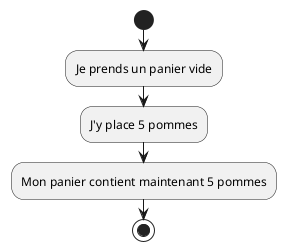

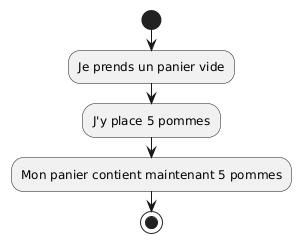

**Code Java :**

```java
public class AppleBasket {
    public static void main(String[] args) {
        // Je déclare une variable pour compter les pommes
        int appleCount = 5;

        // J'affiche le nombre de pommes
        System.out.println("Mon panier contient " + appleCount + " pommes");
    }
}
```

**Résultat dans la console :**

```
Mon panier contient 5 pommes
```

**Explications ligne par ligne :**

- `int appleCount = 5;` → Je crée une variable de type entier nommée
  `appleCount` et je lui donne la valeur `5`
- `System.out.println(...)` → J'affiche un message dans la console
- `"Mon panier contient " + appleCount + " pommes"` → Je combine du texte avec
  la valeur de ma variable en utilisant le symbole `+`

##### Exemple 2 — Calculer un âge

**Phrase descriptive :**

```text
Marie a 20 ans. Dans 5 ans, elle aura 25 ans.
```

**Diagramme UML :**

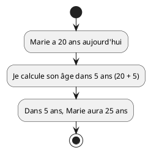

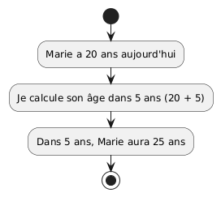

**Code Java :**

```java
public class CalculateAge {
    public static void main(String[] args) {
        // L'âge actuel de Marie
        int currentAge = 20;

        // Je calcule son âge dans 5 ans
        int futureAge = currentAge + 5;

        // J'affiche le résultat
        System.out.println("Marie a " + currentAge + " ans aujourd'hui");
        System.out.println("Dans 5 ans, elle aura " + futureAge + " ans");
    }
}
```

**Résultat dans la console :**

```
Marie a 20 ans aujourd'hui
Dans 5 ans, elle aura 25 ans
```

##### Exemple 3 — Compter des étudiants dans une classe

**Phrase descriptive :**

```text
Il y a 25 étudiants dans la classe. 3 étudiants sont absents aujourd'hui.
Combien d'étudiants sont présents ?
```

**Diagramme UML :**

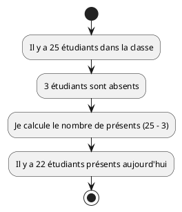

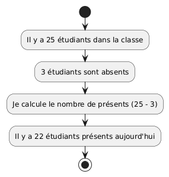

**Code Java :**

```java
public class PresentStudents {
    public static void main(String[] args) {
        // Le nombre total d'étudiants
        int totalCount = 25;

        // Le nombre d'absents
        int absentCount = 3;

        // Je calcule le nombre de présents
        int presentCount = totalCount - absentCount;

        // J'affiche le résultat
        System.out.println("Nombre total d'étudiants : " + totalCount);
        System.out.println("Nombre d'absents : " + absentCount);
        System.out.println("Nombre de présents : " + presentCount);
    }
}
```

**Résultat dans la console :**

```
Nombre total d'étudiants : 25
Nombre d'absents : 3
Nombre de présents : 22
```

> [!TIP]
>
> **Opérations possibles avec les `int` :**
>
> - Addition : `a + b`
> - Soustraction : `a - b`
> - Multiplication : `a * b`
> - Division : `a / b` (attention : division entière !)
> - Modulo (reste) : `a % b`

#### 1.2.2. Le type `double` (nombres décimaux)

Le type `double` permet de stocker des **nombres décimaux** (avec virgule, notée
avec un point en programmation).

**Exemples d'utilisation** : prix, mesures, pourcentages, etc.

##### Exemple 1 — Calculer le prix total d'un achat

**Phrase descriptive :**

```text
J'achète un livre à 15.90 francs et un café à 4.50 francs.
Quel est le prix total ?
```

**Diagramme UML :**

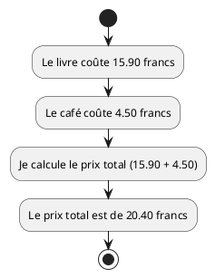

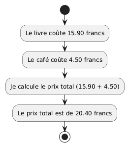

**Code Java :**

```java
public class TotalPrice {
    public static void main(String[] args) {
        // Le prix du livre
        double bookPrice = 15.90;

        // Le prix du café
        double coffeePrice = 4.50;

        // Je calcule le prix total
        double totalPrice = bookPrice + coffeePrice;

        // J'affiche le résultat
        System.out.println("Prix du livre : " + bookPrice + " francs");
        System.out.println("Prix du café : " + coffeePrice + " francs");
        System.out.println("Prix total : " + totalPrice + " francs");
    }
}
```

**Résultat dans la console :**

```
Prix du livre : 15.9 francs
Prix du café : 4.5 francs
Prix total : 20.4 francs
```

##### Exemple 2 — Calculer une moyenne de notes

**Phrase descriptive :**

```text
Pierre a obtenu 5.5 et 4.0 à deux examens.
Quelle est sa moyenne ?
```

**Diagramme UML :**

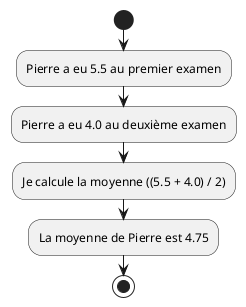


**Code Java :**

```java
public class CalculateAverage {
    public static void main(String[] args) {
        // Les deux notes de Pierre
        double grade1 = 5.5;
        double grade2 = 4.0;

        // Je calcule la moyenne
        double average = (grade1 + grade2) / 2;

        // J'affiche le résultat
        System.out.println("Note 1 : " + grade1);
        System.out.println("Note 2 : " + grade2);
        System.out.println("Moyenne : " + average);
    }
}
```

**Résultat dans la console :**

```
Note 1 : 5.5
Note 2 : 4.0
Moyenne : 4.75
```

##### Exemple 3 — Calculer une distance

**Phrase descriptive :**

```text
Je cours 2.5 kilomètres le matin et 3.75 kilomètres le soir.
Quelle distance totale ai-je parcourue aujourd'hui ?
```

**Diagramme UML :**

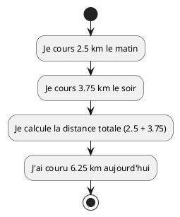

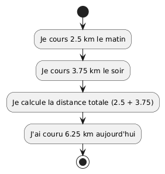

**Code Java :**

```java
public class TotalDistance {
    public static void main(String[] args) {
        // Distance du matin
        double morningDistance = 2.5;

        // Distance du soir
        double eveningDistance = 3.75;

        // Je calcule la distance totale
        double totalDistance = morningDistance + eveningDistance;

        // J'affiche le résultat
        System.out.println("Distance du matin : " + morningDistance + " km");
        System.out.println("Distance du soir : " + eveningDistance + " km");
        System.out.println("Distance totale : " + totalDistance + " km");
    }
}
```

**Résultat dans la console :**

```
Distance du matin : 2.5 km
Distance du soir : 3.75 km
Distance totale : 6.25 km
```

> [!IMPORTANT]
>
> **Différence entre `int` et `double` :**
>
> - Utilisez `int` pour compter des choses (pommes, personnes, jours)
> - Utilisez `double` pour mesurer des choses (prix, distances, températures)

#### 1.2.3. Le type `String` (chaînes de caractères)

Le type `String` permet de stocker du **texte** (des mots, des phrases, des
noms, etc.).

**Exemples d'utilisation** : noms, messages, adresses, etc.

> [!TIP]
>
> Remarquez que `String` commence par une majuscule, contrairement à `int` et
> `double`. C'est parce que `String` est un type un peu spécial en Java (c'est
> une classe), mais vous pouvez l'utiliser de la même manière.

##### Exemple 1 — Afficher un message de bienvenue

**Phrase descriptive :**

```text
Je veux afficher un message de bienvenue avec le nom de l'utilisateur.
```

**Diagramme UML :**

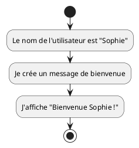

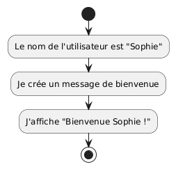

**Code Java :**

```java
public class WelcomeMessage {
    public static void main(String[] args) {
        // Le nom de l'utilisateur
        String name = "Sophie";

        // Je crée le message de bienvenue
        String message = "Bienvenue " + name + " !";

        // J'affiche le message
        System.out.println(message);
    }
}
```

**Résultat dans la console :**

```
Bienvenue Sophie !
```

**Explications :**

- `String name = "Sophie";` → Je crée une variable de type texte avec le nom
  "Sophie"
- Les textes (String) sont toujours entourés de guillemets doubles `"`
- Le symbole `+` permet de **concaténer** (coller ensemble) plusieurs textes

##### Exemple 2 — Créer une adresse complète

**Phrase descriptive :**

```text
Je veux créer une adresse complète en combinant la rue, le numéro et la ville.
```

**Diagramme UML :**

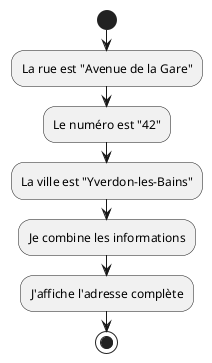

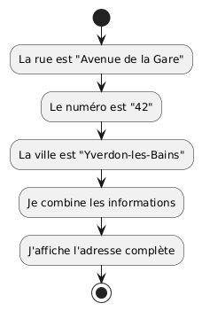

**Code Java :**

```java
public class CompleteAddress {
    public static void main(String[] args) {
        // Les différentes parties de l'adresse
        String street = "Avenue de la Gare";
        String number = "42";
        String city = "Yverdon-les-Bains";

        // Je crée l'adresse complète
        String fullAddress = street + " " + number + ", " + city;

        // J'affiche l'adresse
        System.out.println("Adresse : " + fullAddress);
    }
}
```

**Résultat dans la console :**

```
Adresse : Avenue de la Gare 42, Yverdon-les-Bains
```

##### Exemple 3 — Présentation personnelle

**Phrase descriptive :**

```text
Je veux créer une phrase de présentation avec mon nom, mon âge et ma ville.
```

**Diagramme UML :**

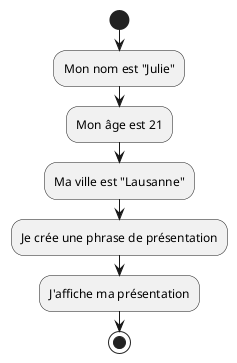


**Code Java :**

```java
public class Presentation {
    public static void main(String[] args) {
        // Mes informations
        String name = "Julie";
        int age = 21;
        String city = "Lausanne";

        // Je crée ma présentation
        String presentation = "Bonjour, je m'appelle " + name +
                            ", j'ai " + age +
                            " ans et j'habite à " + city + ".";

        // J'affiche ma présentation
        System.out.println(presentation);
    }
}
```

**Résultat dans la console :**

```
Bonjour, je m'appelle Julie, j'ai 21 ans et j'habite à Lausanne.
```

> [!TIP]
>
> **Astuce** : Vous pouvez combiner des `String` avec d'autres types (comme
> `int` ou `double`) en utilisant le symbole `+`. Java convertit automatiquement
> les nombres en texte pour vous !

#### 1.2.4. Le type `boolean` (vrai ou faux)

Le type `boolean` permet de stocker une valeur **vraie** (`true`) ou **fausse**
(`false`). C'est comme un interrupteur qui peut être allumé ou éteint.

**Exemples d'utilisation** : vérifier une condition, indiquer un état, etc.

##### Exemple 1 — Vérifier si une lampe est allumée

**Phrase descriptive :**

```text
Ma lampe est allumée. Je veux afficher son état.
```

**Diagramme UML :**

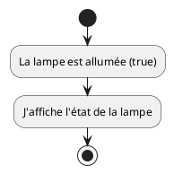

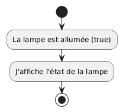

**Code Java :**

```java
public class LampState {
    public static void main(String[] args) {
        // L'état de la lampe
        boolean lampOn = true;

        // J'affiche l'état
        System.out.println("La lampe est allumée : " + lampOn);
    }
}
```

**Résultat dans la console :**

```
La lampe est allumée : true
```

##### Exemple 2 — Vérifier si j'ai faim

**Phrase descriptive :**

```text
Je viens de manger, donc je n'ai pas faim.
```

**Diagramme UML :**

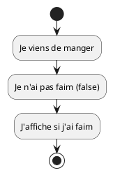

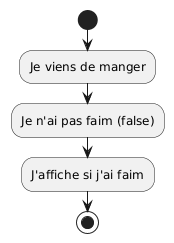

**Code Java :**

```java
public class AmHungry {
    public static void main(String[] args) {
        // Est-ce que j'ai faim ?
        boolean hungry = false;

        // J'affiche mon état
        System.out.println("J'ai faim : " + hungry);
    }
}
```

**Résultat dans la console :**

```
J'ai faim : false
```

##### Exemple 3 — Vérifier si un nombre est pair

**Phrase descriptive :**

```text
Je veux vérifier si le nombre 10 est pair.
Un nombre est pair si le reste de sa division par 2 est égal à 0.
```

**Diagramme UML :**

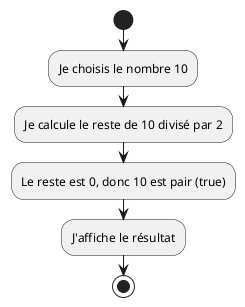


**Code Java :**

```java
public class EvenNumber {
    public static void main(String[] args) {
        // Le nombre à vérifier
        int number = 10;

        // Je vérifie si le nombre est pair
        // Un nombre est pair si le reste de la division par 2 est 0
        boolean isEven = (number % 2 == 0);

        // J'affiche le résultat
        System.out.println("Le nombre " + number + " est pair : " + isEven);
    }
}
```

**Résultat dans la console :**

```
Le nombre 10 est pair : true
```

**Explications :**

- `number % 2` → Calcule le reste de la division de `number` par 2 (opérateur
  modulo)
- `==` → Opérateur de comparaison (égal à)
- `(number % 2 == 0)` → Cette expression donne `true` si le reste est 0, `false`
  sinon
- Les parenthèses rendent le code plus lisible

> [!IMPORTANT]
>
> **Les booléens sont essentiels !** Nous les utiliserons beaucoup dans les
> structures de contrôle (if/else) que nous verrons plus tard. Ils permettent à
> votre programme de prendre des décisions.

> [!TIP]
>
> **Opérateurs de comparaison qui donnent un booléen :**
>
> - `==` : égal à
> - `!=` : différent de
> - `>` : supérieur à
> - `<` : inférieur à
> - `>=` : supérieur ou égal à
> - `<=` : inférieur ou égal à

### 1.3. Opérations sur les variables

Maintenant que vous savez créer des variables, voyons comment les modifier et
effectuer des opérations avec elles.

#### Affectation

L'**affectation** est l'action de donner une valeur à une variable. On utilise
le symbole `=` (un seul signe égal).

```java
int age = 20;  // J'affecte la valeur 20 à la variable age
```

> [!IMPORTANT]
>
> **Attention !** En programmation, `=` ne signifie pas "égal à" (comme en
> mathématiques), mais "affecter la valeur de droite à la variable de gauche".
>
> Pour comparer deux valeurs, on utilise `==` (deux signes égal).

#### Modification

Une fois qu'une variable est créée, on peut **modifier** sa valeur autant de
fois qu'on veut.

##### Exemple 1 — Modifier le contenu d'un panier

**Phrase descriptive :**

```text
Je commence avec 5 pommes dans mon panier.
J'en ajoute 3 de plus.
Maintenant j'ai 8 pommes.
```

**Diagramme UML :**

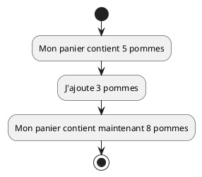

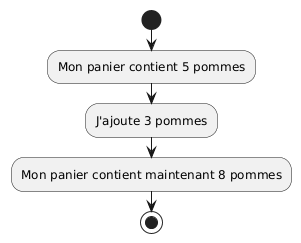

**Code Java :**

```java
public class ModifyBasket {
    public static void main(String[] args) {
        // Je commence avec 5 pommes
        int apples = 5;
        System.out.println("Au début, j'ai " + apples + " pommes");

        // J'ajoute 3 pommes
        apples = apples + 3;
        System.out.println("Après avoir ajouté 3 pommes, j'ai " + apples + " pommes");
    }
}
```

**Résultat dans la console :**

```text
Au début, j'ai 5 pommes
Après avoir ajouté 3 pommes, j'ai 8 pommes
```

**Explications :**

- `apples = apples + 3;` → Je prends la valeur actuelle de `apples` (5), j'y
  ajoute 3, et je stocke le résultat (8) dans `apples`
- La variable `apples` est modifiée : elle passe de 5 à 8

##### Exemple 2 — Mettre à jour un solde bancaire

**Phrase descriptive :**

```text
J'ai 100 francs sur mon compte. Je dépense 25 francs, puis je reçois 50 francs.
Quel est mon nouveau solde ?
```

**Diagramme UML :**

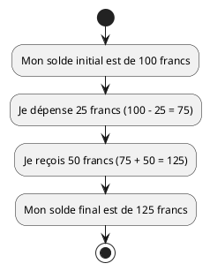

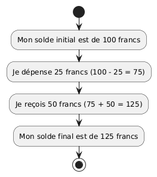

**Code Java :**

```java
public class BankBalance {
    public static void main(String[] args) {
        // Mon solde initial
        double balance = 100.0;
        System.out.println("Solde initial : " + balance + " francs");

        // Je dépense 25 francs
        balance = balance - 25.0;
        System.out.println("Après dépense : " + balance + " francs");

        // Je reçois 50 francs
        balance = balance + 50.0;
        System.out.println("Solde final : " + balance + " francs");
    }
}
```

**Résultat dans la console :**

```text
Solde initial : 100.0 francs
Après dépense : 75.0 francs
Solde final : 125.0 francs
```

#### Opérations arithmétiques

Java propose plusieurs opérateurs pour effectuer des calculs :

| Opérateur | Signification  | Exemple  | Résultat |
| --------- | -------------- | -------- | -------- |
| `+`       | Addition       | `5 + 3`  | `8`      |
| `-`       | Soustraction   | `5 - 3`  | `2`      |
| `*`       | Multiplication | `5 * 3`  | `15`     |
| `/`       | Division       | `10 / 2` | `5`      |
| `%`       | Modulo (reste) | `10 % 3` | `1`      |

##### Exemple 1 — Calculer le prix total d'une commande

**Phrase descriptive :**

```text
Je commande 4 pizzas à 12.50 francs chacune.
Quel est le prix total de ma commande ?
```

**Diagramme UML :**

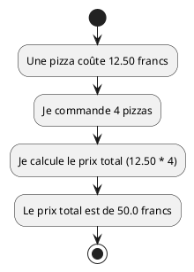

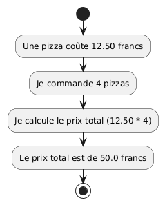

**Code Java :**

```java
public class OrderPizzas {
    public static void main(String[] args) {
        // Le prix d'une pizza
        double unitPrice = 12.50;

        // Le nombre de pizzas
        int quantity = 4;

        // Je calcule le prix total
        double totalPrice = unitPrice * quantity;

        // J'affiche le résultat
        System.out.println("Prix unitaire : " + unitPrice + " francs");
        System.out.println("Quantité : " + quantity);
        System.out.println("Prix total : " + totalPrice + " francs");
    }
}
```

**Résultat dans la console :**

```text
Prix unitaire : 12.5 francs
Quantité : 4
Prix total : 50.0 francs
```

##### Exemple 2 — Partager équitablement des bonbons

**Phrase descriptive :**

```text
J'ai 20 bonbons à partager entre 3 amis.
Combien de bonbons chaque ami reçoit-il ?
Combien de bonbons reste-t-il ?
```

**Diagramme UML :**

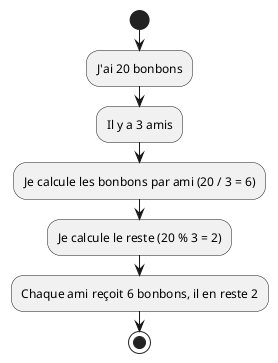

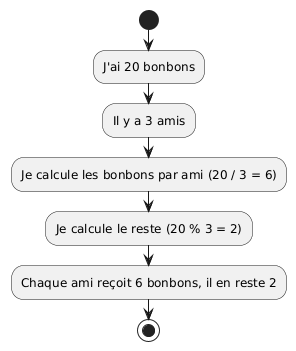

**Code Java :**

```java
public class ShareCandies {
    public static void main(String[] args) {
        // Le nombre total de bonbons
        int totalCandies = 20;

        // Le nombre d'amis
        int friendCount = 3;

        // Combien de bonbons par ami ? (division entière)
        int candiesPerFriend = totalCandies / friendCount;

        // Combien de bonbons restent ? (modulo)
        int remainingCandies = totalCandies % friendCount;

        // J'affiche le résultat
        System.out.println("Total de bonbons : " + totalCandies);
        System.out.println("Nombre d'amis : " + friendCount);
        System.out.println("Bonbons par ami : " + candiesPerFriend);
        System.out.println("Bonbons restants : " + remainingCandies);
    }
}
```

**Résultat dans la console :**

```text
Total de bonbons : 20
Nombre d'amis : 3
Bonbons par ami : 6
Bonbons restants : 2
```

**Explications :**

- `20 / 3` donne `6` (et non `6.666...`) car c'est une **division entière** (les
  deux nombres sont des `int`)
- `20 % 3` donne `2` (le reste de la division : 3×6 = 18, il reste 2)

##### Exemple 3 — Calculer une remise

**Phrase descriptive :**

```text
Un produit coûte 80 francs. Il y a une remise de 20%.
Quel est le nouveau prix après la remise ?
```

**Diagramme UML :**

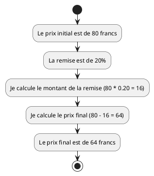

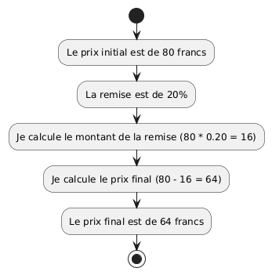

**Code Java :**

```java
public class CalculateDiscount {
    public static void main(String[] args) {
        // Le prix initial du produit
        double initialPrice = 80.0;

        // Le pourcentage de remise (20% = 0.20)
        double discountPercentage = 0.20;

        // Je calcule le montant de la remise
        double discountAmount = initialPrice * discountPercentage;

        // Je calcule le prix final
        double finalPrice = initialPrice - discountAmount;

        // J'affiche le résultat
        System.out.println("Prix initial : " + initialPrice + " francs");
        System.out.println("Remise : " + (discountPercentage * 100) + "%");
        System.out.println("Montant de la remise : " + discountAmount + " francs");
        System.out.println("Prix final : " + finalPrice + " francs");
    }
}
```

**Résultat dans la console :**

```text
Prix initial : 80.0 francs
Remise : 20.0%
Montant de la remise : 16.0 francs
Prix final : 64.0 francs
```

> [!TIP]
>
> **Raccourcis pratiques :**
>
> Java offre des raccourcis pour modifier une variable :
>
> - `x = x + 5;` peut s'écrire `x += 5;`
> - `x = x - 3;` peut s'écrire `x -= 3;`
> - `x = x * 2;` peut s'écrire `x *= 2;`
> - `x = x / 4;` peut s'écrire `x /= 4;`
> - `x = x + 1;` peut s'écrire `x++;` (incrémentation)
> - `x = x - 1;` peut s'écrire `x--;` (décrémentation)

##### Exemple 4 — Utiliser les raccourcis

**Phrase descriptive :**

```text
Je commence avec 10 points. J'en gagne 5, puis j'en perds 2.
```

**Diagramme UML :**

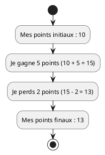

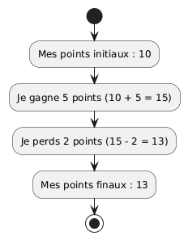

**Code Java :**

```java
public class GamePoints {
    public static void main(String[] args) {
        // Mes points initiaux
        int points = 10;
        System.out.println("Points initiaux : " + points);

        // Je gagne 5 points (raccourci)
        points += 5;  // Équivalent à : points = points + 5;
        System.out.println("Après avoir gagné 5 points : " + points);

        // Je perds 2 points (raccourci)
        points -= 2;  // Équivalent à : points = points - 2;
        System.out.println("Après avoir perdu 2 points : " + points);
    }
}
```

**Résultat dans la console :**

```text
Points initiaux : 10
Après avoir gagné 5 points : 15
Après avoir perdu 2 points : 13
```

> [!WARNING]
>
> **Attention à la division entière !**
>
> Quand vous divisez deux `int`, le résultat est aussi un `int` (la partie
> décimale est supprimée).
>
> - `7 / 2` donne `3` (et non `3.5`)
> - `7.0 / 2` donne `3.5` (car `7.0` est un `double`)
> - `7 / 2.0` donne `3.5` (car `2.0` est un `double`)

## 2. Les constantes en Java

### 2.1. Qu'est-ce qu'une constante ?

Une **constante** est une variable dont la valeur **ne peut jamais être
modifiée** après sa création. C'est comme une boîte fermée à clé : une fois
qu'on y a mis quelque chose, on ne peut plus le changer.

#### Différence avec les variables

| Variables                          | Constantes                          |
| ---------------------------------- | ----------------------------------- |
| Peuvent être modifiées             | **Ne peuvent PAS être modifiées**   |
| Nom en minuscules (`age`, `price`) | Nom en MAJUSCULES (`MAX_AGE`, `PI`) |
| Déclarées normalement              | Déclarées avec le mot-clé `final`   |
| Pour des valeurs qui changent      | Pour des valeurs qui restent fixes  |

#### Pourquoi utiliser des constantes ?

Les constantes sont utiles pour plusieurs raisons :

1. **Clarté du code** : Un nom comme `SWISS_VAT` est plus clair que `0.077`
2. **Éviter les erreurs** : On ne peut pas modifier accidentellement une
   constante
3. **Facilité de maintenance** : Si une valeur change (ex: le taux de TVA), on
   la modifie à un seul endroit
4. **Intention claire** : Le mot `final` indique que cette valeur ne doit jamais
   changer

> [!TIP]
>
> **Exemples de valeurs qui devraient être des constantes :**
>
> - Valeurs mathématiques : PI, nombre d'or
> - Taux fixes : TVA, taux de change
> - Limites : âge de majorité, vitesse maximale
> - Configuration : nombre de tentatives, temps d'attente

### 2.2. Déclaration avec `final`

#### Syntaxe

Pour déclarer une constante en Java, on utilise le mot-clé `final` avant le type
:

```java
final double PI = 3.14159;
final int VOTING_AGE = 18;
final String SCHOOL_NAME = "HEIG-VD";
```

#### Convention de nommage

Par convention, les noms de constantes sont écrits :

- **En MAJUSCULES**
- Avec des **underscores** (`_`) pour séparer les mots
- De manière **descriptive**

Exemples :

- ✅ `SWISS_VAT`
- ✅ `MAX_ATTEMPTS`
- ✅ `BASE_PRICE`
- ❌ `vat` (minuscules)
- ❌ `swissvat` (pas de séparation)
- ❌ `x` (pas descriptif)

> [!IMPORTANT]
>
> Si vous essayez de modifier une constante, Java vous donnera une **erreur de
> compilation**. C'est voulu ! Cela vous protège contre les erreurs.

#### Exemples avec UML et code Java

##### Exemple 1 — Calculer la TVA suisse

**Phrase descriptive :**

```text
Un produit coûte 100 francs hors taxe.
Le taux de TVA en Suisse est de 7.7%.
Quel est le prix TTC (toutes taxes comprises) ?
```

**Diagramme UML :**

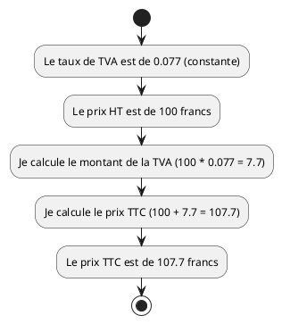

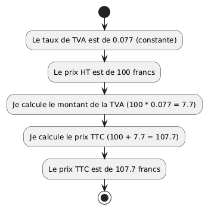

**Code Java :**

```java
public class CalculateVAT {
    public static void main(String[] args) {
        // Le taux de TVA en Suisse (constante)
        final double SWISS_VAT = 0.077;  // 7.7%

        // Le prix hors taxe
        double priceExclVAT = 100.0;

        // Je calcule le montant de la TVA
        double vatAmount = priceExclVAT * SWISS_VAT;

        // Je calcule le prix TTC
        double priceInclVAT = priceExclVAT + vatAmount;

        // J'affiche le résultat
        System.out.println("Prix HT : " + priceExclVAT + " francs");
        System.out.println("Taux TVA : " + (SWISS_VAT * 100) + "%");
        System.out.println("Montant TVA : " + vatAmount + " francs");
        System.out.println("Prix TTC : " + priceInclVAT + " francs");
    }
}
```

**Résultat dans la console :**

```text
Prix HT : 100.0 francs
Taux TVA : 7.7%
Montant TVA : 7.7 francs
Prix TTC : 107.7 francs
```

**Pourquoi utiliser une constante ici ?**

- Le taux de TVA est fixe (défini par la loi)
- On ne doit jamais le modifier accidentellement
- Si le taux change dans le futur, on le modifie à un seul endroit

##### Exemple 2 — Calculer le périmètre d'un cercle

**Phrase descriptive :**

```text
Un cercle a un rayon de 5 mètres.
Je veux calculer son périmètre avec la formule : périmètre = 2 × π × rayon
```

**Diagramme UML :**

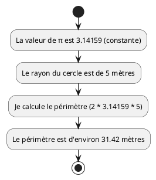

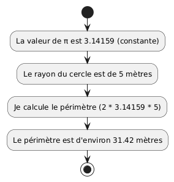

**Code Java :**

```java
public class CirclePerimeter {
    public static void main(String[] args) {
        // La valeur de π (constante mathématique)
        final double PI = 3.14159;

        // Le rayon du cercle
        double radius = 5.0;

        // Je calcule le périmètre : 2 * π * rayon
        double perimeter = 2 * PI * radius;

        // J'affiche le résultat
        System.out.println("Rayon du cercle : " + radius + " mètres");
        System.out.println("Périmètre du cercle : " + perimeter + " mètres");
    }
}
```

**Résultat dans la console :**

```text
Rayon du cercle : 5.0 mètres
Périmètre du cercle : 31.4159 mètres
```

**Pourquoi utiliser une constante ici ?**

- π est une constante mathématique universelle
- Sa valeur ne change jamais
- Le nom `PI` est plus clair que `3.14159` dans le code

##### Exemple 3 — Vérifier l'âge de majorité

**Phrase descriptive :**

```text
En Suisse, l'âge de la majorité est de 18 ans.
Je veux vérifier si une personne de 17 ans est majeure.
```

**Diagramme UML :**

```plantuml
@startuml
start
:L'âge de majorité est 18 (constante);
:La personne a 17 ans;
:Je vérifie si 17 >= 18;
:La personne n'est pas majeure (false);
stop
@enduml
```

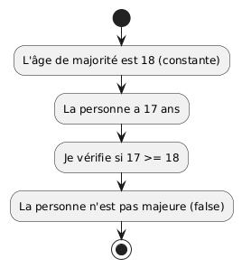

**Code Java :**

```java
public class CheckVotingAge {
    public static void main(String[] args) {
        // L'âge de la majorité en Suisse (constante)
        final int VOTING_AGE = 18;

        // L'âge de la personne
        int age = 17;

        // Je vérifie si la personne est majeure
        boolean isAdult = (age >= VOTING_AGE);

        // J'affiche le résultat
        System.out.println("Âge de la majorité : " + VOTING_AGE + " ans");
        System.out.println("Âge de la personne : " + age + " ans");
        System.out.println("Est majeur : " + isAdult);
    }
}
```

**Résultat dans la console :**

```text
Âge de la majorité : 18 ans
Âge de la personne : 17 ans
Est majeur : false
```

**Pourquoi utiliser une constante ici ?**

- L'âge de la majorité est fixé par la loi
- Il ne change pas pendant l'exécution du programme
- Le nom `AGE_MAJORITE` est plus explicite que le chiffre `18`

##### Exemple 4 — Calculer un prix avec remise maximale

**Phrase descriptive :**

```text
Un magasin offre une remise maximale de 30% sur tous les produits.
Un produit coûte 50 francs. Je veux calculer le prix minimum possible.
```

**Diagramme UML :**

```plantuml
@startuml
start
:La remise maximale est de 30% (constante);
:Le prix initial est de 50 francs;
:Je calcule le montant de la remise (50 * 0.30 = 15);
:Je calcule le prix minimal (50 - 15 = 35);
:Le prix minimal est de 35 francs;
stop
@enduml
```

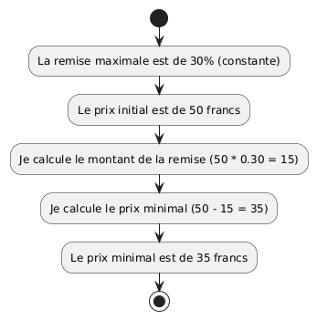

**Code Java :**

```java
public class PriceWithMaxDiscount {
    public static void main(String[] args) {
        // La remise maximale autorisée (constante)
        final double MAX_DISCOUNT = 0.30;  // 30%

        // Le prix initial du produit
        double initialPrice = 50.0;

        // Je calcule le montant de la remise
        double discountAmount = initialPrice * MAX_DISCOUNT;

        // Je calcule le prix minimal
        double minPrice = initialPrice - discountAmount;

        // J'affiche le résultat
        System.out.println("Prix initial : " + initialPrice + " francs");
        System.out.println("Remise maximale : " + (MAX_DISCOUNT * 100) + "%");
        System.out.println("Montant de la remise : " + discountAmount + " francs");
        System.out.println("Prix minimal : " + minPrice + " francs");
    }
}
```

**Résultat dans la console :**

```text
Prix initial : 50.0 francs
Remise maximale : 30.0%
Montant de la remise : 15.0 francs
Prix minimal : 35.0 francs
```

**Pourquoi utiliser une constante ici ?**

- La remise maximale est une règle du magasin
- Elle ne doit pas changer pendant l'exécution
- Si la politique du magasin change, on modifie la constante à un seul endroit

> [!WARNING]
>
> **Erreur courante : essayer de modifier une constante**
>
> ```java
> final int AGE_MAX = 100;
> AGE_MAX = 120;  // ❌ ERREUR ! Cannot assign a value to final variable
> ```
>
> Si vous essayez de compiler ce code, Java vous donnera une erreur. C'est
> normal et c'est voulu : les constantes protègent votre code contre les
> modifications accidentelles.

> [!TIP]
>
> **Résumé : Variables vs Constantes**
>
> **Utilisez une VARIABLE quand :**
>
> - La valeur peut changer pendant l'exécution
> - Exemples : âge d'une personne, solde bancaire, nombre de points
>
> **Utilisez une CONSTANTE quand :**
>
> - La valeur ne change jamais
> - Exemples : π, taux de TVA, âge de majorité, limites fixes

## 3. Les structures algorithmiques en Java

Maintenant que vous savez manipuler des variables et des constantes, apprenons à
organiser votre code avec les **structures algorithmiques fondamentales**. Ces
structures vous permettent de créer des programmes qui font plus que de simples
calculs.

Les trois structures fondamentales sont :

1. **La séquence** : exécuter des instructions les unes après les autres
2. **La sélection** : prendre des décisions (if/else)
3. **L'itération** : répéter des actions (boucles while et for)

> [!IMPORTANT]
>
> Ces trois structures sont les briques de base de TOUS les programmes
> informatiques, peu importe le langage. En les maîtrisant, vous pourrez créer
> des programmes complexes !

### 3.1. La séquence

#### Définition et rappel

La **séquence** est la structure la plus simple : les instructions sont
exécutées **l'une après l'autre**, dans l'ordre où elles sont écrites.

C'est exactement comme suivre une recette de cuisine :

1. Préchauffer le four
2. Mélanger les ingrédients
3. Enfourner
4. Attendre 30 minutes
5. Sortir du four

Chaque étape doit être faite dans l'ordre, l'une après l'autre.

#### Exemple 1 — Préparer un café

**Phrase descriptive :**

```text
Pour préparer un café, je dois :
1. Prendre une tasse
2. Mettre du café
3. Ajouter de l'eau chaude
4. Mélanger
Mon café est prêt !
```

**Diagramme UML :**

```plantuml
@startuml
start
:Prendre une tasse;
:Mettre du café;
:Ajouter de l'eau chaude;
:Mélanger;
:Mon café est prêt !;
stop
@enduml
```

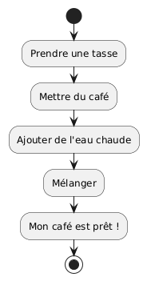

**Code Java :**

```java
public class PrepareCoffee {
    public static void main(String[] args) {
        // Séquence d'instructions exécutées dans l'ordre
        System.out.println("1. Je prends une tasse");
        System.out.println("2. Je mets du café");
        System.out.println("3. J'ajoute de l'eau chaude");
        System.out.println("4. Je mélange");
        System.out.println("Mon café est prêt !");
    }
}
```

**Résultat dans la console :**

```text
1. Je prends une tasse
2. Je mets du café
3. J'ajoute de l'eau chaude
4. Je mélange
Mon café est prêt !
```

#### Exemple 2 — Calculer le prix total avec TVA

**Phrase descriptive :**

```text
Je veux calculer le prix TTC d'un produit :
1. Définir le prix HT (100 francs)
2. Définir le taux de TVA (7.7%)
3. Calculer le montant de la TVA
4. Calculer le prix TTC
5. Afficher le résultat
```

**Diagramme UML :**

```plantuml
@startuml
start
:Prix HT = 100 francs;
:Taux TVA = 0.077;
:Calculer montant TVA = 100 * 0.077;
:Calculer prix TTC = 100 + 7.7;
:Afficher le prix TTC;
stop
@enduml
```

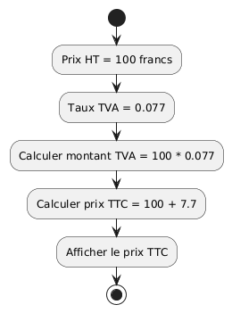

**Code Java :**

```java
public class SequencePriceInclVAT {
    public static void main(String[] args) {
        // 1. Définir le prix HT
        double priceExclVAT = 100.0;

        // 2. Définir le taux de TVA
        final double VAT = 0.077;

        // 3. Calculer le montant de la TVA
        double vatAmount = priceExclVAT * VAT;

        // 4. Calculer le prix TTC
        double priceInclVAT = priceExclVAT + vatAmount;

        // 5. Afficher le résultat
        System.out.println("Prix HT : " + priceExclVAT + " francs");
        System.out.println("Montant TVA : " + vatAmount + " francs");
        System.out.println("Prix TTC : " + priceInclVAT + " francs");
    }
}
```

**Résultat dans la console :**

```text
Prix HT : 100.0 francs
Montant TVA : 7.7 francs
Prix TTC : 107.7 francs
```

> [!TIP]
>
> **La séquence en résumé :**
>
> - Les instructions s'exécutent **de haut en bas**
> - Chaque instruction attend que la précédente soit terminée
> - L'ordre est **crucial** : si vous inversez des instructions, le résultat
>   peut être différent !

### 3.2. La sélection (if/else)

#### Rappel du concept

La **sélection** permet à votre programme de **prendre des décisions** et
d'exécuter différentes instructions selon une condition.

C'est comme dans la vie réelle :

- **SI** il pleut, **ALORS** je prends un parapluie
- **SINON**, je ne prends rien

En programmation, on utilise les structures `if` (si) et `else` (sinon).

#### Syntaxe Java

```java
if (condition) {
    // Code exécuté si la condition est vraie
} else {
    // Code exécuté si la condition est fausse
}
```

#### Opérateurs de comparaison

Pour créer des conditions, on utilise des **opérateurs de comparaison** :

| Opérateur | Signification       | Exemple  | Résultat si a=5, b=3 |
| --------- | ------------------- | -------- | -------------------- |
| `==`      | Égal à              | `a == b` | `false`              |
| `!=`      | Différent de        | `a != b` | `true`               |
| `>`       | Supérieur à         | `a > b`  | `true`               |
| `<`       | Inférieur à         | `a < b`  | `false`              |
| `>=`      | Supérieur ou égal à | `a >= 5` | `true`               |
| `<=`      | Inférieur ou égal à | `b <= 3` | `true`               |

#### Opérateurs logiques

Pour combiner plusieurs conditions :

| Opérateur | Signification | Exemple                    | Description                             |
| --------- | ------------- | -------------------------- | --------------------------------------- |
| `&&`      | ET (AND)      | `age >= 18 && age < 65`    | Les deux conditions doivent être vraies |
| ` \|\|`   | OU (OR)       | `jour == 6 \|\| jour == 7` | Au moins une condition doit être vraie  |
| `!`       | NON (NOT)     | `!estMajeur`               | Inverse la condition                    |

#### Exemple 1 — Vérifier si on peut voter

**Phrase descriptive :**

```text
En Suisse, on peut voter à partir de 18 ans.
Je veux vérifier si une personne de 20 ans peut voter.
```

**Diagramme UML :**

```plantuml
@startuml
start
:L'âge de majorité est 18 ans;
:La personne a 20 ans;
if (âge >= 18 ?) then (oui)
  :Afficher "Vous pouvez voter";
else (non)
  :Afficher "Vous ne pouvez pas encore voter";
endif
stop
@enduml
```

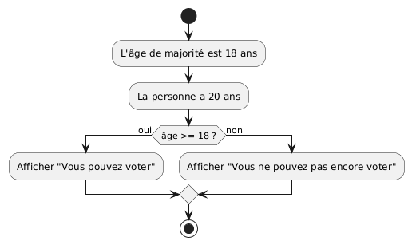

**Code Java :**

```java
public class CanVote {
    public static void main(String[] args) {
        // L'âge de la majorité
        final int VOTING_AGE = 18;

        // L'âge de la personne
        int age = 20;

        // Vérification avec if/else
        if (age >= VOTING_AGE) {
            System.out.println("Vous avez " + age + " ans");
            System.out.println("Vous pouvez voter !");
        } else {
            System.out.println("Vous avez " + age + " ans");
            System.out.println("Vous ne pouvez pas encore voter");
        }
    }
}
```

**Résultat dans la console :**

```text
Vous avez 20 ans
Vous pouvez voter !
```

#### Exemple 2 — Comparer deux nombres

**Phrase descriptive :**

```text
Je veux comparer deux nombres et afficher lequel est le plus grand.
```

**Diagramme UML :**

```plantuml
@startuml
start
:Nombre a = 15;
:Nombre b = 10;
if (a > b ?) then (oui)
  :Afficher "a est plus grand que b";
else (non)
  if (a < b ?) then (oui)
    :Afficher "a est plus petit que b";
  else (non)
    :Afficher "a est égal à b";
  endif
endif
stop
@enduml
```

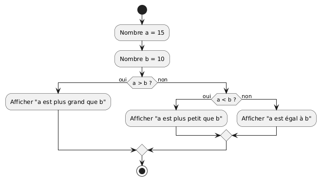

**Code Java :**

```java
public class CompareNumbers {
    public static void main(String[] args) {
        int a = 15;
        int b = 10;

        System.out.println("a = " + a);
        System.out.println("b = " + b);

        if (a > b) {
            System.out.println("a est plus grand que b");
        } else if (a < b) {
            System.out.println("a est plus petit que b");
        } else {
            System.out.println("a est égal à b");
        }
    }
}
```

**Résultat dans la console :**

```text
a = 15
b = 10
a est plus grand que b
```

#### Exemple 3 — Vérifier si un nombre est pair ou impair

**Phrase descriptive :**

```text
Je veux savoir si un nombre est pair ou impair.
Un nombre est pair si le reste de sa division par 2 est 0.
```

**Diagramme UML :**

```plantuml
@startuml
start
:Nombre = 7;
:Calculer reste = nombre % 2;
if (reste == 0 ?) then (oui)
  :Afficher "Le nombre est pair";
else (non)
  :Afficher "Le nombre est impair";
endif
stop
@enduml
```

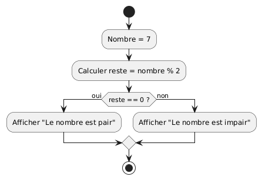

**Code Java :**

```java
public class EvenOrOdd {
    public static void main(String[] args) {
        int number = 7;

        System.out.println("Nombre : " + number);

        if (number % 2 == 0) {
            System.out.println("Le nombre est pair");
        } else {
            System.out.println("Le nombre est impair");
        }
    }
}
```

**Résultat dans la console :**

```text
Nombre : 7
Le nombre est impair
```

#### Exemple 4 — Vérifier plusieurs conditions (ET logique)

**Phrase descriptive :**

```text
Pour entrer dans un bar en Suisse, il faut avoir 18 ans ET avoir une pièce d'identité.
```

**Diagramme UML :**

```plantuml
@startuml
start
:Âge = 20;
:A une carte d'identité = true;
if (âge >= 18 ET a carte ?) then (oui)
  :Afficher "Vous pouvez entrer";
else (non)
  :Afficher "Accès refusé";
endif
stop
@enduml
```

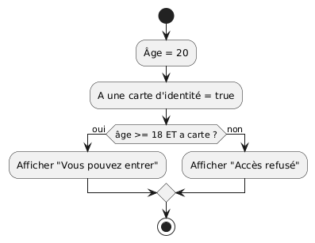

**Code Java :**

```java
public class EnterBar {
    public static void main(String[] args) {
        int age = 20;
        boolean hasIdCard = true;

        System.out.println("Âge : " + age + " ans");
        System.out.println("Carte d'identité : " + hasIdCard);

        // Les DEUX conditions doivent être vraies (&&)
        if (age >= 18 && hasIdCard) {
            System.out.println("Vous pouvez entrer dans le bar");
        } else {
            System.out.println("Accès refusé");
        }
    }
}
```

**Résultat dans la console :**

```text
Âge : 20 ans
Carte d'identité : true
Vous pouvez entrer dans le bar
```

#### Exemple 5 — Vérifier plusieurs conditions (OU logique)

**Phrase descriptive :**

```text
Le magasin est fermé le samedi OU le dimanche.
```

**Diagramme UML :**

```plantuml
@startuml
start
:Jour = 6 (samedi);
if (jour == 6 OU jour == 7 ?) then (oui)
  :Afficher "Le magasin est fermé";
else (non)
  :Afficher "Le magasin est ouvert";
endif
stop
@enduml
```

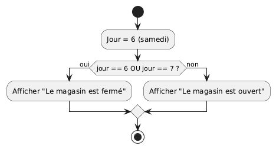

**Code Java :**

```java
public class StoreOpen {
    public static void main(String[] args) {
        // Jour de la semaine (1=lundi, ..., 6=samedi, 7=dimanche)
        int day = 6;  // Samedi

        System.out.println("Nous sommes le jour " + day);

        // AU MOINS une condition doit être vraie (||)
        if (day == 6 || day == 7) {
            System.out.println("Le magasin est fermé (week-end)");
        } else {
            System.out.println("Le magasin est ouvert");
        }
    }
}
```

**Résultat dans la console :**

```text
Nous sommes le jour 6
Le magasin est fermé (week-end)
```

> [!TIP]
>
> **Différence entre `&&` (ET) et `||` (OU) :**
>
> - `&&` (ET) : **TOUTES** les conditions doivent être vraies
>
>   - `true && true` → `true`
>   - `true && false` → `false`
>   - `false && false` → `false`
>
> - `||` (OU) : **AU MOINS UNE** condition doit être vraie
>   - `true || true` → `true`
>   - `true || false` → `true`
>   - `false || false` → `false`

### 3.3. L'itération - La boucle while

#### Rappel du concept

Vous avez déjà vu les boucles dans un cours précédent avec des algorithmes et
des diagrammes UML. Maintenant, nous allons les implémenter en Java !

La boucle **while** (tant que) répète des instructions **tant qu'une condition
est vraie**. On l'utilise quand on ne connaît pas à l'avance le nombre
d'itérations.

C'est comme :

- Remplir un seau d'eau **tant qu'il** n'est pas plein
- Économiser de l'argent **tant qu'on** n'a pas atteint son objectif

#### Syntaxe Java

```java
while (condition) {
    // Instructions à répéter
}
```

> [!WARNING]
>
> **Attention aux boucles infinies !** Si la condition reste toujours vraie, la
> boucle ne s'arrêtera jamais. Assurez-vous que la condition finira par devenir
> fausse.

#### Exemple 1 — Économiser pour un objectif

**Phrase descriptive :**

```text
Je veux économiser 300 francs.
Chaque semaine, j'économise 50 francs.
Combien de semaines me faut-il ?
```

**Diagramme UML :**

```plantuml
@startuml
start
:Objectif = 300 francs;
:Économies hebdomadaires = 50 francs;
:Total économisé = 0;
:Semaine = 0;
while (Total < Objectif ?) is (oui)
  :Total = Total + 50;
  :Semaine = Semaine + 1;
  :Afficher le total;
endwhile (non)
:Objectif atteint !;
stop
@enduml
```

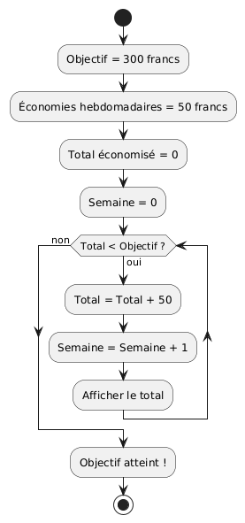

**Code Java :**

```java
public class SaveMoney {
    public static void main(String[] args) {
        // Mon objectif d'économies
        final int TARGET = 300;

        // Ce que j'économise chaque semaine
        int weeklySavings = 50;

        // Mon total actuel (au départ : 0)
        int totalSaved = 0;

        // Compteur de semaines
        int week = 0;

        System.out.println("Objectif : " + TARGET + " francs");
        System.out.println("Économies par semaine : " + weeklySavings + " francs");
        System.out.println();

        // Boucle while : tant que je n'ai pas atteint mon objectif
        while (totalSaved < TARGET) {
            week++;
            totalSaved += weeklySavings;
            System.out.println("Semaine " + week + " : " + totalSaved + " francs");
        }

        System.out.println();
        System.out.println("Objectif atteint en " + week + " semaines !");
    }
}
```

**Résultat dans la console :**

```text
Objectif : 300 francs
Économies par semaine : 50 francs

Semaine 1 : 50 francs
Semaine 2 : 100 francs
Semaine 3 : 150 francs
Semaine 4 : 200 francs
Semaine 5 : 250 francs
Semaine 6 : 300 francs

Objectif atteint en 6 semaines !
```

#### Exemple 2 — Remplir un panier de pommes

**Phrase descriptive :**

```text
Mon panier peut contenir 10 pommes.
Je mets 2 pommes à chaque fois.
Combien de fois dois-je répéter l'action ?
```

**Diagramme UML :**

```plantuml
@startuml
start
:Capacité = 10 pommes;
:Pommes dans le panier = 0;
:Nombre d'actions = 0;
while (Pommes < Capacité ?) is (oui)
  :Ajouter 2 pommes;
  :Actions = Actions + 1;
  :Afficher l'état;
endwhile (non)
:Le panier est plein !;
stop
@enduml
```

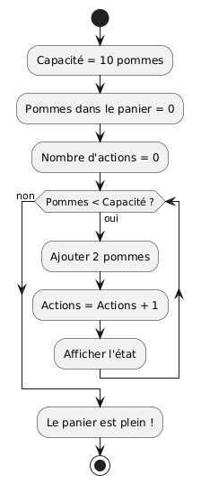

**Code Java :**

```java
public class FillBasket {
    public static void main(String[] args) {
        // Capacité maximale du panier
        final int CAPACITY = 10;

        // Nombre de pommes actuellement dans le panier
        int apples = 0;

        // Compteur d'actions
        int actions = 0;

        System.out.println("Capacité du panier : " + CAPACITY + " pommes");
        System.out.println();

        // Boucle while : tant que le panier n'est pas plein
        while (apples < CAPACITY) {
            apples += 2;  // J'ajoute 2 pommes
            actions++;
            System.out.println("Action " + actions + " : " + apples + " pommes dans le panier");
        }

        System.out.println();
        System.out.println("Le panier est plein après " + actions + " actions !");
    }
}
```

**Résultat dans la console :**

```text
Capacité du panier : 10 pommes

Action 1 : 2 pommes dans le panier
Action 2 : 4 pommes dans le panier
Action 3 : 6 pommes dans le panier
Action 4 : 8 pommes dans le panier
Action 5 : 10 pommes dans le panier

Le panier est plein après 5 actions !
```

#### Exemple 3 — Compter jusqu'à un nombre

**Phrase descriptive :**

```text
Je veux compter de 1 jusqu'à 5.
```

**Diagramme UML :**

```plantuml
@startuml
start
:Compteur = 1;
:Maximum = 5;
while (Compteur <= Maximum ?) is (oui)
  :Afficher le compteur;
  :Compteur = Compteur + 1;
endwhile (non)
:Comptage terminé !;
stop
@enduml
```

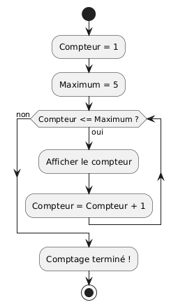

**Code Java :**

```java
public class CountTo {
    public static void main(String[] args) {
        int counter = 1;
        final int MAXIMUM = 5;

        System.out.println("Je compte de 1 à " + MAXIMUM + " :");

        // Boucle while : tant que compteur <= maximum
        while (counter <= MAXIMUM) {
            System.out.println(counter);
            counter++;  // J'incrémente le compteur
        }

        System.out.println("Comptage terminé !");
    }
}
```

**Résultat dans la console :**

```text
Je compte de 1 à 5 :
1
2
3
4
5
Comptage terminé !
```

> [!IMPORTANT]
>
> **Les éléments clés d'une boucle while :**
>
> 1. **Initialisation** : Créer la variable de contrôle avant la boucle
> 2. **Condition** : Définir quand la boucle doit continuer
> 3. **Modification** : Changer la variable dans la boucle pour que la condition
>    finisse par être fausse

### 3.4. L'itération - La boucle for

#### Rappel du concept

La boucle **for** (pour) est utilisée quand on **connaît à l'avance** le nombre
d'itérations. C'est une version plus compacte de la boucle while.

C'est comme :

- Distribuer une part de gâteau à chacun des 8 invités
- Arroser chacune des 5 plantes du jardin

#### Syntaxe Java

```java
for (initialisation; condition; incrémentation) {
    // Instructions à répéter
}
```

Décomposition :

- **Initialisation** : Créer et initialiser le compteur (ex: `int i = 0`)
- **Condition** : Tant que cette condition est vraie, la boucle continue (ex:
  `i < 5`)
- **Incrémentation** : Modifier le compteur après chaque itération (ex: `i++`)

#### Exemple 1 — Arroser des plantes

**Phrase descriptive :**

```text
J'ai 5 plantes dans mon jardin.
Je veux arroser chaque plante une par une.
```

**Diagramme UML :**

```plantuml
@startuml
start
:Nombre de plantes = 5;
:Plante actuelle = 1;
repeat
  :Arroser la plante actuelle;
  :Plante actuelle = Plante actuelle + 1;
repeat while (Plante actuelle <= 5 ?) is (oui) not (non)
:Toutes les plantes sont arrosées !;
stop
@enduml
```

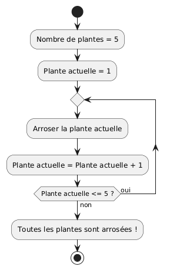

**Code Java :**

```java
public class WaterPlants {
    public static void main(String[] args) {
        final int PLANT_COUNT = 5;

        System.out.println("J'ai " + PLANT_COUNT + " plantes à arroser");
        System.out.println();

        // Boucle for : de 1 à PLANT_COUNT
        for (int plant = 1; plant <= PLANT_COUNT; plant++) {
            System.out.println("J'arrose la plante numéro " + plant);
        }

        System.out.println();
        System.out.println("Toutes les plantes sont arrosées !");
    }
}
```

**Résultat dans la console :**

```text
J'ai 5 plantes à arroser

J'arrose la plante numéro 1
J'arrose la plante numéro 2
J'arrose la plante numéro 3
J'arrose la plante numéro 4
J'arrose la plante numéro 5

Toutes les plantes sont arrosées !
```

#### Exemple 2 — Distribuer des parts de gâteau

**Phrase descriptive :**

```text
Il y a 8 invités à ma fête.
Je veux donner une part de gâteau à chaque invité.
```

**Diagramme UML :**

```plantuml
@startuml
start
:Nombre d'invités = 8;
:Invité actuel = 1;
repeat
  :Donner une part à l'invité actuel;
  :Invité actuel = Invité actuel + 1;
repeat while (Invité actuel <= 8 ?) is (oui) not (non)
:Tout le monde a une part !;
stop
@enduml
```


**Code Java :**

```java
public class DistributeCake {
    public static void main(String[] args) {
        final int GUEST_COUNT = 8;

        System.out.println("Il y a " + GUEST_COUNT + " invités");
        System.out.println();

        // Boucle for : de 1 à GUEST_COUNT
        for (int guest = 1; guest <= GUEST_COUNT; guest++) {
            System.out.println("Je donne une part à l'invité " + guest);
        }

        System.out.println();
        System.out.println("Tout le monde a une part de gâteau !");
    }
}
```

**Résultat dans la console :**

```text
Il y a 8 invités

Je donne une part à l'invité 1
Je donne une part à l'invité 2
Je donne une part à l'invité 3
Je donne une part à l'invité 4
Je donne une part à l'invité 5
Je donne une part à l'invité 6
Je donne une part à l'invité 7
Je donne une part à l'invité 8

Tout le monde a une part de gâteau !
```

#### Exemple 3 — Afficher une table de multiplication

**Phrase descriptive :**

```text
Je veux afficher la table de multiplication de 5 (de 1 à 10).
```

**Diagramme UML :**

```plantuml
@startuml
start
:Nombre = 5;
:Multiplicateur = 1;
repeat
  :Calculer résultat = 5 * multiplicateur;
  :Afficher "5 x multiplicateur = résultat";
  :Multiplicateur = Multiplicateur + 1;
repeat while (Multiplicateur <= 10 ?) is (oui) not (non)
:Table de multiplication terminée !;
stop
@enduml
```


**Code Java :**

```java
public class MultiplicationTable {
    public static void main(String[] args) {
        final int NUMBER = 5;

        System.out.println("Table de multiplication de " + NUMBER + " :");
        System.out.println();

        // Boucle for : de 1 à 10
        for (int i = 1; i <= 10; i++) {
            int result = NUMBER * i;
            System.out.println(NUMBER + " x " + i + " = " + result);
        }
    }
}
```

**Résultat dans la console :**

```text
Table de multiplication de 5 :

5 x 1 = 5
5 x 2 = 10
5 x 3 = 15
5 x 4 = 20
5 x 5 = 25
5 x 6 = 30
5 x 7 = 35
5 x 8 = 40
5 x 9 = 45
5 x 10 = 50
```

#### Exemple 4 — Calculer une somme

**Phrase descriptive :**

```text
Je veux calculer la somme des nombres de 1 à 10.
(1 + 2 + 3 + ... + 10 = ?)
```

**Diagramme UML :**

```plantuml
@startuml
start
:Somme = 0;
:Nombre actuel = 1;
repeat
  :Somme = Somme + nombre actuel;
  :Nombre actuel = Nombre actuel + 1;
repeat while (Nombre actuel <= 10 ?) is (oui) not (non)
:Afficher la somme totale;
stop
@enduml
```


**Code Java :**

```java
public class CalculateSum {
    public static void main(String[] args) {
        // Variable accumulateur (pour accumuler la somme)
        int sum = 0;

        System.out.println("Calcul de la somme de 1 à 10 :");
        System.out.println();

        // Boucle for : de 1 à 10
        for (int number = 1; number <= 10; number++) {
            sum += number;  // J'ajoute le nombre à la somme
            System.out.println("Après avoir ajouté " + number + " : somme = " + sum);
        }

        System.out.println();
        System.out.println("La somme totale est : " + sum);
    }
}
```

**Résultat dans la console :**

```text
Calcul de la somme de 1 à 10 :

Après avoir ajouté 1 : somme = 1
Après avoir ajouté 2 : somme = 3
Après avoir ajouté 3 : somme = 6
Après avoir ajouté 4 : somme = 10
Après avoir ajouté 5 : somme = 15
Après avoir ajouté 6 : somme = 21
Après avoir ajouté 7 : somme = 28
Après avoir ajouté 8 : somme = 36
Après avoir ajouté 9 : somme = 45
Après avoir ajouté 10 : somme = 55

La somme totale est : 55
```

> [!TIP]
>
> **Quand utiliser `while` vs `for` ?**
>
> **Utilisez `while` quand :**
>
> - Vous ne connaissez pas le nombre d'itérations à l'avance
> - La condition d'arrêt dépend d'un événement
> - Exemple : économiser jusqu'à atteindre un objectif
>
> **Utilisez `for` quand :**
>
> - Vous connaissez exactement le nombre d'itérations
> - Vous voulez parcourir une séquence de nombres
> - Exemple : arroser 5 plantes, compter de 1 à 10

> [!IMPORTANT]
>
> **Convention de nommage :**
>
> - Pour les compteurs de boucle, on utilise souvent `i`, `j`, `k` (tradition
>   mathématique)
> - Mais vous pouvez utiliser des noms plus descriptifs comme `plante`,
>   `invite`, `nombre`
> - Les noms descriptifs rendent le code plus facile à comprendre !

## 4. Récapitulatif et bonnes pratiques

### Résumé des structures algorithmiques

Vous avez maintenant appris les trois structures fondamentales de la
programmation :

1. **Séquence** : Instructions exécutées l'une après l'autre
2. **Sélection** : Prendre des décisions avec `if`/`else`
3. **Itération** : Répéter des actions avec `while` et `for`

### Tableau récapitulatif

| Structure    | Quand l'utiliser                        | Exemple                              |
| ------------ | --------------------------------------- | ------------------------------------ |
| **Séquence** | Instructions à exécuter dans l'ordre    | Préparer un café, calculer un prix   |
| **if/else**  | Prendre une décision                    | Vérifier l'âge, comparer des nombres |
| **while**    | Répéter tant qu'une condition est vraie | Économiser jusqu'à un objectif       |
| **for**      | Répéter un nombre connu de fois         | Arroser 5 plantes, compter de 1 à 10 |

### Erreurs courantes à éviter

> [!WARNING]
>
> **Erreurs fréquentes :**
>
> 1. **Confusion entre `=` et `==`**
>
>    - `=` : affectation (`age = 20`)
>    - `==` : comparaison (`age == 20`)
>
> 2. **Boucle infinie**
>
>    ```java
>    int i = 0;
>    while (i < 10) {
>        System.out.println(i);
>        // Oups ! On oublie i++; → boucle infinie !
>    }
>    ```
>
> 3. **Variable non initialisée**
>
>    ```java
>    int total;  // Pas d'initialisation
>    total = total + 5;  // Erreur ! total n'a pas de valeur
>    ```
>
> 4. **Point-virgule après if ou for**
>    ```java
>    if (age >= 18);  // ❌ Point-virgule en trop !
>    {
>        System.out.println("Majeur");  // Ne sera pas dans le if
>    }
>    ```

### Bonnes pratiques

> [!TIP]
>
> **Conseils pour écrire du bon code :**
>
> 1. **Nommage des variables**
>
>    - Utilisez des noms descriptifs : `nombreDePommes` plutôt que `n`
>    - Utilisez le camelCase : `prixTotal`, `ageMinimum`
>    - Les constantes en MAJUSCULES : `AGE_MAJORITE`, `TVA_SUISSE`
>
> 2. **Indentation**
>
>    - Indentez le code à l'intérieur des blocs `{}` (4 espaces ou 1 tab)
>    - Cela rend le code plus lisible
>
> 3. **Commentaires**
>
>    - Expliquez **pourquoi**, pas **quoi**
>    - ✅ `// Le taux de TVA est défini par la loi suisse`
>    - ❌ `// Je déclare une variable`
>
> 4. **Testez votre code**
>    - Testez avec différentes valeurs
>    - Testez les cas limites (0, nombres négatifs, etc.)

### Sources et liens utiles

- <https://www.w3schools.com/java/>

[licence]:
	https://github.com/HEIG-VD-Prog-Course/HEIG-VD-ProgIM-Course/blob/main/LICENSE.md
