# Variables & Constantes - Exercices

Cette série d'exercices est conçue pour vous permettre de valider les concepts
théoriques et pratiques vus dans le cours
_[Variables & Constantes](../01-supports-de-cours/README.md)_.

## Ressources

- Supports de cours : [Lien vers le contenu](../01-supports-de-cours/README.md)
  ·
  [Presentation (web)](https://HEIG-VD-Prog-Course.github.io/HEIG-VD-ProgIM-Course/04.02-variables-constantes/01-supports-de-cours/index.html)
  ·
  [Presentation (PDF)](https://HEIG-VD-Prog-Course.github.io/HEIG-VD-ProgIM-Course/04.02-variables-constantes/01-supports-de-cours/04.02-variables-constantes-presentation.pdf)
- Exercices : [Énoncés et solutions](../02-exercices/README.md)

## Table des matières

- [Ressources](#ressources)
- [Table des matières](#table-des-matières)
- [Exercice 1 - Déclaration et affichage de variables](#exercice-1---déclaration-et-affichage-de-variables)
  - [Énoncé](#énoncé)
- [Exercice 2 - Calculs avec des variables](#exercice-2---calculs-avec-des-variables)
  - [Énoncé](#énoncé-1)
- [Exercice 3 - Utilisation de constantes](#exercice-3---utilisation-de-constantes)
  - [Énoncé](#énoncé-2)
- [Exercice 4 - Structure de sélection simple (if)](#exercice-4---structure-de-sélection-simple-if)
  - [Énoncé](#énoncé-3)
- [Exercice 5 - Structure de sélection avec plusieurs conditions](#exercice-5---structure-de-sélection-avec-plusieurs-conditions)
  - [Énoncé](#énoncé-4)
- [Exercice 6 - Boucle while simple](#exercice-6---boucle-while-simple)
  - [Énoncé](#énoncé-5)
- [Exercice 7 - Boucle for simple](#exercice-7---boucle-for-simple)
  - [Énoncé](#énoncé-6)
- [Exercice 8 - Calcul de somme avec une boucle](#exercice-8---calcul-de-somme-avec-une-boucle)
  - [Énoncé](#énoncé-7)
- [Exercice 9 - Table de multiplication](#exercice-9---table-de-multiplication)
  - [Énoncé](#énoncé-8)
- [Exercice 10 - Combinaison de structures (Défi)](#exercice-10---combinaison-de-structures-défi)
  - [Énoncé](#énoncé-9)
- [Exercice 11 - Compteur dégressif avec while](#exercice-11---compteur-dégressif-avec-while)
  - [Énoncé](#énoncé-10)
- [Exercice 12 - Calcul de moyenne (Défi avancé)](#exercice-12---calcul-de-moyenne-défi-avancé)
  - [Énoncé](#énoncé-11)

> [!TIP]
>
> Pour chaque exercice, créez d'abord le **pseudocode**, puis le **diagramme
> d'activité** avec PlantUML, et enfin vérifiez votre logique avec la solution.
>
> **À propos du pseudocode** : Le pseudocode est un outil pour structurer vos
> idées et organiser votre réflexion. Vous pouvez l'écrire à la main sur papier,
> dans un bloc-notes, dans n'importe quelle application de texte, ou même
> mentalement. L'important est qu'il vous aide à clarifier la logique de votre
> algorithme avant de passer à l'implémentation.
>
> **À propos de PlantUML** : Utilisez l'éditeur PlantUML en ligne :
> <https://plantuml.nortalle.ch>

## Exercice 1 - Déclaration et affichage de variables

### Énoncé

Créez un programme Java qui déclare trois variables :

- Une variable `nom` de type `String` contenant votre prénom
- Une variable `age` de type `int` contenant votre âge
- Une variable `taille` de type `double` contenant votre taille en mètres (par
  exemple 1.75)

Affichez ensuite ces trois informations dans la console avec des messages
clairs.

**Exemple de sortie attendue :**

```text
Je m'appelle Alice
J'ai 20 ans
Je mesure 1.75 mètres
```

<details>
<summary>Afficher la solution - Pseudocode</summary>

```text
DÉBUT
  Déclarer nom comme chaîne de caractères et l'initialiser avec "Alice"
  Déclarer age comme nombre entier et l'initialiser avec 20
  Déclarer taille comme nombre décimal et l'initialiser avec 1.75

  Afficher "Je m'appelle " suivi de nom
  Afficher "J'ai " suivi de age suivi de " ans"
  Afficher "Je mesure " suivi de taille suivi de " mètres"
FIN
```

</details>

<details>
<summary>Afficher la solution - Diagramme PlantUML</summary>

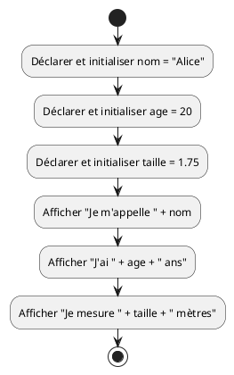

</details>

<details>
<summary>Afficher la solution - Code Java</summary>

```java
public class Main {
  public static void main(String[] args) {
    String nom = "Alice";
    int age = 20;
    double taille = 1.75;

    System.out.println("Je m'appelle " + nom);
    System.out.println("J'ai " + age + " ans");
    System.out.println("Je mesure " + taille + " mètres");
  }
}
```

</details>

## Exercice 2 - Calculs avec des variables

### Énoncé

Créez un programme qui calcule et affiche le périmètre et l'aire d'un rectangle.

Le programme doit :

- Déclarer deux variables `longueur` et `largeur` (de type `double`)
- Calculer le périmètre (formule : `2 × (longueur + largeur)`)
- Calculer l'aire (formule : `longueur × largeur`)
- Afficher les résultats

Testez avec une longueur de 12.5 et une largeur de 7.3.

<details>
<summary>Afficher la solution - Pseudocode</summary>

```text
DÉBUT
  Déclarer longueur comme nombre décimal et l'initialiser avec 12.5
  Déclarer largeur comme nombre décimal et l'initialiser avec 7.3

  Déclarer perimetre comme nombre décimal
  Calculer perimetre = 2 × (longueur + largeur)

  Déclarer aire comme nombre décimal
  Calculer aire = longueur × largeur

  Afficher "Longueur : " suivi de longueur
  Afficher "Largeur : " suivi de largeur
  Afficher "Périmètre : " suivi de perimetre
  Afficher "Aire : " suivi de aire
FIN
```

</details>

<details>
<summary>Afficher la solution - Diagramme PlantUML</summary>

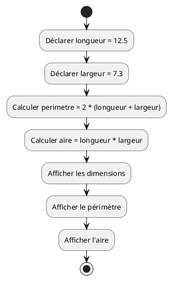

</details>

<details>
<summary>Afficher la solution - Code Java</summary>

```java
public class Main {
  public static void main(String[] args) {
    double longueur = 12.5;
    double largeur = 7.3;

    double perimetre = 2 * (longueur + largeur);
    double aire = longueur * largeur;

    System.out.println("Longueur : " + longueur);
    System.out.println("Largeur : " + largeur);
    System.out.println("Périmètre : " + perimetre);
    System.out.println("Aire : " + aire);
  }
}
```

</details>

## Exercice 3 - Utilisation de constantes

### Énoncé

Créez un programme qui calcule la circonférence d'un cercle en utilisant une
constante pour Pi.

Le programme doit :

- Déclarer une constante `PI` avec la valeur 3.14159
- Déclarer une variable `rayon` (par exemple 5.0)
- Calculer la circonférence (formule : `2 × PI × rayon`)
- Afficher le résultat

<details>
<summary>Afficher la solution - Pseudocode</summary>

```text
DÉBUT
  Déclarer PI comme constante avec la valeur 3.14159
  Déclarer rayon comme nombre décimal et l'initialiser avec 5.0

  Déclarer circonference comme nombre décimal
  Calculer circonference = 2 × PI × rayon

  Afficher "Rayon : " suivi de rayon
  Afficher "Circonférence : " suivi de circonference
FIN
```

</details>

<details>
<summary>Afficher la solution - Diagramme PlantUML</summary>

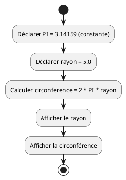

</details>

<details>
<summary>Afficher la solution - Code Java</summary>

```java
public class Main {
  public static void main(String[] args) {
    final double PI = 3.14159;
    double rayon = 5.0;

    double circonference = 2 * PI * rayon;

    System.out.println("Rayon : " + rayon);
    System.out.println("Circonférence : " + circonference);
  }
}
```

</details>

## Exercice 4 - Structure de sélection simple (if)

### Énoncé

Créez un programme qui vérifie si une personne est majeure (18 ans ou plus).

Le programme doit :

- Déclarer une variable `age` avec une valeur de votre choix
- Utiliser une structure `if` pour vérifier si l'âge est supérieur ou égal à 18
- Afficher "Vous êtes majeur" si la condition est vraie
- Afficher "Vous êtes mineur" sinon

Testez avec différentes valeurs pour l'âge.

<details>
<summary>Afficher la solution - Pseudocode</summary>

```text
DÉBUT
  Déclarer age comme nombre entier et l'initialiser avec 20

  SI age >= 18 ALORS
    Afficher "Vous êtes majeur"
  SINON
    Afficher "Vous êtes mineur"
  FIN SI
FIN
```

</details>

<details>
<summary>Afficher la solution - Diagramme PlantUML</summary>

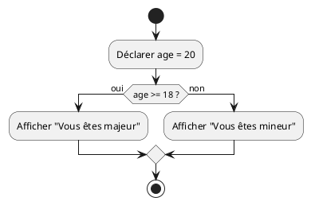

</details>

<details>
<summary>Afficher la solution - Code Java</summary>

```java
public class Main {
  public static void main(String[] args) {
    int age = 20;

    if (age >= 18) {
      System.out.println("Vous êtes majeur");
    } else {
      System.out.println("Vous êtes mineur");
    }
  }
}
```

</details>

## Exercice 5 - Structure de sélection avec plusieurs conditions

### Énoncé

Créez un programme qui affiche une appréciation en fonction d'une note.

Le programme doit :

- Déclarer une variable `note` (entre 0 et 6)
- Afficher une appréciation selon les critères suivants :
  - note >= 5.5 : "Excellent"
  - note >= 4.5 : "Bien"
  - note >= 4.0 : "Suffisant"
  - note < 4.0 : "Insuffisant"

<details>
<summary>Afficher la solution - Pseudocode</summary>

```text
DÉBUT
  Déclarer note comme nombre décimal et l'initialiser avec 5.2

  SI note >= 5.5 ALORS
    Afficher "Excellent"
  SINON SI note >= 4.5 ALORS
    Afficher "Bien"
  SINON SI note >= 4.0 ALORS
    Afficher "Suffisant"
  SINON
    Afficher "Insuffisant"
  FIN SI
FIN
```

</details>

<details>
<summary>Afficher la solution - Diagramme PlantUML</summary>

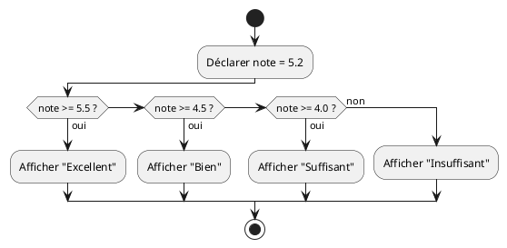

</details>

<details>
<summary>Afficher la solution - Code Java</summary>

```java
public class Main {
  public static void main(String[] args) {
    double note = 5.2;

    if (note >= 5.5) {
      System.out.println("Excellent");
    } else if (note >= 4.5) {
      System.out.println("Bien");
    } else if (note >= 4.0) {
      System.out.println("Suffisant");
    } else {
      System.out.println("Insuffisant");
    }
  }
}
```

</details>

## Exercice 6 - Boucle while simple

### Énoncé

Créez un programme qui affiche les nombres de 1 à 5 en utilisant une boucle
`while`.

Le programme doit :

- Déclarer une variable compteur initialisée à 1
- Utiliser une boucle `while` pour afficher les nombres tant que le compteur est
  inférieur ou égal à 5
- Incrémenter le compteur à chaque itération

<details>
<summary>Afficher la solution - Pseudocode</summary>

```text
DÉBUT
  Déclarer compteur comme nombre entier et l'initialiser avec 1

  TANT QUE compteur <= 5 FAIRE
    Afficher compteur
    Incrémenter compteur de 1
  FIN TANT QUE
FIN
```

</details>

<details>
<summary>Afficher la solution - Diagramme PlantUML</summary>

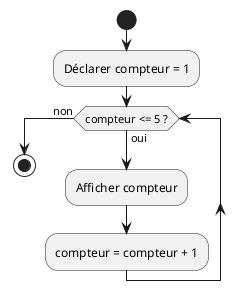

</details>

<details>
<summary>Afficher la solution - Code Java</summary>

```java
public class Main {
  public static void main(String[] args) {
    int compteur = 1;

    while (compteur <= 5) {
      System.out.println(compteur);
      compteur = compteur + 1;
    }
  }
}
```

</details>

## Exercice 7 - Boucle for simple

### Énoncé

Créez un programme qui affiche les nombres pairs de 0 à 10 en utilisant une
boucle `for`.

Le programme doit utiliser une boucle `for` avec un pas de 2 pour n'afficher que
les nombres pairs.

<details>
<summary>Afficher la solution - Pseudocode</summary>

```text
DÉBUT
  POUR i de 0 à 10 avec un pas de 2 FAIRE
    Afficher i
  FIN POUR
FIN
```

</details>

<details>
<summary>Afficher la solution - Diagramme PlantUML</summary>

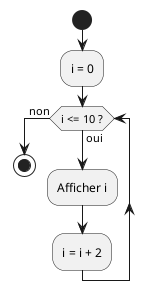

</details>

<details>
<summary>Afficher la solution - Code Java</summary>

```java
public class Main {
  public static void main(String[] args) {
    for (int i = 0; i <= 10; i = i + 2) {
      System.out.println(i);
    }
  }
}
```

</details>

## Exercice 8 - Calcul de somme avec une boucle

### Énoncé

Créez un programme qui calcule la somme des nombres de 1 à 10.

Le programme doit :

- Utiliser une boucle `for` pour parcourir les nombres de 1 à 10
- Accumuler la somme dans une variable
- Afficher le résultat final

**Résultat attendu :** 55 (car 1+2+3+4+5+6+7+8+9+10 = 55)

<details>
<summary>Afficher la solution - Pseudocode</summary>

```text
DÉBUT
  Déclarer somme comme nombre entier et l'initialiser avec 0

  POUR i de 1 à 10 FAIRE
    somme = somme + i
  FIN POUR

  Afficher "La somme des nombres de 1 à 10 est : " suivi de somme
FIN
```

</details>

<details>
<summary>Afficher la solution - Diagramme PlantUML</summary>

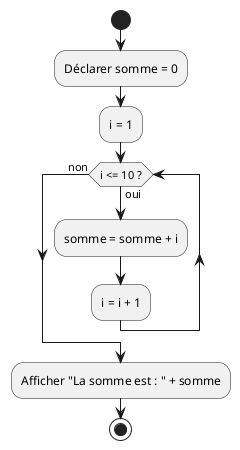

</details>

<details>
<summary>Afficher la solution - Code Java</summary>

```java
public class Main {
  public static void main(String[] args) {
    int somme = 0;

    for (int i = 1; i <= 10; i++) {
      somme = somme + i;
    }

    System.out.println("La somme des nombres de 1 à 10 est : " + somme);
  }
}
```

</details>

## Exercice 9 - Table de multiplication

### Énoncé

Créez un programme qui affiche la table de multiplication d'un nombre donné (par
exemple 7).

Le programme doit :

- Déclarer une constante `NOMBRE` avec la valeur 7
- Utiliser une boucle `for` pour afficher les multiplications de 1 à 10
- Afficher le résultat sous la forme : "7 x 1 = 7"

<details>
<summary>Afficher la solution - Pseudocode</summary>

```text
DÉBUT
  Déclarer NOMBRE comme constante avec la valeur 7

  POUR i de 1 à 10 FAIRE
    Déclarer resultat = NOMBRE × i
    Afficher NOMBRE + " x " + i + " = " + resultat
  FIN POUR
FIN
```

</details>

<details>
<summary>Afficher la solution - Diagramme PlantUML</summary>

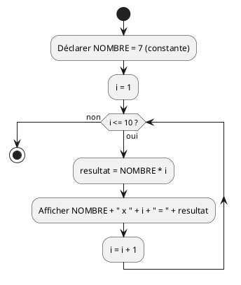

</details>

<details>
<summary>Afficher la solution - Code Java</summary>

```java
public class Main {
  public static void main(String[] args) {
    final int NOMBRE = 7;

    for (int i = 1; i <= 10; i++) {
      int resultat = NOMBRE * i;
      System.out.println(NOMBRE + " x " + i + " = " + resultat);
    }
  }
}
```

</details>

## Exercice 10 - Combinaison de structures (Défi)

### Énoncé

Créez un programme qui affiche tous les nombres de 1 à 20, mais :

- Pour les multiples de 3, affichez "Fizz" au lieu du nombre
- Pour les multiples de 5, affichez "Buzz" au lieu du nombre
- Pour les multiples de 3 ET de 5, affichez "FizzBuzz" au lieu du nombre
- Pour les autres nombres, affichez simplement le nombre

**Exemple de sortie attendue :**

```text
1
2
Fizz
4
Buzz
Fizz
7
8
Fizz
Buzz
11
Fizz
13
14
FizzBuzz
16
17
Fizz
19
Buzz
```

> [!TIP]
>
> L'opérateur modulo `%` retourne le reste de la division d'un nombre par un autre.
> Il vous permet ainsi de vérifier si un nombre est divisible par un autre.
> Par exemple, `nombre % 3 == 0` vérifie si `nombre` est divisible par 3.

<details>
<summary>Afficher la solution - Pseudocode</summary>

```text
DÉBUT
  POUR i de 1 à 20 FAIRE
    SI i est divisible par 3 ET par 5 ALORS
      Afficher "FizzBuzz"
    SINON SI i est divisible par 3 ALORS
      Afficher "Fizz"
    SINON SI i est divisible par 5 ALORS
      Afficher "Buzz"
    SINON
      Afficher i
    FIN SI
  FIN POUR
FIN
```

</details>

<details>
<summary>Afficher la solution - Diagramme PlantUML</summary>

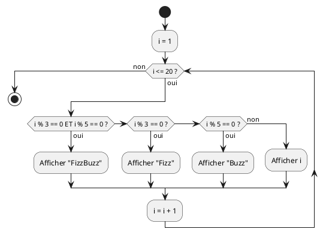

</details>

<details>
<summary>Afficher la solution - Code Java</summary>

```java
public class Main {
  public static void main(String[] args) {
    for (int i = 1; i <= 20; i++) {
      if (i % 3 == 0 && i % 5 == 0) {
        System.out.println("FizzBuzz");
      } else if (i % 3 == 0) {
        System.out.println("Fizz");
      } else if (i % 5 == 0) {
        System.out.println("Buzz");
      } else {
        System.out.println(i);
      }
    }
  }
}
```

</details>

## Exercice 11 - Compteur dégressif avec while

### Énoncé

Créez un programme qui simule un compte à rebours de 10 à 0, puis affiche
"Décollage !".

Le programme doit :

- Déclarer un compteur initialisé à 10
- Utiliser une boucle `while` pour décrémenter le compteur
- Afficher chaque nombre du compte à rebours
- Afficher "Décollage !" à la fin

<details>
<summary>Afficher la solution - Pseudocode</summary>

```text
DÉBUT
  Déclarer compteur comme nombre entier et l'initialiser avec 10

  TANT QUE compteur >= 0 FAIRE
    Afficher compteur
    Décrémenter compteur de 1
  FIN TANT QUE

  Afficher "Décollage !"
FIN
```

</details>

<details>
<summary>Afficher la solution - Diagramme PlantUML</summary>

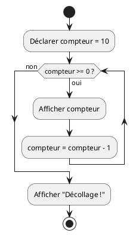

</details>

<details>
<summary>Afficher la solution - Code Java</summary>

```java
public class Main {
  public static void main(String[] args) {
    int compteur = 10;

    while (compteur >= 0) {
      System.out.println(compteur);
      compteur = compteur - 1;
    }

    System.out.println("Décollage !");
  }
}
```

</details>

## Exercice 12 - Calcul de moyenne (Défi avancé)

### Énoncé

Créez un programme qui calcule la moyenne de 5 notes.

Le programme doit :

- Déclarer 5 variables pour les notes (par exemple : 5.5, 4.8, 5.2, 4.5, 5.0)
- Calculer la somme des notes
- Calculer la moyenne (somme divisée par le nombre de notes)
- Afficher chaque note, la somme, et la moyenne
- Utiliser une constante pour le nombre de notes

**Bonus :** Affichez aussi si la moyenne est suffisante (>= 4.0) ou non.

<details>
<summary>Afficher la solution - Pseudocode</summary>

```text
DÉBUT
  Déclarer NOMBRE_NOTES comme constante avec la valeur 5

  Déclarer note1 = 5.5
  Déclarer note2 = 4.8
  Déclarer note3 = 5.2
  Déclarer note4 = 4.5
  Déclarer note5 = 5.0

  Calculer somme = note1 + note2 + note3 + note4 + note5
  Calculer moyenne = somme / NOMBRE_NOTES

  Afficher "Notes : " + note1 + ", " + note2 + ", " + note3 + ", " + note4 + ", " + note5
  Afficher "Somme : " + somme
  Afficher "Moyenne : " + moyenne

  SI moyenne >= 4.0 ALORS
    Afficher "Résultat : Suffisant"
  SINON
    Afficher "Résultat : Insuffisant"
  FIN SI
FIN
```

</details>

<details>
<summary>Afficher la solution - Diagramme PlantUML</summary>

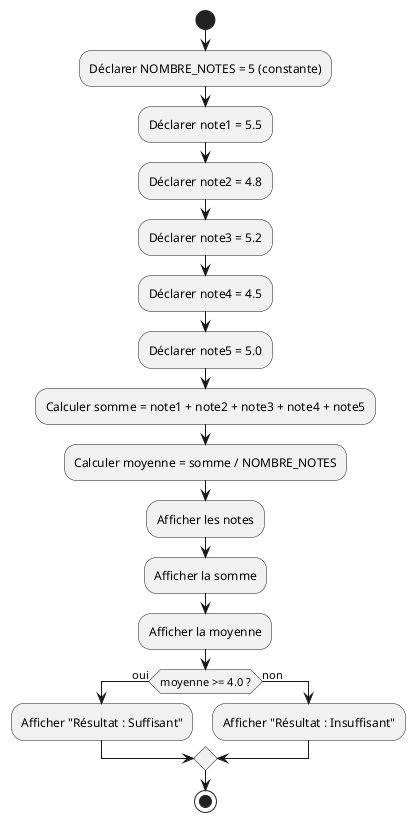

</details>

<details>
<summary>Afficher la solution - Code Java</summary>

```java
public class Main {
  public static void main(String[] args) {
    final int NOMBRE_NOTES = 5;

    double note1 = 5.5;
    double note2 = 4.8;
    double note3 = 5.2;
    double note4 = 4.5;
    double note5 = 5.0;

    double somme = note1 + note2 + note3 + note4 + note5;
    double moyenne = somme / NOMBRE_NOTES;

    System.out.println("Notes : " + note1 + ", " + note2 + ", " + note3 + ", " + note4 + ", " + note5);
    System.out.println("Somme : " + somme);
    System.out.println("Moyenne : " + moyenne);

    if (moyenne >= 4.0) {
      System.out.println("Résultat : Suffisant");
    } else {
      System.out.println("Résultat : Insuffisant");
    }
  }
}
```

</details>
