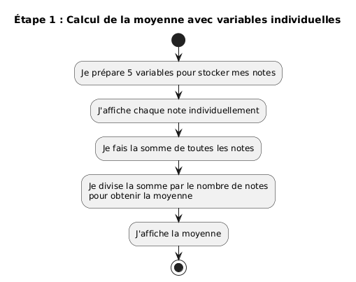
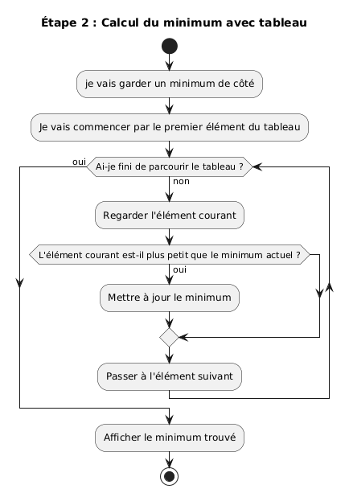
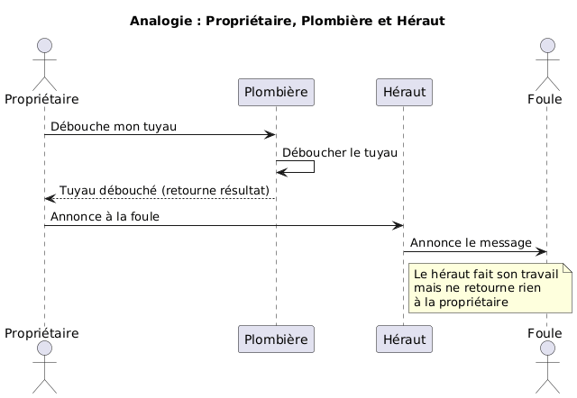
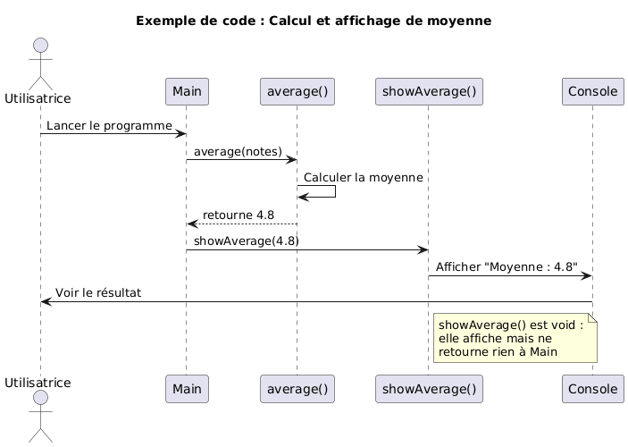
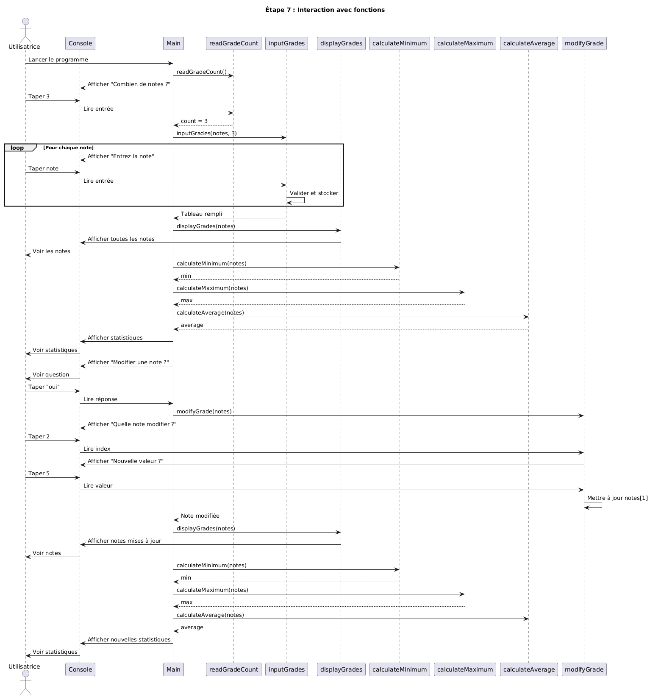

# Méthodologies de résolution de problèmes

V. Guidoux, avec l'aide de
[GitHub Copilot](https://github.com/features/copilot).

Ce travail est sous licence [CC BY-SA 4.0][licence].

## Ressources annexes

- Objectifs, méthodes d'enseignement et d'apprentissage, et méthodes
  d'évaluation : [Lien vers le contenu](..)
- Exemples de code : [Lien vers le contenu](../02-exemples-de-code/)

## Introduction

Ce support de cours présente une méthodologie de résolution de problèmes
appliquée à la programmation. Plutôt que de présenter des concepts de manière
abstraite, nous allons construire ensemble un programme complet, étape par
étape, en réfléchissant à voix haute sur les choix à faire.

L'objectif n'est pas d'apprendre de nouvelles structures de programmation : vous
connaissez déjà les variables, les tableaux, les boucles, les conditions et les
fonctions. L'objectif est d'apprendre à **penser** un problème avant de coder, à
décomposer une tâche complexe en sous-tâches simples, et à faire évoluer une
solution de manière itérative.

Cette approche est au cœur de la programmation professionnelle : on ne code
jamais la solution finale directement. On commence par une version simple qui
fonctionne, puis on ajoute progressivement des fonctionnalités.

> [!IMPORTANT]
>
> Ce cours est un tutoriel guidé. Prenez le temps de lire chaque section dans
> l'ordre, d'exécuter les exemples de code sur votre machine, et de comprendre
> les raisonnements présentés. Ne sautez pas d'étapes.

À la fin de cette séance, vous devriez être capable de :

- Décomposer un problème complexe en étapes simples et progressives.
- Traduire un besoin exprimé en français en algorithme structuré (diagramme
- Passer d'un algorithme à une implémentation en Java de manière méthodique.
- Identifier les moments opportuns pour introduire des structures de données
- Appliquer une démarche itérative : commencer simple, tester, puis améliorer.

## Description du problème

Nous allons construire un programme de gestion de notes. Ce programme doit
permettre à l'utilisatrice de :

1. Saisir plusieurs notes
2. Afficher toutes les notes
3. Calculer et afficher le minimum, maximum et la moyenne
4. Modifier une note si nécessaire

Ce problème peut sembler simple, mais il contient plusieurs difficultés :

- Comment stocker plusieurs notes ?
- Comment demander des valeurs à l'utilisatrice ?
- Comment valider que les valeurs sont correctes ?
- Comment permettre la modification après la saisie ?

Nous allons résoudre ces questions une par une, en construisant 7 versions
successives du programme, chacune ajoutant une nouvelle capacité ou améliorant
un aspect du code.

## Étape 1 : Notes en dur avec variables individuelles

### Réflexion en français

Commençons par le plus simple possible : afficher quelques notes et calculer
leur moyenne.

Pour cette première version, nous allons :

- Définir les notes directement dans le code (valeurs "en dur")
- Utiliser des variables individuelles (`note1`, `note2`, etc.)
- Afficher chaque note individuellement
- Calculer la moyenne en additionnant toutes les notes et en divisant par leur
  nombre

Cette approche est volontairement naïve. Elle nous permettra de voir les limites
de l'utilisation de variables individuelles.

### Modélisation UML

Voici le diagramme d'activité pour le calcul de la moyenne :



_Source :
[etape-01-activite-moyenne.plantuml](images/etape-01-activite-moyenne.plantuml)_

### Implémentation en Java

Le code complet se trouve dans :
[02-exemples-de-code/01-notes-en-dur-variables/Main.java](../02-exemples-de-code/01-notes-en-dur-variables/Main.java)

Voici les points clés de cette implémentation :

```java
// Déclaration de variables individuelles
int note1 = 5;
int note2 = 6;
int note3 = 4;
int note4 = 4;
int note5 = 5;

// Affichage de chaque note individuellement
System.out.println("Note 1 : " + note1);
System.out.println("Note 2 : " + note2);
System.out.println("Note 3 : " + note3);
System.out.println("Note 4 : " + note4);
System.out.println("Note 5 : " + note5);

// Calcul de la moyenne
int sum = note1 + note2 + note3 + note4 + note5;
double average = sum / 5.0;
```

### Enseignements tirés

Cette première version fonctionne, mais elle présente plusieurs problèmes :

1. **Rigidité** : Pour ajouter une note, il faut modifier le code à plusieurs
   endroits (déclaration, affichage, calcul de la somme, diviseur)
2. **Répétition** : Chaque note nécessite une ligne de code pour l'affichage et
   doit être ajoutée manuellement à la somme
3. **Difficulté de maintenance** : Si on se trompe dans le nombre de notes, on
   doit corriger partout (affichage, somme, diviseur)
4. **Erreurs faciles** : Oublier une note dans la somme ou se tromper dans le
   diviseur sont des erreurs courantes

Ces limitations nous amènent naturellement à la question : existe-t-il une
structure de données permettant de stocker plusieurs valeurs du même type ? Oui,
les tableaux !

## Étape 2 : Notes en dur avec un tableau

### Réflexion en français

Nous allons maintenant remplacer les 5 variables individuelles par un seul
tableau. Cette modification va simplifier considérablement le code :

- Déclaration en une seule ligne
- Calculs utilisant des boucles sur les indices du tableau
- Code beaucoup plus facile à maintenir

Les tableaux sont conçus précisément pour stocker plusieurs valeurs du même
type. Ils offrent un accès par indice (`notes[0]`, `notes[1]`, etc.) et
connaissent leur propre taille (`notes.length`).

### Modélisation UML

Le diagramme pour le calcul du minimum devient beaucoup plus simple avec un
tableau :



_Source :
[etape-02-activite-minimum.plantuml](images/etape-02-activite-minimum.plantuml)_

Observez comment la boucle parcourt simplement les indices du tableau, sans
avoir besoin de structure conditionnelle pour sélectionner la bonne valeur.

> [!NOTE]
>
> Quand un humain regarde une liste de notes comme `[5, 6, 4, 4, 5]`, il
> identifie instantanément le minimum (4) d'un seul coup d'œil. Mais un
> ordinateur ne peut pas "voir" toute la liste en même temps : il doit examiner
> chaque élément un par un, en suivant une procédure explicite. C'est
> précisément ce que montre le diagramme ci-dessus : l'ordinateur garde en
> mémoire le plus petit élément vu jusqu'à présent, puis compare chaque nouvel
> élément avec ce minimum temporaire. Cette démarche étape par étape, qui peut
> sembler évidente ou même laborieuse pour nous, est fondamentale en
> programmation : nous devons décrire chaque action dans un ordre précis.

### Implémentation en Java

Le code complet se trouve dans :
[02-exemples-de-code/02-notes-en-dur-tableau/Main.java](../02-exemples-de-code/02-notes-en-dur-tableau/Main.java)

Voici les améliorations principales :

```java
// Déclaration et initialisation en une ligne
int[] notes = {5, 6, 4, 4, 5};

// Affichage simplifié avec une boucle for classique
for (int i = 0; i < notes.length; i++) {
    System.out.println("Note " + (i + 1) + " : " + notes[i]);
}

// Ou avec une boucle for-each encore plus simple
for (int note : notes) {
    System.out.println("Note : " + note);
}

// Calcul du minimum avec une boucle simple
int min = notes[0];
for (int i = 1; i < notes.length; i++) {
    if (notes[i] < min) {
        min = notes[i];
    }
}
```

### Enseignements tirés

L'utilisation d'un tableau apporte plusieurs avantages majeurs :

1. **Simplicité** : Le code est plus court et plus lisible
2. **Généricité** : Les boucles fonctionnent quelle que soit la taille du
   tableau
3. **Maintenance** : Pour changer le nombre de notes, on modifie uniquement la
   déclaration

> [!TIP]
>
> Comparez le code de cette étape avec celui de l'étape 1. Le tableau réduit la
> complexité de manière spectaculaire. C'est un excellent exemple de choix de
> structure de données impactant la qualité du code.

Cependant, nous avons toujours un problème : les notes sont définies dans le
code. Pour utiliser ce programme avec d'autres notes, il faut modifier le code
source, recompiler, et relancer. Ce n'est pas pratique. La prochaine étape va
résoudre ce problème.

## Étape 3 : Saisie de notes avec un nombre fixe

### Réflexion en français

Nous allons maintenant rendre le programme interactif en permettant à
l'utilisatrice de saisir les notes au clavier. Cela soulève une question
importante :

- Comment lire des valeurs depuis le clavier en Java ?

Java propose la classe `Scanner` pour lire les entrées. Pour cette première
version interactive, nous allons faire simple : nous supposons que
l'utilisatrice entre toujours des valeurs correctes. Nous verrons comment gérer
les erreurs dans une étape ultérieure.

Pour cette version, nous gardons un nombre fixe de notes (5) pour simplifier.
Nous ajouterons la flexibilité dans l'étape suivante.

### Implémentation en Java

Le code complet se trouve dans :
[02-exemples-de-code/03-saisie-notes-nombre-fixe/Main.java](../02-exemples-de-code/03-saisie-notes-nombre-fixe/Main.java)

Voici les éléments nouveaux :

```java
import java.util.Scanner;

// Création du Scanner
Scanner scanner = new Scanner(System.in);

// Saisie simple
for (int i = 0; i < NOMBRE_NOTES; i++) {
    System.out.print("Entrez la note " + (i + 1) + " : ");
    notes[i] = scanner.nextInt();
}

// Fermeture du Scanner
scanner.close();
```

### Enseignements tirés

L'ajout de l'interaction utilisatrice introduit plusieurs concepts importants :

1. **Entrées-sorties** : La classe `Scanner` permet de lire depuis la console
2. **Méthode `nextInt()`** : Lit un entier depuis l'entrée standard
3. **Gestion des ressources** : Il faut fermer le `Scanner` après utilisation
4. **Simplicité** : Commencer par une version simple aide à comprendre les bases

> [!NOTE]
>
> Cette version suppose que l'utilisatrice entre toujours des entiers valides.
> Dans un programme réel, il faudrait valider les entrées (étape 6).

Cette version est fonctionnelle pour un usage normal, mais elle manque encore de
flexibilité : pourquoi forcer l'utilisatrice à entrer exactement 5 notes ?
Laissons-la choisir.

## Étape 4 : Saisie de notes avec un nombre dynamique

### Réflexion en français

Pour rendre le programme vraiment flexible, nous allons demander à
l'utilisatrice combien de notes elle souhaite saisir, puis créer un tableau de
la taille appropriée.

Cette modification nécessite de :

- Demander le nombre de notes en premier
- Créer le tableau avec la taille choisie
- Adapter le reste du code pour utiliser cette taille

Heureusement, notre code utilise déjà `notes.length` partout, donc il n'y a pas
beaucoup de changements à faire !

### Implémentation en Java

Le code complet se trouve dans :
[02-exemples-de-code/04-saisie-notes-nombre-dynamique/Main.java](../02-exemples-de-code/04-saisie-notes-nombre-dynamique/Main.java)

Voici la partie ajoutée :

```java
// Demande du nombre de notes
System.out.print("Combien de notes souhaitez-vous saisir ? ");
int count = scanner.nextInt();

// Création du tableau de la taille choisie
int[] notes = new int[count];

// Le reste du code reste identique
```

### Enseignements tirés

Cette évolution démontre l'importance de la généricité dans le code :

1. **Tableaux dynamiques** : En Java, on peut créer un tableau de n'importe
   quelle taille à l'exécution
2. **Code adaptable** : Utiliser `notes.length` au lieu d'une constante rend le
   code flexible
3. **Simplicité** : Le changement est minimal grâce à un code bien conçu

> [!NOTE]
>
> Remarquez que le code de l'étape 3 (saisie des notes, calcul des statistiques)
> n'a **pas changé**. C'est la récompense d'avoir écrit un code générique dès le
> départ.

Notre programme est maintenant très flexible, mais il lui manque une dernière
fonctionnalité : que faire si l'utilisatrice fait une erreur de saisie ?

## Étape 5 : Modification d'une note

### Réflexion en français

La dernière fonctionnalité de base à ajouter est la possibilité de modifier une
note après avoir tout saisi. Cela nécessite de :

- Afficher les statistiques une première fois
- Demander à l'utilisatrice si elle souhaite modifier une note
- Si oui, lui demander quelle note modifier (par son index)
- Lui demander la nouvelle valeur
- Mettre à jour le tableau
- Recalculer et réafficher les statistiques

Cette fonctionnalité illustre un concept important : la modification de données
après leur création initiale.

### Implémentation en Java

Le code complet se trouve dans :
[02-exemples-de-code/05-modification-note/Main.java](../02-exemples-de-code/05-modification-note/Main.java)

Voici la partie ajoutée :

```java
// Proposition de modification
System.out.print("Souhaitez-vous modifier une note ? (oui/non) : ");
scanner.nextLine(); // Consommer le retour à la ligne restant
String response = scanner.nextLine().toLowerCase();

if (response.equals("oui") || response.equals("o")) {
    System.out.print("Quelle note souhaitez-vous modifier ? (1-" + count + ") : ");
    int indexToModify = scanner.nextInt() - 1;

    System.out.println("Note actuelle : " + notes[indexToModify]);
    System.out.print("Entrez la nouvelle note : ");
    int newGrade = scanner.nextInt();

    notes[indexToModify] = newGrade;
    System.out.println("Note modifiée avec succès !");

    // Recalcul et réaffichage
    // ... code de recalcul des statistiques ...
}
```

### Enseignements tirés

Cette étape illustre plusieurs concepts importants :

1. **Modification en place** : On modifie directement une case du tableau avec
   `notes[i] = nouvelleNote`
2. **Gestion des indices** : Attention à la conversion entre numérotation
   utilisatrice (1-n) et indices Java (0-(n-1))
3. **Recalcul** : Après modification, il faut recalculer les statistiques
4. **Expérience utilisatrice** : Proposer la modification est plus ergonomique
   que forcer à recommencer

> [!WARNING]
>
> L'interaction entre `scanner.nextInt()` et `scanner.nextLine()` peut causer
> des problèmes. Le `nextInt()` ne consomme pas le retour à la ligne, donc il
> faut un `nextLine()` supplémentaire avant de lire une chaîne de caractères.

Notre programme est maintenant fonctionnel avec toutes les fonctionnalités de
base. Mais il y a un problème : que se passe-t-il si l'utilisatrice entre des
valeurs incorrectes ?

## Étape 6 : Validation robuste des entrées

### Réflexion en français

Jusqu'à présent, nous avons supposé que l'utilisatrice entrait toujours des
valeurs correctes. Mais dans la réalité, des erreurs peuvent survenir :

- L'utilisatrice tape une lettre au lieu d'un nombre
- Elle entre un nombre négatif ou trop grand
- Elle fait une faute de frappe

Sans validation, le programme va planter avec une exception. Pour rendre le
programme robuste, nous devons valider toutes les entrées.

### Implémentation en Java

Le code complet se trouve dans :
[02-exemples-de-code/06-validation-robuste/Main.java](../02-exemples-de-code/06-validation-robuste/Main.java)

Voici comment valider une entrée :

```java
int count = 0;
boolean validCount = false;

while (!validCount) {
    System.out.print("Combien de notes souhaitez-vous saisir ? ");

    // Vérifier que c'est bien un entier
    if (scanner.hasNextInt()) {
        count = scanner.nextInt();

        // Vérifier que la valeur est acceptable
        if (count > 0) {
            validCount = true;
        } else {
            System.out.println("Erreur : le nombre doit être positif");
        }
    } else {
        System.out.println("Erreur : veuillez entrer un nombre entier");
        scanner.next(); // Consommer l'entrée invalide
    }
}
```

### Enseignements tirés

La validation robuste ajoute de la complexité mais améliore grandement
l'expérience utilisatrice :

1. **Vérification du type** : `hasNextInt()` vérifie qu'un entier peut être lu
2. **Vérification de la valeur** : Tester que la valeur est dans une plage
   acceptable
3. **Boucle de validation** : `while (!valid)` redemande jusqu'à obtenir une
   valeur correcte
4. **Consommer les erreurs** : `scanner.next()` enlève l'entrée invalide du
   buffer
5. **Messages clairs** : Expliquer à l'utilisatrice ce qui ne va pas

> [!IMPORTANT]
>
> La validation robuste est essentielle dans les programmes réels, mais elle
> ajoute beaucoup de code. C'est pourquoi nous l'avons traitée dans une étape
> séparée : comprendre d'abord la logique de base, puis ajouter la robustesse.

> [!WARNING]
>
> Ne jamais faire confiance aux données saisies par l'utilisatrice. Validez
> toujours le type ET les valeurs. Un programme qui plante sur une entrée
> incorrecte n'est pas un programme professionnel.

Notre programme est maintenant robuste. Mais le code devient long et répétitif.
Il est temps de le restructurer.

## Interlude : Introduction aux diagrammes de séquence

Avant de passer à la refactorisation, prenons un moment pour découvrir un nouvel
outil de modélisation : le **diagramme de séquence**. Cet outil nous aidera à
visualiser comment différentes parties d'un programme interagissent entre elles
au fil du temps.

### Analogie avec le monde réel

Imaginons une propriétaire qui doit effectuer différentes tâches dans sa maison.
Elle fait appel à deux personnes différentes :



_Source :
[introduction-sequence-analogie.plantuml](images/introduction-sequence-analogie.plantuml)_

Observez la différence importante :

- **La plombière** : Elle reçoit une demande, effectue le travail, et **retourne
  un résultat** à la propriétaire (le tuyau débouché). La propriétaire reçoit
  quelque chose en retour.

- **Le héraut** : Il reçoit une demande, effectue le travail (annoncer à la
  foule), mais **ne retourne rien** à la propriétaire. Son travail est fait,
  mais la propriétaire ne récupère aucune information.

### Application en programmation

En Java, cette distinction correspond exactement à la différence entre :

- **Fonctions avec retour** : Comme la plombière, elles calculent et retournent
  une valeur
- **Fonctions void** : Comme le héraut, elles effectuent une action (souvent
  afficher quelque chose) mais ne retournent rien

Voici un exemple concret avec le calcul et l'affichage d'une moyenne :



_Source :
[introduction-sequence-code.plantuml](images/introduction-sequence-code.plantuml)_

```java
public class AverageExample {

    // Fonction qui RETOURNE une valeur (comme la plombière)
    public static double average(int[] notes) {
        int sum = 0;
        for (int i = 0; i < notes.length; i++) {
            sum = sum + notes[i];
        }
        return sum / (double) notes.length;
    }

    // Fonction VOID qui ne retourne rien (comme le héraut)
    public static void showAverage(double avg) {
        System.out.println("Moyenne : " + avg);
        // Pas de return - la fonction se termine après l'affichage
    }

    public static void main(String[] args) {
        int[] notes = {5, 6, 4, 4, 5};

        // average() retourne une valeur que nous stockons
        double avg = average(notes);

        // showAverage() ne retourne rien (void), elle affiche juste
        showAverage(avg);
    }
}
```

### Points clés à retenir

> [!TIP]
>
> - **Diagramme de séquence** : Montre l'ordre des interactions entre
>   différentes parties du programme
> - **Flèche pleine (→)** : Appel d'une fonction
> - **Flèche pointillée (⇢)** : Retour d'une valeur
> - **Fonction avec retour** : Calcule et retourne une valeur que l'appelant
>   peut utiliser
> - **Fonction void** : Effectue une action (comme afficher) mais ne retourne
>   rien

> [!NOTE]
>
> Une fonction `void` peut faire beaucoup de choses (afficher dans la console,
> modifier un tableau, écrire dans un fichier), mais elle ne **retourne pas de
> valeur** à la fonction qui l'a appelée. C'est pourquoi on ne peut pas écrire
> `double result = showAverage(avg);` - il n'y a rien à récupérer !

Maintenant que nous comprenons les diagrammes de séquence et la distinction
entre fonctions avec retour et fonctions void, nous sommes prêts à refactoriser
notre programme de gestion de notes.

## Étape 7 : Refactorisation avec des fonctions

### Réflexion en français

Le code de l'étape 6 fonctionne bien, mais il devient difficile à lire : tout
est dans la fonction `main`, qui contient beaucoup de lignes. Il est temps de
**refactoriser**, c'est-à-dire de réorganiser le code sans changer son
comportement.

Les avantages de la refactorisation :

- **Lisibilité** : Chaque fonction a un nom qui décrit ce qu'elle fait
- **Réutilisabilité** : On peut appeler la même fonction plusieurs fois
- **Maintenance** : Plus facile de trouver et corriger un bug
- **Tests** : Plus facile de tester chaque fonction individuellement

Nous allons créer des fonctions pour :

- Lire le nombre de notes
- Saisir une note avec validation
- Saisir toutes les notes
- Afficher les notes
- Calculer le minimum
- Calculer le maximum
- Calculer la moyenne
- Afficher les statistiques
- Modifier une note

### Modélisation UML

Le diagramme de séquence montre l'interaction entre l'utilisatrice et les
différentes fonctions du programme :



_Source :
[etape-07-sequence-refactoring.plantuml](images/etape-07-sequence-refactoring.plantuml)_

Observez comment le programme principal (`Main`) délègue chaque tâche à une
fonction spécialisée. Chaque fonction a une responsabilité unique et bien
définie, ce qui rend le code beaucoup plus facile à comprendre et à maintenir.

### Implémentation en Java

Voici un exemple de refactorisation pour le calcul du minimum :

```java
// Avant : code dans main
int min = notes[0];
for (int i = 1; i < notes.length; i++) {
    if (notes[i] < min) {
        min = notes[i];
    }
}
System.out.println("Note minimale : " + min);

// Après : fonction dédiée
private static int calculateMinimum(int[] grades) {
    int min = grades[0];
    for (int i = 1; i < grades.length; i++) {
        if (grades[i] < min) {
            min = grades[i];
        }
    }
    return min;
}

// Utilisation dans main
int min = calculateMinimum(notes);
System.out.println("Note minimale : " + min);
```

### Enseignements tirés

La refactorisation apporte plusieurs bénéfices :

1. **Séparation des responsabilités** : Chaque fonction fait une seule chose
2. **Code auto-documenté** : Les noms de fonctions expliquent le code
3. **Éviter la répétition** : Le calcul des statistiques est utilisé deux fois,
   mais le code n'est écrit qu'une fois
4. **Main simplifié** : La fonction `main` devient un scénario de haut niveau
   facile à comprendre

> [!TIP]
>
> Une bonne fonction a :
>
> - Un nom clair décrivant ce qu'elle fait
> - Des paramètres bien définis
> - Une seule responsabilité
> - Une taille raisonnable (généralement moins de 20 lignes)

Cette refactorisation conclut notre construction progressive du programme de
gestion de notes. Nous avons maintenant un code propre, lisible, robuste et
maintenable.

## Récapitulatif de la méthodologie

Revenons sur ce que nous avons fait et extrayons-en une méthodologie générale
applicable à n'importe quel problème de programmation.

### Étapes de résolution

1. **Commencer simple** : Résoudre la version la plus simple du problème
2. **Faire fonctionner** : S'assurer que cette version simple marche
3. **Ajouter une fonctionnalité** : Étendre progressivement les capacités
4. **Tester** : Vérifier que chaque ajout fonctionne avant de continuer
5. **Refactoriser** : Réorganiser le code quand il devient complexe
6. **Répéter** : Continuer jusqu'à avoir toutes les fonctionnalités voulues

### Principes guidant les choix

- **Généricité** : Écrire du code qui s'adapte plutôt que du code rigide
- **Validation** : Toujours vérifier les données externes
- **Lisibilité** : Le code est lu plus souvent qu'il n'est écrit
- **Robustesse** : Gérer les cas d'erreur gracieusement
- **Modularité** : Découper en fonctions avec une responsabilité unique

### Outils de réflexion

Avant de coder, nous avons systématiquement :

1. **Réfléchi en français** : Décrit le problème et l'approche dans notre langue
   naturelle
2. **Modélisé en UML** : Visualisé la structure et le comportement
3. **Implémenté en Java** : Traduit la réflexion en code
4. **Tiré des enseignements** : Analysé les forces et faiblesses de chaque
   approche

Cette méthodologie est applicable à n'importe quel problème de programmation,
quel que soit le langage ou le domaine.

### Comparaison des versions

Voici un tableau récapitulatif de l'évolution :

| Étape | Stockage  | Saisie | Taille | Modification | Validation | Structure |
| ----- | --------- | ------ | ------ | ------------ | ---------- | --------- |
| 1     | Variables | Non    | Fixe   | Non          | N/A        | Main      |
| 2     | Tableau   | Non    | Fixe   | Non          | N/A        | Main      |
| 3     | Tableau   | Oui    | Fixe   | Non          | Non        | Main      |
| 4     | Tableau   | Oui    | Libre  | Non          | Non        | Main      |
| 5     | Tableau   | Oui    | Libre  | Oui          | Non        | Main      |
| 6     | Tableau   | Oui    | Libre  | Oui          | Oui        | Main      |
| 7     | Tableau   | Oui    | Libre  | Oui          | Oui        | Fonctions |

Observez la progression : chaque étape ajoute une fonctionnalité ou améliore un
aspect. L'étape 6 ajoute la robustesse (validation), et l'étape 7 améliore la
structure (refactorisation).

## Pour aller plus loin

Ce tutoriel vous a montré une méthode de travail, mais il reste beaucoup à
explorer. Voici quelques pistes pour approfondir :

### Améliorations possibles du programme

1. **Menu interactif** : Permettre plusieurs actions (afficher, ajouter,
   supprimer, modifier) dans une boucle jusqu'à ce que l'utilisatrice choisisse
   de quitter
2. **Sauvegarde sur disque** : Écrire les notes dans un fichier pour les
   retrouver plus tard
3. **Statistiques avancées** : Médiane, écart-type, notes au-dessus de la
   moyenne
4. **Catégories de notes** : Gérer plusieurs matières avec leurs notes
5. **Interface graphique** : Remplacer la console par une fenêtre avec des
   boutons

### Concepts à approfondir

- **Gestion d'exceptions** : Utiliser `try/catch` au lieu de `hasNextDouble()`
- **Programmation orientée objet** : Créer une classe `GestionnaireNotes` avec
  des méthodes
- **Collections Java** : Utiliser `ArrayList` pour permettre l'ajout/suppression
  de notes
- **Tests unitaires** : Écrire des tests pour chaque fonction avec JUnit
- **Design patterns** : Appliquer des patrons de conception (Strategy, Command,
  etc.)

[licence]:
	https://github.com/heig-vd-progim-course/heig-vd-progim1-course/blob/main/LICENSE.md
