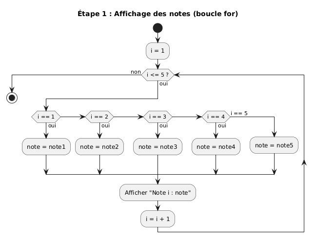
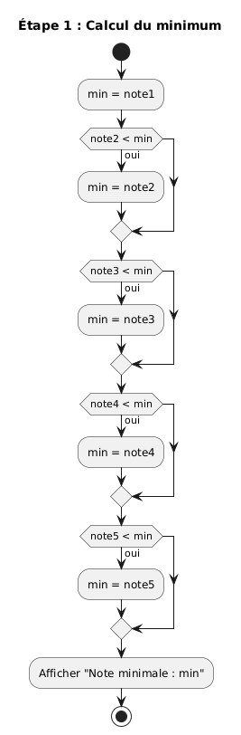
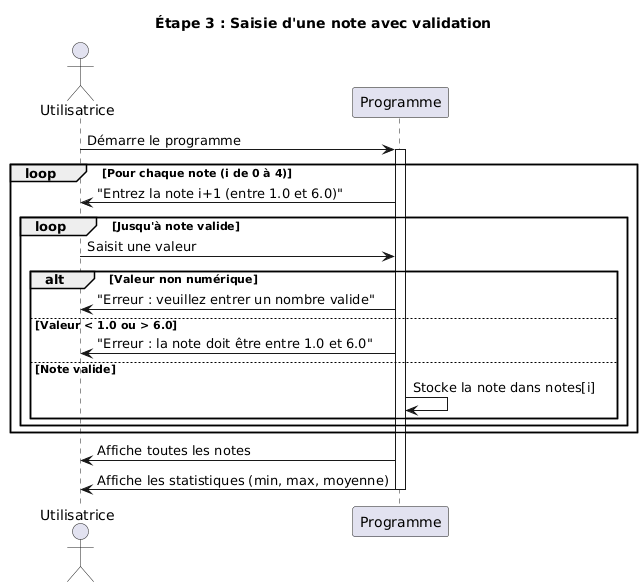
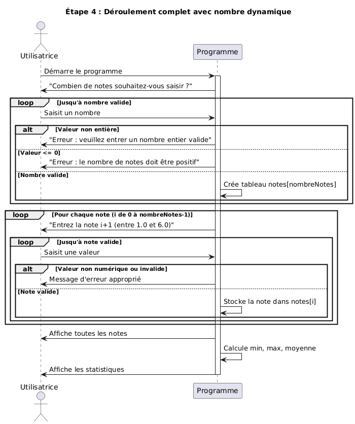
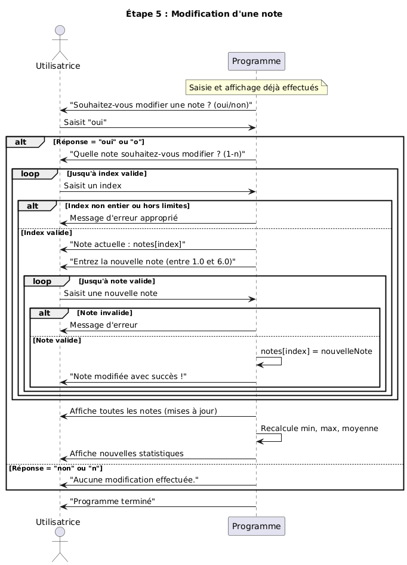
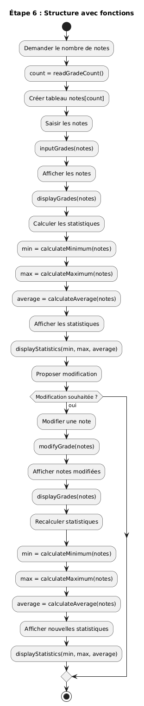
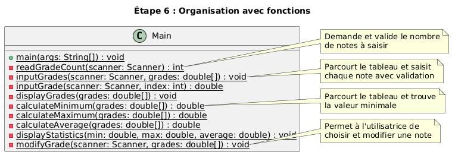

# Méthodologies de résolution de problèmes

V. Guidoux, avec l'aide de
[GitHub Copilot](https://github.com/features/copilot).

Ce travail est sous licence [CC BY-SA 4.0][licence].

## Ressources annexes

- Objectifs, méthodes d'enseignement et d'apprentissage, et méthodes
  d'évaluation : [Lien vers le contenu](..)
- Exemples de code : [Lien vers le contenu](../02-exemples-de-code/)

## Introduction

Ce support de cours présente une méthodologie de résolution de problèmes
appliquée à la programmation. Plutôt que de présenter des concepts de manière
abstraite, nous allons construire ensemble un programme complet, étape par
étape, en réfléchissant à voix haute sur les choix à faire.

L'objectif n'est pas d'apprendre de nouvelles structures de programmation : vous
connaissez déjà les variables, les tableaux, les boucles, les conditions et les
fonctions. L'objectif est d'apprendre à **penser** un problème avant de coder, à
décomposer une tâche complexe en sous-tâches simples, et à faire évoluer une
solution de manière itérative.

Cette approche est au cœur de la programmation professionnelle : on ne code
jamais la solution finale directement. On commence par une version simple qui
fonctionne, puis on ajoute progressivement des fonctionnalités.

> [!IMPORTANT]
>
> Ce cours est un tutoriel guidé. Prenez le temps de lire chaque section dans
> l'ordre, d'exécuter les exemples de code sur votre machine, et de comprendre
> les raisonnements présentés. Ne sautez pas d'étapes.

## Description du problème

Nous allons construire un programme de gestion de notes. Ce programme doit
permettre à l'utilisatrice de :

1. Saisir plusieurs notes
2. Afficher toutes les notes
3. Calculer et afficher le minimum, maximum et la moyenne
4. Modifier une note si nécessaire

Ce problème peut sembler simple, mais il contient plusieurs difficultés :

- Comment stocker plusieurs notes ?
- Comment demander des valeurs à l'utilisatrice ?
- Comment valider que les valeurs sont correctes ?
- Comment permettre la modification après la saisie ?

Nous allons résoudre ces questions une par une, en construisant 5 versions
successives du programme, chacune ajoutant une nouvelle capacité.

## Étape 1 : Notes en dur avec variables individuelles

### Réflexion en français

Commençons par le plus simple possible : afficher quelques notes et calculer
leurs statistiques (minimum, maximum, moyenne).

Pour cette première version, nous allons :

- Définir les notes directement dans le code (valeurs "en dur")
- Utiliser des variables individuelles (`note1`, `note2`, etc.)
- Afficher les notes de plusieurs façons pour comparer les approches
- Calculer le minimum en comparant chaque note avec le minimum actuel
- Calculer le maximum de la même manière
- Calculer la moyenne en additionnant toutes les notes et en divisant par leur
  nombre

Cette approche est volontairement naïve. Elle nous permettra de voir les limites
de l'utilisation de variables individuelles.

### Modélisation UML

Voici le diagramme d'activité pour l'affichage des notes avec une boucle :



_Source :
[etape-01-activite-affichage.plantuml](images/etape-01-activite-affichage.plantuml)_

Et voici le diagramme pour le calcul du minimum :



_Source :
[etape-01-activite-minimum.plantuml](images/etape-01-activite-minimum.plantuml)_

### Implémentation en Java

Le code complet se trouve dans :
[02-exemples-de-code/01-notes-en-dur-variables/Main.java](../02-exemples-de-code/01-notes-en-dur-variables/Main.java)

Voici les points clés de cette implémentation :

````java
// Déclaration de variables individuelles
double note1 = 4.5;
double note2 = 5.0;
double note3 = 3.8;
double note4 = 4.2;
double note5 = 5.3;

// Affichage avec une structure conditionnelle dans une boucle
for (int i = 1; i <= 5; i++) {
    double current;

    if (i == 1) {
        current = note1;
    } else if (i == 2) {
        current = note2;
    } // ... etc

    System.out.println("Note " + i + " : " + current);
}

// Calcul du minimum avec des comparaisons successives
double min = note1;
if (note2 < min) {
    min = note2;
}
// ... répété pour chaque note
```### Enseignements tirés

Cette première version fonctionne, mais elle présente plusieurs problèmes :

1. **Rigidité** : Pour ajouter une note, il faut modifier le code à plusieurs
   endroits (déclaration, affichage, calculs)
2. **Répétition** : Le code pour l'affichage et les calculs contient beaucoup de
   répétitions
3. **Difficulté de maintenance** : Si on se trompe dans le nombre de notes, on
   doit corriger partout

> [!NOTE]
>
> Le code montre trois façons d'afficher les notes : individuellement, avec une
> boucle `while`, et avec une boucle `for`. Observez comment la structure
> `if/else if` devient nécessaire pour sélectionner la bonne variable.

Ces limitations nous amènent naturellement à la question : existe-t-il une
structure de données permettant de stocker plusieurs valeurs du même type ? Oui,
les tableaux !

## Étape 2 : Notes en dur avec un tableau

### Réflexion en français

Nous allons maintenant remplacer les 5 variables individuelles par un seul
tableau. Cette modification va simplifier considérablement le code :

- Déclaration en une seule ligne
- Boucles simplifiées (plus besoin de `if/else if`)
- Calculs utilisant des boucles sur les indices du tableau
- Code beaucoup plus facile à maintenir

Les tableaux sont conçus précisément pour stocker plusieurs valeurs du même
type. Ils offrent un accès par indice (`notes[0]`, `notes[1]`, etc.) et
connaissent leur propre taille (`notes.length`).

### Modélisation UML

Le diagramme pour le calcul du minimum devient beaucoup plus simple avec un
tableau :


_Source :
[etape-02-activite-minimum.plantuml](images/etape-02-activite-minimum.plantuml)_

Observez comment la boucle parcourt simplement les indices du tableau, sans
avoir besoin de structure conditionnelle pour sélectionner la bonne valeur.

### Implémentation en Java

Le code complet se trouve dans :
[02-exemples-de-code/02-notes-en-dur-tableau/Main.java](../02-exemples-de-code/02-notes-en-dur-tableau/Main.java)

Voici les améliorations principales :

```java
// Déclaration et initialisation en une ligne
double[] notes = {4.5, 5.0, 3.8, 4.2, 5.3};

// Affichage simplifié avec une boucle for classique
for (int i = 0; i < notes.length; i++) {
    System.out.println("Note " + (i + 1) + " : " + notes[i]);
}

// Ou avec une boucle for-each encore plus simple
for (double note : notes) {
    System.out.println("Note : " + note);
}

// Calcul du minimum avec une boucle simple
double min = notes[0];
for (int i = 1; i < notes.length; i++) {
    if (notes[i] < min) {
        min = notes[i];
    }
}
````

### Enseignements tirés

L'utilisation d'un tableau apporte plusieurs avantages majeurs :

1. **Simplicité** : Le code est plus court et plus lisible
2. **Généricité** : Les boucles fonctionnent quelle que soit la taille du
   tableau
3. **Maintenance** : Pour changer le nombre de notes, on modifie uniquement la
   déclaration

> [!TIP]
>
> Comparez le code de cette étape avec celui de l'étape 1. Le tableau réduit la
> complexité de manière spectaculaire. C'est un excellent exemple de choix de
> structure de données impactant la qualité du code.

Cependant, nous avons toujours un problème : les notes sont définies dans le
code. Pour utiliser ce programme avec d'autres notes, il faut modifier le code
source, recompiler, et relancer. Ce n'est pas pratique. La prochaine étape va
résoudre ce problème.

## Étape 3 : Saisie de notes avec un nombre fixe

### Réflexion en français

Nous allons maintenant rendre le programme interactif en permettant à
l'utilisatrice de saisir les notes au clavier. Cela soulève plusieurs questions
:

- Comment lire des valeurs depuis le clavier en Java ?
- Comment s'assurer que les valeurs saisies sont valides ?
- Que faire si l'utilisatrice entre une valeur incorrecte ?

Java propose la classe `Scanner` pour lire les entrées. Pour valider les
données, nous allons utiliser une boucle `while` qui continue tant que la valeur
n'est pas valide.

Pour cette version, nous gardons un nombre fixe de notes (5) pour simplifier.
Nous ajouterons la flexibilité dans l'étape suivante.

### Modélisation UML

Le diagramme de séquence montre l'interaction entre l'utilisatrice et le
programme :



_Source :
[etape-03-sequence-saisie.plantuml](images/etape-03-sequence-saisie.plantuml)_

Observez la boucle de validation : le programme demande une note, vérifie
qu'elle est valide, et redemande si nécessaire. Cette approche garantit que
seules des valeurs correctes sont stockées.

### Implémentation en Java

Le code complet se trouve dans :
[02-exemples-de-code/03-saisie-notes-nombre-fixe/Main.java](../02-exemples-de-code/03-saisie-notes-nombre-fixe/Main.java)

Voici les éléments nouveaux :

````java
import java.util.Scanner;

// Création du Scanner
Scanner scanner = new Scanner(System.in);

// Saisie avec validation
for (int i = 0; i < NOMBRE_NOTES; i++) {
    boolean valid = false;

    while (!valid) {
        System.out.print("Entrez la note " + (i + 1) + " (entre 1.0 et 6.0) : ");

        if (scanner.hasNextDouble()) {
            double grade = scanner.nextDouble();

            if (grade >= 1.0 && grade <= 6.0) {
                notes[i] = grade;
                valid = true;
            } else {
                System.out.println("Erreur : la note doit être entre 1.0 et 6.0");
            }
        } else {
            System.out.println("Erreur : veuillez entrer un nombre valide");
            scanner.next(); // Consommer l'entrée invalide
        }
    }
}

// Fermeture du Scanner
scanner.close();
```### Enseignements tirés

L'ajout de l'interaction utilisatrice introduit plusieurs concepts importants :

1. **Entrées-sorties** : La classe `Scanner` permet de lire depuis la console
2. **Validation** : Les données externes doivent toujours être validées
3. **Robustesse** : Le programme gère les erreurs et guide l'utilisatrice
4. **Gestion des ressources** : Il faut fermer le `Scanner` après utilisation

> [!WARNING]
>
> Ne jamais faire confiance aux données saisies par l'utilisatrice. Validez
> toujours le type (avec `hasNextDouble()`) et les valeurs (avec des
> conditions). Sinon, votre programme peut planter ou produire des résultats
> incorrects.

Cette version est fonctionnelle et utilisable, mais elle manque encore de
flexibilité : pourquoi forcer l'utilisatrice à entrer exactement 5 notes ?
Laissons-la choisir.

## Étape 4 : Saisie de notes avec un nombre dynamique

### Réflexion en français

Pour rendre le programme vraiment flexible, nous allons demander à
l'utilisatrice combien de notes elle souhaite saisir, puis créer un tableau de
la taille appropriée.

Cette modification nécessite de :

- Demander le nombre de notes en premier
- Valider que ce nombre est positif
- Créer le tableau avec la taille choisie
- Adapter le reste du code pour utiliser cette taille

Heureusement, notre code utilise déjà `notes.length` partout, donc il n'y a pas
beaucoup de changements à faire !

### Modélisation UML

Le diagramme de séquence complet montre maintenant deux phases :



_Source :
[etape-04-sequence-complete.plantuml](images/etape-04-sequence-complete.plantuml)_

La première phase (demande du nombre) est nouvelle. La seconde phase (saisie des
notes) est identique à l'étape 3, mais avec un nombre variable de notes.

### Implémentation en Java

Le code complet se trouve dans :
[02-exemples-de-code/04-saisie-notes-nombre-dynamique/Main.java](../02-exemples-de-code/04-saisie-notes-nombre-dynamique/Main.java)

Voici la partie ajoutée :

```java
// Demande du nombre de notes
int count = 0;
boolean validCount = false;

while (!validCount) {
    System.out.print("Combien de notes souhaitez-vous saisir ? ");

    if (scanner.hasNextInt()) {
        count = scanner.nextInt();

        if (count > 0) {
            validCount = true;
        } else {
            System.out.println("Erreur : le nombre de notes doit être positif");
        }
    } else {
        System.out.println("Erreur : veuillez entrer un nombre entier valide");
        scanner.next();
    }
}

// Création du tableau de la taille choisie
double[] notes = new double[count];

// Le reste du code reste identique
```### Enseignements tirés

Cette évolution démontre l'importance de la généricité dans le code :

1. **Tableaux dynamiques** : En Java, on peut créer un tableau de n'importe
   quelle taille à l'exécution
2. **Code adaptable** : Utiliser `notes.length` au lieu d'une constante rend le
   code flexible
3. **Validation en cascade** : Chaque donnée saisie doit être validée de la même
   manière

> [!NOTE]
>
> Remarquez que le code de l'étape 3 (saisie des notes, calcul des statistiques)
> n'a **pas changé**. C'est la récompense d'avoir écrit un code générique dès le
> départ.

Notre programme est maintenant très flexible, mais il lui manque une dernière
fonctionnalité : que faire si l'utilisatrice fait une erreur de saisie ?

## Étape 5 : Modification d'une note

### Réflexion en français

La dernière fonctionnalité à ajouter est la possibilité de modifier une note
après avoir tout saisi. Cela nécessite de :

- Afficher les statistiques une première fois
- Demander à l'utilisatrice si elle souhaite modifier une note
- Si oui, lui demander quelle note modifier (par son index)
- Valider que l'index est correct
- Lui demander la nouvelle valeur
- Mettre à jour le tableau
- Recalculer et réafficher les statistiques

Cette fonctionnalité illustre un concept important : la modification de données
après leur création initiale.

### Modélisation UML

Le diagramme de séquence montre la nouvelle interaction :



_Source :
[etape-05-sequence-modification.plantuml](images/etape-05-sequence-modification.plantuml)_

Observez comment le programme propose la modification après avoir affiché les
statistiques, puis recalcule tout si une modification est faite.

### Implémentation en Java

Le code complet se trouve dans :
[02-exemples-de-code/05-modification-note/Main.java](../02-exemples-de-code/05-modification-note/Main.java)

Voici la partie ajoutée :

```java
// Proposition de modification
System.out.print("Souhaitez-vous modifier une note ? (oui/non) : ");
scanner.nextLine(); // Consommer le retour à la ligne restant
String response = scanner.nextLine().toLowerCase();

if (response.equals("oui") || response.equals("o")) {
    // Demande de l'index à modifier
    System.out.print("Quelle note souhaitez-vous modifier ? (1-" + count + ") : ");
    int indexToModify = scanner.nextInt() - 1;

    // Validation de l'index
    if (indexToModify >= 0 && indexToModify < count) {
        System.out.println("Note actuelle : " + notes[indexToModify]);

        // Saisie de la nouvelle valeur avec validation
        System.out.print("Entrez la nouvelle note (entre 1.0 et 6.0) : ");
        double newGrade = scanner.nextDouble();

        // Mise à jour
        notes[indexToModify] = newGrade;

        // Recalcul et réaffichage
        displayGrades(notes);
        calculateAndDisplayStatistics(notes);
    }
}
```### Enseignements tirés

Cette dernière étape illustre plusieurs concepts avancés :

1. **Modification en place** : On modifie directement une case du tableau avec
   `notes[i] = nouvelleNote`
2. **Gestion des indices** : Attention à la conversion entre numérotation
   utilisatrice (1-n) et indices Java (0-(n-1))
3. **Recalcul** : Après modification, il faut recalculer les statistiques
4. **Expérience utilisatrice** : Proposer la modification est plus ergonomique
   que forcer à recommencer

> [!WARNING]
>
> L'interaction entre `scanner.nextInt()` et `scanner.nextLine()` peut causer
> des problèmes. Le `nextInt()` ne consomme pas le retour à la ligne, donc il
> faut un `nextLine()` supplémentaire avant de lire une chaîne de caractères.

Notre programme est maintenant complet et fonctionnel. Mais le code commence à
être long et répétitif. Il est temps de le restructurer.

## Étape 6 : Refactorisation avec des fonctions

### Réflexion en français

Le code de l'étape 5 fonctionne bien, mais il devient difficile à lire : tout
est dans la fonction `main`, qui fait maintenant plus de 150 lignes. Il est
temps de **refactoriser**, c'est-à-dire de réorganiser le code sans changer son
comportement.

Les avantages de la refactorisation :

- **Lisibilité** : Chaque fonction a un nom qui décrit ce qu'elle fait
- **Réutilisabilité** : On peut appeler la même fonction plusieurs fois
- **Maintenance** : Plus facile de trouver et corriger un bug
- **Tests** : Plus facile de tester chaque fonction individuellement

Nous allons créer des fonctions pour :

- Lire le nombre de notes
- Saisir une note avec validation
- Saisir toutes les notes
- Afficher les notes
- Calculer le minimum
- Calculer le maximum
- Calculer la moyenne
- Afficher les statistiques
- Modifier une note

### Modélisation UML

Le diagramme d'activité montre la structure simplifiée avec des fonctions :



_Source :
[etape-06-activite-refactoring.plantuml](images/etape-06-activite-refactoring.plantuml)_

Et voici le diagramme de classes montrant toutes les fonctions :



_Source : [etape-06-classes.plantuml](images/etape-06-classes.plantuml)_

Observez comment chaque fonction a une responsabilité unique et bien définie.

### Implémentation en Java

Voici un exemple de refactorisation pour le calcul du minimum :

```java
// Avant : code dans main
double min = notes[0];
for (int i = 1; i < notes.length; i++) {
    if (notes[i] < min) {
        min = notes[i];
    }
}
System.out.println("Note minimale : " + min);

// Après : fonction dédiée
private static double calculateMinimum(double[] grades) {
    double min = grades[0];
    for (int i = 1; i < grades.length; i++) {
        if (grades[i] < min) {
            min = grades[i];
        }
    }
    return min;
}

// Utilisation dans main
double min = calculateMinimum(notes);
System.out.println("Note minimale : " + min);
````

### Enseignements tirés

La refactorisation apporte plusieurs bénéfices :

1. **Séparation des responsabilités** : Chaque fonction fait une seule chose
2. **Code auto-documenté** : Les noms de fonctions expliquent le code
3. **Éviter la répétition** : Le calcul des statistiques est utilisé deux fois,
   mais le code n'est écrit qu'une fois
4. **Main simplifié** : La fonction `main` devient un scénario de haut niveau
   facile à comprendre

> [!TIP]
>
> Une bonne fonction a :
>
> - Un nom clair décrivant ce qu'elle fait
> - Des paramètres bien définis
> - Une seule responsabilité
> - Une taille raisonnable (généralement moins de 20 lignes)

Cette refactorisation conclut notre construction progressive du programme de
gestion de notes. Nous avons maintenant un code propre, lisible et maintenable.

## Récapitulatif de la méthodologie

Revenons sur ce que nous avons fait et extrayons-en une méthodologie générale
applicable à n'importe quel problème de programmation.

### Étapes de résolution

1. **Commencer simple** : Résoudre la version la plus simple du problème
2. **Faire fonctionner** : S'assurer que cette version simple marche
3. **Ajouter une fonctionnalité** : Étendre progressivement les capacités
4. **Tester** : Vérifier que chaque ajout fonctionne avant de continuer
5. **Refactoriser** : Réorganiser le code quand il devient complexe
6. **Répéter** : Continuer jusqu'à avoir toutes les fonctionnalités voulues

### Principes guidant les choix

- **Généricité** : Écrire du code qui s'adapte plutôt que du code rigide
- **Validation** : Toujours vérifier les données externes
- **Lisibilité** : Le code est lu plus souvent qu'il n'est écrit
- **Robustesse** : Gérer les cas d'erreur gracieusement
- **Modularité** : Découper en fonctions avec une responsabilité unique

### Outils de réflexion

Avant de coder, nous avons systématiquement :

1. **Réfléchi en français** : Décrit le problème et l'approche dans notre langue
   naturelle
2. **Modélisé en UML** : Visualisé la structure et le comportement
3. **Implémenté en Java** : Traduit la réflexion en code
4. **Tiré des enseignements** : Analysé les forces et faiblesses de chaque
   approche

Cette méthodologie est applicable à n'importe quel problème de programmation,
quel que soit le langage ou le domaine.

### Comparaison des versions

Voici un tableau récapitulatif de l'évolution :

| Étape | Stockage  | Saisie | Taille | Modification | Complexité |
| ----- | --------- | ------ | ------ | ------------ | ---------- |
| 1     | Variables | Non    | Fixe   | Non          | Haute      |
| 2     | Tableau   | Non    | Fixe   | Non          | Moyenne    |
| 3     | Tableau   | Oui    | Fixe   | Non          | Moyenne    |
| 4     | Tableau   | Oui    | Libre  | Non          | Moyenne    |
| 5     | Tableau   | Oui    | Libre  | Oui          | Moyenne    |
| 6     | Tableau   | Oui    | Libre  | Oui          | Faible     |

Observez comment la complexité diminue à l'étape 6 grâce à la refactorisation,
même si les fonctionnalités augmentent.

## Pour aller plus loin

Ce tutoriel vous a montré une méthode de travail, mais il reste beaucoup à
explorer. Voici quelques pistes pour approfondir :

### Améliorations possibles du programme

1. **Menu interactif** : Permettre plusieurs actions (afficher, ajouter,
   supprimer, modifier) dans une boucle jusqu'à ce que l'utilisatrice choisisse
   de quitter
2. **Sauvegarde sur disque** : Écrire les notes dans un fichier pour les
   retrouver plus tard
3. **Statistiques avancées** : Médiane, écart-type, notes au-dessus de la
   moyenne
4. **Catégories de notes** : Gérer plusieurs matières avec leurs notes
5. **Interface graphique** : Remplacer la console par une fenêtre avec des
   boutons

### Concepts à approfondir

- **Gestion d'exceptions** : Utiliser `try/catch` au lieu de `hasNextDouble()`
- **Programmation orientée objet** : Créer une classe `GestionnaireNotes` avec
  des méthodes
- **Collections Java** : Utiliser `ArrayList` pour permettre l'ajout/suppression
  de notes
- **Tests unitaires** : Écrire des tests pour chaque fonction avec JUnit
- **Design patterns** : Appliquer des patrons de conception (Strategy, Command,
  etc.)

### Exercices suggérés

1. **Moyenne pondérée** : Ajouter un coefficient pour chaque note et calculer la
   moyenne pondérée
2. **Recherche de notes** : Permettre de rechercher toutes les notes dans un
   intervalle donné
3. **Tri des notes** : Afficher les notes triées par ordre croissant ou
   décroissant
4. **Histogramme** : Afficher un graphique en mode texte de la répartition des
   notes
5. **Comparaison de séries** : Gérer deux séries de notes et les comparer

### Ressources complémentaires

Pour approfondir la méthodologie de résolution de problèmes :

- George Pólya, _How to Solve It_ : Un classique sur la résolution de problèmes
  en mathématiques, applicable à la programmation
- Martin Fowler, _Refactoring_ : Le livre de référence sur la refactorisation de
  code
- Robert C. Martin, _Clean Code_ : Principes pour écrire du code lisible et
  maintenable

## Conclusion

Ce tutoriel vous a montré qu'on ne code jamais "tout d'un coup". La
programmation est un processus itératif où l'on construit progressivement une
solution en faisant des choix réfléchis à chaque étape.

Les compétences développées ici sont transférables :

- Décomposer un problème complexe en sous-problèmes simples
- Commencer par une version simple et ajouter progressivement des
  fonctionnalités
- Réfléchir en français avant de coder
- Modéliser pour comprendre la structure avant l'implémentation
- Refactoriser quand le code devient complexe

Ces compétences sont au cœur de la programmation professionnelle. Continuez à
les pratiquer dans tous vos projets !

[licence]:
	https://github.com/HEIG-VD-Prog-Course/HEIG-VD-ProgIM-Course/blob/main/LICENSE.md
