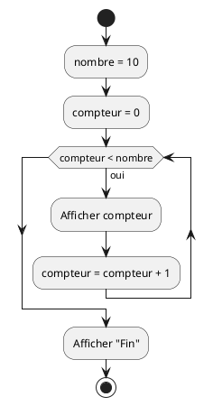
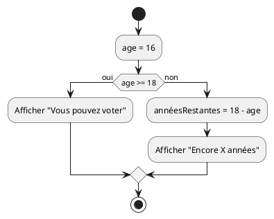

# Évaluation - Programmation 1

V. Guidoux, avec l'aide de
[GitHub Copilot](https://github.com/features/copilot).

Ce travail est sous licence [CC BY-SA 4.0][licence].

---

**Nom :**

**Prénom :**

**Date :** 14 novembre 2024

---

## Instructions

Cette évaluation porte sur les contenus suivants :

- Séquence, sélection et itération
- Variables & Constantes
- Fonctions
- Entrée/sortie/encodage
- Bonnes pratiques

**Durée :** 120 minutes

**Documents autorisés :** Aucun (closed-book)

**Matériel autorisé :** Casque anti-bruit (sans musique)

**Important :** L'évaluation se déroule entièrement sur la plateforme
d'évaluation en ligne. Une documentation sera fournie pour les méthodes Java non
triviales si nécessaire.

> [!CAUTION]
>
> Toute tentative de tricherie entraînera automatiquement la note de 1 pour
> l'ensemble de l'examen, sans discussion possible.

---

## Section 1 : Vrai ou Faux (12 points)

Pour chaque affirmation, indiquez si elle est vraie ou fausse.

**Temps estimé : 10 minutes**

### Question 1 - Constantes et final (2 points - Facile)

En Java, une constante déclarée avec le mot-clé `final` peut être modifiée après
son initialisation.

- [ ] Vrai
- [ ] Faux

<details>
<summary>Afficher la réponse</summary>

**Réponse : Faux**

Objectif : Comprendre l'utilisation des constantes en Java

Une constante déclarée avec `final` ne peut **pas** être modifiée après son
initialisation. C'est justement le but d'une constante : sa valeur reste fixe
tout au long de l'exécution du programme.

</details>

### Question 2 - Types de données (2 points - Facile)

En Java, une variable de type `int` peut stocker des nombres décimaux comme
3.14.

- [ ] Vrai
- [ ] Faux

<details>
<summary>Afficher la réponse</summary>

**Réponse : Faux**

Objectif : Connaître les types de données de base en Java

Le type `int` ne peut stocker que des nombres entiers (sans virgule). Pour
stocker des nombres décimaux, on utilise `double` ou `float`.

</details>

### Question 3 - Conventions de nommage (2 points - Facile)

En Java, les noms de variables doivent toujours commencer par une majuscule
selon les conventions de nommage.

- [ ] Vrai
- [ ] Faux

<details>
<summary>Afficher la réponse</summary>

**Réponse : Faux**

Objectif : Connaître les conventions de nommage en Java

En Java, les noms de variables commencent par une **minuscule** en utilisant la
convention camelCase (exemple : `userName`, `totalPrice`). Les noms de classes
commencent par une majuscule (PascalCase).

</details>

### Question 4 - Opérateur + (2 points - Facile)

En Java, le symbole `+` peut être utilisé à la fois pour additionner des nombres
et pour concaténer (coller ensemble) des chaînes de caractères.

- [ ] Vrai
- [ ] Faux

<details>
<summary>Afficher la réponse</summary>

**Réponse : Vrai**

Objectif : Comprendre l'opérateur + en Java

Le symbole `+` a deux utilisations en Java :

- Addition : `5 + 3` donne `8`
- Concaténation : `"Hello" + " World"` donne `"Hello World"`

</details>

### Question 5 - Opérateurs de comparaison (2 points - Facile)

En Java, l'opérateur `==` est utilisé pour comparer deux valeurs, tandis que `=`
est utilisé pour l'affectation (C'est-à-dire donner une valeur à une variable).

- [ ] Vrai
- [ ] Faux

<details>
<summary>Afficher la réponse</summary>

**Réponse : Vrai**

Objectif : Différencier l'affectation de la comparaison

- `=` est l'opérateur d'affectation (donner une valeur à une variable)
- `==` est l'opérateur de comparaison (vérifier si deux valeurs sont égales)

</details>

### Question 6 - Boucle for (2 points - Moyen)

Dans une boucle `for`, il est obligatoire d'initialiser le compteur à 0.

Dans cet exemple, le compteur est `counter` :

```java
for (int counter = 0; counter < 10; counter++) {
    System.out.println(counter);
}
```

Dans cet exemple, le compteur est `i` :

```java
for (int i = 0; i < 10; i++) {
    System.out.println(i);
}
```

- [ ] Vrai
- [ ] Faux

<details>
<summary>Afficher la réponse</summary>

**Réponse : Faux**

Objectif : Comprendre la flexibilité de la boucle for

Le compteur d'une boucle `for` peut être initialisé à n'importe quelle valeur
selon les besoins. Par exemple :

```java
for (int i = 5; i <= 10; i++) {
    // Commence à 5, pas à 0
}
```

</details>

---

## Section 2 : Choix multiples (18 points)

Pour chaque question, cochez la ou les réponses correctes. Plusieurs réponses
peuvent être correctes.

**Temps estimé : 15 minutes**

### Question 7 - Déclarations de variables (3 points - Facile)

Parmi les déclarations suivantes, lesquelles sont correctes en Java ?

- [ ] `int age = 25;`
- [ ] `double price = 19.99;`
- [ ] `String name = "Alice";`
- [ ] `boolean isValid = 1;`

<details>
<summary>Afficher la réponse</summary>

Objectif : Identifier les déclarations de variables correctes en Java

Réponses correctes :

- [x] `int age = 25;` **(1 point)** - Déclaration correcte d'un entier
- [x] `double price = 19.99;` **(1 point)** - Déclaration correcte d'un nombre
      décimal
- [x] `String name = "Alice";` **(1 point)** - Déclaration correcte d'une chaîne
      de caractères
- [ ] `boolean isValid = 1;` - **Incorrecte** : en Java, un booléen doit être
      `true` ou `false`, pas `1` ou `0`

</details>

### Question 8 - Méthodes en Java (3 points - Facile)

Quelle(s) affirmation(s) est/sont vraie(s) concernant les méthodes en Java ?

- [ ] Une méthode/fonction peut retourner une valeur avec le mot-clé `return`
- [ ] Une méthode/fonction peut avoir plusieurs paramètres séparés par des
      virgules
- [ ] Une méthode/fonction `void` doit toujours contenir une instruction
      `return`
- [ ] Une méthode/fonction peut être appelée depuis la méthode `main`

<details>
<summary>Afficher la réponse</summary>

Objectif : Comprendre les caractéristiques des méthodes en Java

Réponses correctes :

- [x] Une méthode peut retourner une valeur avec le mot-clé `return` **(1
      point)**
- [x] Une méthode peut avoir plusieurs paramètres séparés par des virgules **(1
      point)**
- [ ] Une méthode `void` doit toujours contenir une instruction `return` -
      **Faux** : une méthode `void` n'est pas obligée d'avoir un `return`
- [x] Une méthode peut être appelée depuis la méthode `main` **(1 point)**

</details>

### Question 9 - Bonnes pratiques (3 points - Facile)

Parmi les bonnes pratiques suivantes, lesquelles sont recommandées ?

- [ ] Utiliser des noms de variables courts comme `x`, `y`, `z` pour économiser
      de l'espace
- [ ] Indenter correctement le code pour améliorer la lisibilité
- [ ] Utiliser des constantes pour les valeurs qui ne changent pas
- [ ] Utiliser des noms de variables en anglais pour faciliter la collaboration

<details>
<summary>Afficher la réponse</summary>

Objectif : Identifier les bonnes pratiques de programmation

Réponses correctes :

- [ ] Utiliser des noms de variables courts comme `x`, `y`, `z` pour économiser
      de l'espace - **Faux** : préférer des noms explicites
- [x] Indenter correctement le code pour améliorer la lisibilité **(1 point)**
- [x] Utiliser des constantes pour les valeurs qui ne changent pas **(1 point)**
- [x] Utiliser des noms de variables en anglais pour faciliter la collaboration
      **(1 point)**

</details>

### Question 10 - Opérateurs de comparaison (3 points - Facile)

Parmi les opérateurs suivants, lesquels sont des opérateurs de comparaison en
Java ?

- [ ] `==` (égal à)
- [ ] `=` (affectation)
- [ ] `!=` (différent de)
- [ ] `<=` (inférieur ou égal à)

<details>
<summary>Afficher la réponse</summary>

Objectif : Identifier les opérateurs de comparaison

Réponses correctes :

- [x] `==` (égal à) **(1 point)**
- [ ] `=` (affectation) - **Faux** : c'est un opérateur d'affectation, pas de
      comparaison
- [x] `!=` (différent de) **(1 point)**
- [x] `<=` (inférieur ou égal à) **(1 point)**

</details>

### Question 11 - Conventions de nommage Java (3 points - Moyen)

Parmi les conventions de nommage suivantes, lesquelles sont correctes en Java ?

- [ ] `final double PI = 3.14159;`
- [ ] `String UserName = "Alice";`
- [ ] `int total_price = 100;`
- [ ] `final int MAX_ATTEMPTS = 3;`

<details>
<summary>Afficher la réponse</summary>

Objectif : Connaître les conventions de nommage Java

Réponses correctes :

- [x] `final double PI = 3.14159;` **(1.5 point)** - Constante correctement
      nommée en majuscules
- [ ] `String UserName = "Alice";` - **Incorrect** : les variables commencent
      par une minuscule (`userName`)
- [ ] `int total_price = 100;` - **Incorrect** : on utilise camelCase, pas
      snake_case (`totalPrice`)
- [x] `final int MAX_ATTEMPTS = 3;` **(1.5 point)** - Constante correctement
      nommée

</details>

### Question 12 - Types de boucles (3 points - Facile)

Quels types de boucles existent en Java ?

- [ ] `for`
- [ ] `while`
- [ ] `loop`
- [ ] `repeat`

<details>
<summary>Afficher la réponse</summary>

Objectif : Connaître les types de boucles en Java

Réponses correctes :

- [x] `for` **(1.5 point)** - Boucle avec compteur
- [x] `while` **(1.5 point)** - Boucle avec condition
- [ ] `loop` - **Faux** : ce mot-clé n'existe pas en Java
- [ ] `repeat` - **Faux** : ce mot-clé n'existe pas en Java

Note : Il existe aussi `do-while` mais ce n'est pas dans les options proposées.

</details>

---

## Section 3 : Questions à choix unique (10 points)

Pour chaque question, une seule réponse est correcte.

**Temps estimé : 8 minutes**

### Question 13 - print vs println (2 points - Facile)

Quelle est la différence principale entre `System.out.print()` et
`System.out.println()` ?

- [ ] `print()` affiche du texte, `println()` affiche des nombres
- [ ] `println()` va à la ligne après l'affichage, `print()` non
- [ ] `print()` est plus rapide que `println()`
- [ ] Il n'y a aucune différence

<details>
<summary>Afficher la réponse</summary>

**Réponse : `println()` va à la ligne après l'affichage, `print()` non**

Objectif : Différencier les méthodes d'affichage

- `System.out.print()` affiche sans aller à la ligne
- `System.out.println()` affiche et ajoute un retour à la ligne (le "ln"
  signifie "line")

</details>

### Question 14 - Méthode qui ne retourne rien (2 points - Facile)

Quel est le type de retour d'une méthode qui ne retourne rien ?

- [ ] `null`
- [ ] `empty`
- [ ] `void`
- [ ] `return`

<details>
<summary>Afficher la réponse</summary>

**Réponse : `void`**

Objectif : Connaître le mot-clé void

Une méthode qui ne retourne aucune valeur est déclarée avec le type de retour
`void`.

Exemple :

```java
public static void displayMessage() {
    System.out.println("Hello");
}
```

</details>

### Question 15 - Affichage en Java (2 points - Facile)

Quelle instruction permet d'afficher du texte à l'écran en Java ?

- [ ] `print.system("Hello");`
- [ ] `System.out.println("Hello");`
- [ ] `console.write("Hello");`
- [ ] `display("Hello");`

<details>
<summary>Afficher la réponse</summary>

**Réponse : `System.out.println("Hello");`**

Objectif : Connaître la méthode d'affichage standard en Java

`System.out.println()` est la méthode standard pour afficher du texte dans la
console en Java.

</details>

### Question 16 - Opérateur modulo (2 points - Moyen)

Dans l'expression `10 % 3`, quel est le résultat ?

- [ ] `3`
- [ ] `3.33`
- [ ] `1`
- [ ] `0`

<details>
<summary>Afficher la réponse</summary>

**Réponse : `1`**

Objectif : Comprendre l'opérateur modulo

L'opérateur `%` (modulo) retourne le **reste** de la division entière.
`10 ÷ 3 = 3` avec un reste de `1`.

</details>

### Question 17 - Mot-clé pour constante (2 points - Facile)

En Java, quel mot-clé est utilisé pour déclarer une constante ?

- [ ] `const`
- [ ] `constant`
- [ ] `final`
- [ ] `static`

<details>
<summary>Afficher la réponse</summary>

**Réponse : `final`**

Objectif : Connaître le mot-clé pour déclarer une constante

En Java, le mot-clé `final` est utilisé pour déclarer une constante. Par exemple
: `final double PI = 3.14159;`

</details>

---

## Section 4 : Lecture de diagrammes UML (10 points)

Analysez les diagrammes PlantUML suivants et répondez aux questions.

**Temps estimé : 10 minutes**

### Question 18 - Diagramme boucle while (4 points - Moyen)

Analysez le diagramme d'activité suivant :



**Questions :**

a) Combien de fois le compteur sera-t-il affiché (sans compter "Fin") ? **(2
point)**

b) Quelle est la valeur finale de `compteur` ? **(2 point)**

<details>
<summary>Afficher la réponse</summary>

Objectif : Interpréter un diagramme d'activité avec une boucle

**a) Réponse : 10 fois** (compteur va de 0 à 9) **(1 point)**

**b) Réponse : 10** (la boucle s'arrête quand compteur = 10) **(1 point)**

```text
DÉBUT
  nombre = 10
  compteur = 0
  TANT QUE compteur < nombre FAIRE
    Afficher compteur
    compteur = compteur + 1
  FIN TANT QUE
  Afficher "Fin"
FIN
```

</details>

### Question 19 - Diagramme if/else (5 points - Moyen)

Analysez le diagramme d'activité suivant :



**Questions :**

a) Quelle structure algorithmique est utilisée ? **(2 points)**

b) Quel message sera affiché avec `age = 16` ? **(1.5 point)**

c) Quelle sera la valeur de `annéesRestantes` ? **(1.5 point)**

<details>
<summary>Afficher la réponse</summary>

Objectif : Interpréter un diagramme d'activité avec sélection

**a) Réponse : Sélection (if/else)** **(2 points)**

**b) Réponse : "Encore X années"** (où X = 2) **(1.5 point)**

**c) Réponse : 2** (18 - 16 = 2) **(1.5 point)**

</details>

---

## Section 5 : Lecture et explication de code (15 points)

Lisez attentivement le code Java suivant et répondez aux questions.

**Temps estimé : 15 minutes**

### Question 20 - Évolution des variables (5 points - Moyen)

Qu'affiche le code suivant ?

```java
public class Main {
    public static void main(String[] args) {
        int a = 5;
        int b = 10;
        int c = a + b;

        a = a * 2;
        b = c - a;

        System.out.println("a = " + a);
        System.out.println("b = " + b);
        System.out.println("c = " + c);
    }
}
```

<details>
<summary>Afficher la réponse</summary>

Objectif : Suivre l'évolution des variables et l'ordre d'exécution

**Grille de correction :**

- `a = 10` **(1.5 point)** - Initialement 5, puis multiplié par 2
- `b = 5` **(2 points)** - c (15) moins a (10) = 5
- `c = 15` **(1.5 point)** - Somme initiale de a (5) et b (10)

**Sortie attendue :**

```text
a = 10
b = 5
c = 15
```

**Points de compréhension :**

- L'ordre d'exécution est séquentiel
- Les modifications de `a` n'affectent pas la valeur déjà calculée de `c`
- `b` est recalculé après la modification de `a`

</details>

### Question 21 - Boucle for avec condition (5 points - Moyen)

Expliquez ligne par ligne ce que fait ce code :

```java
public class Main {
    public static void main(String[] args) {
        for (int i = 1; i <= 5; i++) { // Ligne 1
            if (i % 2 == 0) {  // Ligne 2
                System.out.println(i + " est pair"); // Ligne 3
            }
        }
    }
}
```

<details>
<summary>Afficher la réponse</summary>

Objectif : Analyser une boucle avec une condition

**Grille de correction (5 points) :**

**Explication attendue :**

1. La boucle `for` parcourt les nombres de 1 à 5 **(1 point)**
2. Pour chaque nombre `i`, on vérifie s'il est divisible par 2 (pair) avec
   l'opérateur modulo `%` **(2 points)**
3. Si le reste de la division par 2 est égal à 0, le nombre est pair **(1
   point)**
4. On affiche alors le message "[nombre] est pair" **(1 point)**

**Sortie :**

```text
2 est pair
4 est pair
```

</details>

### Question 22 - Méthode mystère (5 points - Difficile)

Analysez ce code et expliquez ce qu'il calcule :

```java
public class Main {
    public static int mystere(int n) {
        int resultat = 0;
        for (int i = 1; i <= n; i++) {
            resultat = resultat + i;
        }
        return resultat;
    }

    public static void main(String[] args) {
        int valeur = mystere(5);
        System.out.println(valeur);
    }
}
```

**Questions :**

a) Quelle valeur sera affichée ? **(2 points)**

b) Expliquez ce que calcule la méthode `mystere`. **(3 points)**

<details>
<summary>Afficher la réponse</summary>

Objectif : Comprendre une méthode avec accumulation

**a) Réponse : 15** **(2 points)**

**b) Explication :** **(3 points)**

La méthode `mystere` calcule la **somme des nombres de 1 à n**.

**Détails de l'exécution avec n=5 :**

- Itération 1 : resultat = 0 + 1 = 1
- Itération 2 : resultat = 1 + 2 = 3
- Itération 3 : resultat = 3 + 3 = 6
- Itération 4 : resultat = 6 + 4 = 10
- Itération 5 : resultat = 10 + 5 = 15

**Grille :**

- Identifier qu'il s'agit d'une somme : **(1 point)**
- Expliquer le processus d'accumulation : **(1 point)**
- Donner le résultat correct (15) : **(1 point)**

</details>

---

## Section 6 : Questions à développement court (15 points)

Répondez de manière concise et précise aux questions suivantes.

**Temps estimé : 15 minutes**

### Question 23 - Différence for et while (5 points - Facile)

Expliquez la différence entre une boucle `for` et une boucle `while`. Donnez un
exemple de situation pour chacune.

**Réponse :**

```text
[Votre réponse ici]
```

<details>
<summary>Afficher la réponse</summary>

Objectif : Distinguer les différents types de boucles et leur utilisation

**Grille de correction (5 points) :**

**Différence (3 points) :**

- Boucle `for` : utilisée quand on connaît le nombre d'itérations à l'avance
  **(1.5 point)**
- Boucle `while` : utilisée quand le nombre d'itérations dépend d'une condition
  qui peut changer dynamiquement **(1.5 point)**

**Exemples (2 points) :**

- Exemple `for` : Afficher les nombres de 1 à 10, parcourir un tableau **(1
  point)**
- Exemple `while` : Lire des données jusqu'à ce que l'utilisateur entre "stop",
  jeu qui continue jusqu'à game over **(1 point)**

</details>

### Question 24 - Scanner en Java (5 points - Moyen)

Qu'est-ce qu'un `Scanner` en Java ? Expliquez son rôle et donnez un exemple
d'utilisation pour lire un nombre entier.

**Ressource fournie :**

```java
Scanner scanner = new Scanner(System.in);
System.out.println();
System.out.print();
scanner.nextLine();
scanner.nextInt();
scanner.close();
```

**Réponse :**

```text
[Votre réponse ici]
```

<details>
<summary>Afficher la réponse</summary>

Objectif : Comprendre l'utilisation du Scanner pour l'entrée utilisateur

**Grille de correction (5 points) :**

**Explication (3 points) :**

- Le `Scanner` est une classe Java qui permet de lire des données saisies par
  l'utilisateur **(1.5 point)**
- Il fournit des méthodes pour lire différents types de données (nextInt(),
  nextDouble(), nextLine(), etc.) **(1.5 point)**

**Exemple (2 points) :**

```java
Scanner scanner = new Scanner(System.in); // 0.5 point
System.out.print("Entrez un nombre : "); // 0.5 point
int nombre = scanner.nextInt(); // 0.5 point
scanner.close(); // 0.5 point
```

</details>

### Question 25 - Bonnes pratiques (5 points - Facile)

Donnez trois exemples de bonnes pratiques en programmation que vous avez
apprises dans ce cours.

**Réponse :**

```text
[Votre réponse ici - listez 3 bonnes pratiques]
1.
2.
3.
```

<details>
<summary>Afficher la réponse</summary>

Objectif : Identifier et expliquer les bonnes pratiques de programmation

**Grille de correction (5 points) :**

Exemples acceptés (au moins 3 parmi les suivants) :

- Utiliser des noms de variables explicites et en anglais **(1.5 point)**
- Indenter correctement le code pour améliorer la lisibilité **(1.5 point)**
- Utiliser des constantes (`final`) pour les valeurs qui ne changent pas **(1.5
  point)**
- Fermer les ressources comme Scanner avec `.close()` **(1.5 point)**
- Utiliser des commentaires pour expliquer le code complexe **(1.5 point)**
- Respecter les conventions de nommage (camelCase pour variables, UPPER_CASE
  pour constantes) **(1.5 point)**

**Barème :**

- 3 bonnes pratiques correctement identifiées : 5 points total
- 2 bonnes pratiques correctement identifiées : 3 points
- 1 bonne pratique correctement identifiée : 1.5 point

</details>

---

## Section 7 : Complétion de code (20 points)

Complétez le code Java pour qu'il fonctionne correctement.

**Temps estimé : 20 minutes**

### Question 26 - Calcul de moyenne avec Scanner (6 points - Facile)

Complétez ce code pour calculer et afficher la moyenne de deux nombres :

Le bouton "CODE CHECK" vous permet de tester votre code. il simule une
interaction et va mettre `50` pour le premier nombre et `70` pour le deuxième
nombre.

**Ressource fournie :**

```java
Scanner scanner = new Scanner(System.in);
System.out.println();
System.out.print();
scanner.nextLine();
scanner.nextInt();
scanner.close();
```

```java
import java.util.Scanner;

public class Main {
    public static void main(String[] args) {
        Scanner scanner = new Scanner(System.in);

        System.out.print("Premier nombre : ");
        // TODO: Lire le premier nombre (double)

        System.out.print("Deuxième nombre : ");
        // TODO: Lire le deuxième nombre (double)

        // TODO: Calculer la moyenne

        // TODO: Afficher la moyenne

        scanner.close();
    }
}
```

**Input** :

```
50
70
```

**Output** :

```
Premier nombre : Deuxième nombre : Moyenne : 60.0
```

<details>
<summary>Afficher la réponse</summary>

Objectif : Utiliser Scanner et effectuer des calculs

**Grille de correction (6 points) :**

```java
import java.util.Scanner;

public class Main {
    public static void main(String[] args) {
        Scanner scanner = new Scanner(System.in);

        System.out.print("Premier nombre : ");
        double number1 = scanner.nextDouble(); // 1.5 point

        System.out.print("Deuxième nombre : ");
        double number2 = scanner.nextDouble(); // 1.5 point

        double average = (number1 + number2) / 2; // 2 points

        System.out.println("Moyenne : " + average); // 1 point

        scanner.close();
    }
}
```

</details>

### Question 27 - Affichage nombres pairs (7 points - Moyen)

Complétez ce code pour afficher les nombres pairs de 2 à 20 :

```java
public class Main {
    public static void main(String[] args) {
        // TODO: Créer une boucle for de 2 à 20

            // TODO: Vérifier si le nombre est pair

                // TODO: Afficher le nombre

        // TODO: Fermer la boucle
    }
}
```

<details>
<summary>Afficher la réponse</summary>

Objectif : Utiliser une boucle avec condition

**Grille de correction (7 points) :**

```java
public class Main {
    public static void main(String[] args) {
        for (int i = 2; i <= 20; i++) { // 2 points (structure for correcte)
            if (i % 2 == 0) { // 3 points (condition de parité)
                System.out.println(i); // 2 points (affichage)
            }
        }
    }
}
```

**Output attendu :**

```text
2
4
6
8
10
12
14
16
18
20

```

**Ressource fournie :**

```java
for (/*initialisation*/; /*condition*/; /*incrémentation*/) {}
if (/*condition*/) {}
else if (/*condition*/) {}
else {}
```

**Alternative avec incrémentation de 2 (aussi acceptée) :**

```java
for (int i = 2; i <= 20; i += 2) { // 5 points
    System.out.println(i); // 2 points
}
```

</details>

### Question 28 - Méthode avec calculs (7 points - Moyen)

Complétez ce code pour créer une méthode qui calcule le carré d'un nombre :

```java
public class Main {

    // TODO: Créer une méthode calculateSquare qui prend un int en paramètre
    // et retourne son carré (nombre * nombre)


    public static void main(String[] args) {
        int result1 = calculateSquare(5);
        int result2 = calculateSquare(10);
        int result3 = calculateSquare(3);

        System.out.println("5 au carré = " + result1);
        System.out.println("10 au carré = " + result2);
        System.out.println("3 au carré = " + result3);
    }
}
```

<details>
<summary>Afficher la réponse</summary>

Objectif : Créer une méthode avec paramètre et valeur de retour

**Grille de correction (7 points) :**

```java
public class Main {

    public static int calculateSquare(int number) { // 3 points (signature)
        return number * number; // 3 points (calcul et retour)
    } // 1 point (structure complète)

    public static void main(String[] args) {
        int result1 = calculateSquare(5);
        int result2 = calculateSquare(10);
        int result3 = calculateSquare(3);

        System.out.println("5 au carré = " + result1);
        System.out.println("10 au carré = " + result2);
        System.out.println("3 au carré = " + result3);
    }
}
```

**Sortie attendue :**

```text
5 au carré = 25
10 au carré = 100
3 au carré = 9
```

</details>

---

## Section 8 : Complétion de code avancée (40 points)

Complétez le code Java pour qu'il fonctionne correctement selon les
instructions.

**Temps estimé : 40 minutes**

### Question 29 - Méthode de calcul simple (12 points - Facile)

Complétez ce programme qui utilise une méthode pour calculer l'aire d'un
rectangle :

```java
public class Main {

    // TODO: Créer une méthode calculateRectangleArea qui prend deux paramètres
    // (longueur et largeur, de type int) et retourne leur produit (aire)


    public static void main(String[] args) {
        int length = 10;
        int width = 5;

        // TODO: Appeler calculateRectangleArea avec length et width
        int area =

        // TODO: Afficher "L'aire du rectangle est : [valeur]"

    }
}
```

**Ressource fournie :**

```java
System.out.println();
System.out.print();
```

<details>
<summary>Afficher la réponse</summary>

Objectifs : Créer une méthode / Passer des paramètres / Utiliser une valeur de
retour

**Grille de correction (12 points) :**

```java
public class Main {

    public static int calculateRectangleArea(int length, int width) { // 4 points (signature)
        return length * width; // 3 points (calcul et retour)
    }

    public static void main(String[] args) {
        int length = 10;
        int width = 5;

        int area = calculateRectangleArea(length, width); // 3 points

        System.out.println("L'aire du rectangle est : " + area); // 2 points
    }
}
```

**Sortie attendue :**

```text
L'aire du rectangle est : 50
```

</details>

### Question 30 - Boucle avec accumulation (13 points - Moyen)

### Question 30 - Boucle avec accumulation (13 points - Moyen)

Complétez ce programme qui calcule la somme des nombres de 1 à 10 :

```java
public class Main {
    public static void main(String[] args) {
        int sum = 0;

        // TODO: Créer une boucle for de 1 à 10

            // TODO: Ajouter i à sum (sum = sum + i)

        // TODO: Fermer la boucle

        // TODO: Afficher "La somme de 1 à 10 est : [valeur]"

    }
}
```

<details>
<summary>Afficher la réponse</summary>

Objectifs : Utiliser une boucle / Accumuler des valeurs

**Grille de correction (13 points) :**

```java
public class Main {
    public static void main(String[] args) {
        int sum = 0;

        for (int i = 1; i <= 10; i++) { // 4 points (structure de boucle)
            sum = sum + i; // 5 points (accumulation)
        }

        System.out.println("La somme de 1 à 10 est : " + sum); // 4 points
    }
}
```

**Sortie attendue :**

```text
La somme de 1 à 10 est : 55
```

**Explication :** 1 + 2 + 3 + 4 + 5 + 6 + 7 + 8 + 9 + 10 = 55

</details>

### Question 31 - FizzBuzz (15 points - Moyen)

Complétez ce programme FizzBuzz qui affiche les nombres de 1 à 20 avec des
règles spéciales :

- Pour les multiples de 3, affichez "Fizz"
- Pour les multiples de 5, affichez "Buzz"
- Pour les multiples de 3 ET de 5, affichez "FizzBuzz"
- Pour les autres nombres, affichez le nombre

**Exemple de sortie (extrait) :**

```text
1
2
Fizz
4
Buzz
Fizz
...
FizzBuzz
```

**Votre code :**

```java
public class Main {
    public static void main(String[] args) {
        // TODO: Créer une boucle de 1 à 20

        if (/* condition */) {
            System.out.println("FizzBuzz");
        } else if (/* condition */) {
            System.out.println("Fizz");
        } else if (/* condition */) {
            System.out.println("Buzz");
        } else {
            System.out.println(i);
        }

    }
}
```

<details>
<summary>Afficher la réponse</summary>

Objectifs : Utiliser des boucles / Utiliser l'opérateur modulo / Utiliser des
structures conditionnelles imbriquées

**Grille de correction (15 points) :**

```java
public class Main {
    public static void main(String[] args) {
        for (int i = 1; i <= 20; i++) { // 3 points (structure de boucle)
            if (i % 3 == 0 && i % 5 == 0) { // 4 points (condition double)
                System.out.println("FizzBuzz");
            } else if (i % 3 == 0) { // 3 points (condition Fizz)
                System.out.println("Fizz");
            } else if (i % 5 == 0) { // 3 points (condition Buzz)
                System.out.println("Buzz");
            } else { // 2 points (cas par défaut)
                System.out.println(i);
            }
        }
    }
}
```

**Points importants :**

- L'ordre des conditions est crucial : tester d'abord la double condition (3
  ET 5)
- Utilisation correcte de l'opérateur modulo `%`
- Logique complète couvrant tous les cas

</details>

---

## Barème de notation

| Section                         | Points possibles | Difficulté |
| ------------------------------- | ---------------: | ---------- |
| Section 1 : Vrai ou Faux        |               12 | Facile     |
| Section 2 : Choix multiples     |               12 | Facile     |
| Section 3 : Choix unique        |                6 | Facile     |
| Section 4 : Diagrammes UML      |                9 | Moyen      |
| Section 5 : Lecture de code     |               15 | Moyen      |
| Section 6 : Développement court |               10 | Facile     |
| Section 7 : Complétion de code  |               20 | Moyen      |
| Section 8 : Complétion avancée  |               40 | Moyen      |
| **Total**                       |          **124** |            |

**Conversion sur 60 points :** Note finale = (Total obtenu / 124) × 60

**Distribution approximative par difficulté :**

- Questions faciles (~60%) : 84 points
- Questions moyennes (~30%) : 42 points
- Questions difficiles (~10%) : 14 points

---

**Bonne chance !**

Rappelez-vous : cette évaluation ne mesure ni votre intelligence émotionnelle et
relationnelle, ni votre capacité à rêver, ni votre sensibilité artistique. Votre
note ne définit pas la richesse de votre personnalité.

[licence]:
	https://github.com/HEIG-VD-Prog-Course/HEIG-VD-ProgIM-Course/blob/main/LICENSE.md
